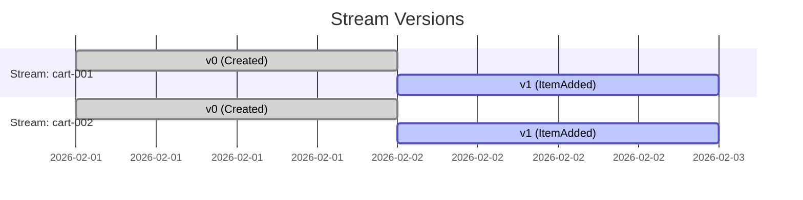

# 14章：最小EventStore②：ストリームIDと順番（version）📼🔢

## この章でできるようになること 🎯✨

* **streamId（ストリームID）**の意味がわかる😊
* **version（順番・通し番号）**が「なんで必要か」を体感できる🔢
* 1つのEventStoreに、**複数のストリーム（集約）**を同時に積めるようになる🧺🧺
* 「順番が壊れるとどうヤバいか」を、実装とテストで確認できる😵‍💫✅

---

## 1. まずはイメージ：streamId と version って何？🧠💡

イベントソーシングって「出来事（イベント）を、起きた順に積む」よね？📚✨
このとき **“どの箱に積むか”** と **“何番目か”** が超大事！

* **streamId**：イベントを積む「箱のID」📦

  * 例：`cart-001`（カート1号）、`cart-002`（カート2号）
* **version**：その箱の中での「通し番号」🔢

  * 0 → 1 → 2 → 3 → …（順番が命！）


イメージ図（1つのストリーム）👇

```text
streamId: cart-001

version: 0        1         2
event:   Created  ItemAdded ItemAdded
time →  ─────────────────────────▶（起きた順に並ぶ）
```

ポイントはこれ！🌸
✅ **version は “全体で1本” じゃなくて “streamごと”** だよ〜！



---

## 2. なんで「順番（version）」が命なの？😺🔁

イベントソーシングの復元（Rehydrate）は、だいたいこう👇

1. イベントを **古い順** に読む📖
2. 1個ずつ状態に **Apply** する🔁
3. 今の状態ができる✨

だから…もし順番が壊れたら？

* `ItemAdded` が先に来て、あとで `CartCreated` が来る
  → 「えっ、まだ作ってないカートに追加…？」ってなる😵💥

順番の保証があると嬉しいこと🌟

* 復元が安定する（いつ読んでも同じ状態になる）✅
* 「同時更新」の検出にも使える（のちの章でやる楽観ロックの土台）🔒

---

## 3. 実装の方針：EventStoreを “ストリーム対応” にする🧱✨

前章（第13章）で作った最小EventStoreに、今回はこの2つを足すよ！

1. **streamId を受け取って保存先を分ける**📦
2. **version をストリーム内で連番にする**🔢

中身はめちゃシンプルに👇

* `Map<string, EventEnvelope[]>` を使って
* `streamId` ごとにイベント配列を持つ

---

## 4. コード：EventEnvelope（包み）を追加する🍱🏷️

イベント本体（DomainEvent）だけだと、保存するときに困ることがあるの。
だから「包み（Envelope）」に入れて保存するよ😊

## 4.1 型を用意する（`src/eventStore.ts`）🧩

```ts
// src/eventStore.ts
import { randomUUID } from "node:crypto";

/** イベントに共通で付けたいメタ情報 */
export type EventMeta = {
  eventId: string;
  occurredAt: string; // ISO文字列
};

/** ドメインイベント（出来事）本体 */
export type DomainEvent<TType extends string = string, TData = unknown> = {
  type: TType;
  data: TData;
  meta: EventMeta;
};

/** EventStoreに保存される“包み” */
export type EventEnvelope<E extends DomainEvent = DomainEvent> = {
  streamId: string;
  version: number; // ストリーム内の通し番号
  event: E;
};

/** 便利関数：イベントを作る（メタ情報つき） */
export function newEvent<TType extends string, TData>(
  type: TType,
  data: TData
): DomainEvent<TType, TData> {
  return {
    type,
    data,
    meta: {
      eventId: randomUUID(),
      occurredAt: new Date().toISOString(),
    },
  };
}
```

> TypeScriptは現時点で `5.9.3` が最新版として配布されているよ📌 ([npm][1])
> （型チェック＆エディタ体験がかなり強いのがTypeScriptの良さだね😊） ([Microsoft for Developers][2])

---

## 5. コード：InMemoryEventStore を “streamId & version” 対応にする📼🔢

## 5.1 インターフェース＋実装（同じファイルに続けてOK）✅

```ts
// src/eventStore.ts（続き）

export interface EventStore<E extends DomainEvent = DomainEvent> {
  appendToStream(streamId: string, events: E[]): Promise<EventEnvelope<E>[]>;
  readStream(streamId: string, fromVersion?: number): Promise<EventEnvelope<E>[]>;
  getStreamVersion(streamId: string): Promise<number>; // 最後のversion（なければ -1）
}

export class InMemoryEventStore<E extends DomainEvent = DomainEvent> implements EventStore<E> {
  private streams = new Map<string, EventEnvelope<E>[]>();

  async appendToStream(streamId: string, events: E[]): Promise<EventEnvelope<E>[]> {
    const current = this.streams.get(streamId) ?? [];

    // 次に振るversion（連番！）
    const startVersion =
      current.length === 0 ? 0 : current[current.length - 1].version + 1;

    const appended: EventEnvelope<E>[] = events.map((event, i) => ({
      streamId,
      version: startVersion + i,
      event,
    }));

    this.streams.set(streamId, [...current, ...appended]);
    return appended;
  }

  async readStream(streamId: string, fromVersion = 0): Promise<EventEnvelope<E>[]> {
    const current = this.streams.get(streamId) ?? [];
    return current.filter((x) => x.version >= fromVersion);
  }

  async getStreamVersion(streamId: string): Promise<number> {
    const current = this.streams.get(streamId);
    if (!current || current.length === 0) return -1;
    return current[current.length - 1].version;
  }
}
```

## ここでの大事ポイント3つ🌟

* `Map` のキーが **streamId**（箱）📦
* `version` は **その箱の中だけで連番**🔢
* `readStream(streamId)` は **その箱だけ読む**📖

> Node.jsは「Current / Active LTS / Maintenance LTS」みたいに段階があるよ〜。開発では LTS 系が基本の安心枠😊 ([Node.js][3])

---

## 6. 動かして確認：2つのストリームに別々に積む🧺🧺✨

`src/demo14.ts` を作って、動きを見てみよ〜！

```ts
// src/demo14.ts
import { InMemoryEventStore, newEvent } from "./eventStore.js";

async function main() {
  const store = new InMemoryEventStore();

  const cartA = "cart-001";
  const cartB = "cart-002";

  await store.appendToStream(cartA, [newEvent("CartCreated", { currency: "JPY" })]);
  await store.appendToStream(cartA, [newEvent("ItemAdded", { sku: "apple", qty: 2 })]);

  await store.appendToStream(cartB, [newEvent("CartCreated", { currency: "JPY" })]);
  await store.appendToStream(cartB, [newEvent("ItemAdded", { sku: "banana", qty: 1 })]);

  const a = await store.readStream(cartA);
  const b = await store.readStream(cartB);

  console.log("cartA:", a.map((x) => ({ v: x.version, type: x.event.type, data: x.event.data })));
  console.log("cartB:", b.map((x) => ({ v: x.version, type: x.event.type, data: x.event.data })));
}

main().catch(console.error);
```

期待する出力イメージ👇（雰囲気でOK😊）

```text
cartA: [ { v: 0, type: 'CartCreated', ... }, { v: 1, type: 'ItemAdded', ... } ]
cartB: [ { v: 0, type: 'CartCreated', ... }, { v: 1, type: 'ItemAdded', ... } ]
```

✨見てほしいところ✨

* `cart-001` の version は `0,1`
* `cart-002` の version も `0,1`（別カウント！）

---

## 7. ミニ演習（手を動かそう）📝💪✨

## 演習1：同じストリームにイベントを3回追加してみよう🔁

* `cart-001` に
  1回目：`CartCreated`
  2回目：`ItemAdded`
  3回目：`ItemAdded`
  を追加して、version が `0,1,2` になるか確認😊✅

## 演習2：2つのストリームで “同じイベント名” を使ってもOK？🤔

* `cart-001` と `cart-002` 両方に `ItemAdded` を追加してみてね🍎🍌
* 「イベント名が同じでも、streamIdが違うから別物」って体感できるよ✨

## 演習3：`fromVersion` を使って途中から読む📖

* `readStream("cart-001", 1)` にして、version 1 以降だけ取れるか確認✅

---

## 8. よくある事故ポイント（初心者あるある）⚠️😵‍💫

## 事故①：version を “全体で1本” にしちゃう💥

「全部のイベントで 0,1,2…」にすると、ストリームごとの順番じゃなくなるよ〜。
→ 復元や競合管理がややこしくなる😵

## 事故②：配列の最後を見ずに version を適当に足す😿

`startVersion` を間違えると、`0,1,1,2` みたいに重複するかも。
→ これは後で “競合” の話に直結する⚔️

## 事故③：readStream が “全ストリーム” を返す😇

間違って「全部のイベント」を返すと、カートAを復元したいのにBのイベントが混ざるよね…？😱
→ `readStream(streamId)` は streamId で必ず絞る！

---

## 9. テストで安心：version と streamId を守れてる？🧪🌸

テストランナーは、最近だと Vitest がよく使われるよ〜（v4 が出てる📣） ([Vitest][4])

`src/eventStore.test.ts` を作ってみよう😊

```ts
// src/eventStore.test.ts
import { describe, it, expect } from "vitest";
import { InMemoryEventStore, newEvent } from "./eventStore.js";

describe("第14章: streamId と version", () => {
  it("同じstreamIdではversionが0,1,2...と増える", async () => {
    const store = new InMemoryEventStore();

    await store.appendToStream("cart-001", [
      newEvent("A", {}),
      newEvent("B", {}),
    ]);
    await store.appendToStream("cart-001", [newEvent("C", {})]);

    const events = await store.readStream("cart-001");
    expect(events.map((x) => x.version)).toEqual([0, 1, 2]);
  });

  it("streamIdが違えばversionは別カウント", async () => {
    const store = new InMemoryEventStore();

    await store.appendToStream("cart-001", [newEvent("A", {})]);
    await store.appendToStream("cart-002", [newEvent("A", {}), newEvent("B", {})]);

    const a = await store.readStream("cart-001");
    const b = await store.readStream("cart-002");

    expect(a.map((x) => x.version)).toEqual([0]);
    expect(b.map((x) => x.version)).toEqual([0, 1]);
  });

  it("fromVersionで途中から読める", async () => {
    const store = new InMemoryEventStore();

    await store.appendToStream("cart-001", [
      newEvent("A", {}),
      newEvent("B", {}),
      newEvent("C", {}),
    ]);

    const events = await store.readStream("cart-001", 2);
    expect(events.map((x) => x.version)).toEqual([2]);
  });
});
```

---

## 10. AI活用：Copilot / Codex に頼むときのプロンプト例🤖💬✨

## 例1：連番チェックのテストを増やしたい🧪

* 「`appendToStream` を2回呼んだとき、2回目の startVersion が正しいか確認するテストを追加して」

## 例2：事故①（version 全体一本化）をわざと起こして差を見たい😈

* 「わざと version をグローバルカウンタにした実装例を作って。どんな不具合が起きるか説明もつけて」

## 例3：読みやすいログ表示にしたい🖥️

* 「EventEnvelope の配列を `[{streamId, version, type}]` だけに整形して出す関数を作って」

---

## まとめ 📌😊

* **streamId = イベントを積む箱のID**📦
* **version = 箱の中での通し番号（順番が命）**🔢
* EventStoreは最低限、**「ストリーム単位で保存・読み出し」＋「連番version」**ができればOK✅
* ここができると、次の「復元（Rehydrate）」が気持ちよく進むよ〜🔁✨

> ちなみに、VS Code のリリースノートは継続的に更新されていて、2026年1月のInsiders版（1.109）も更新日つきでまとまってるよ📘 ([code.visualstudio.com][5])

[1]: https://www.npmjs.com/package/typescript?activeTab=versions&utm_source=chatgpt.com "typescript"
[2]: https://devblogs.microsoft.com/typescript/announcing-typescript-5-9/?utm_source=chatgpt.com "Announcing TypeScript 5.9"
[3]: https://nodejs.org/en/about/previous-releases "Node.js — Node.js Releases"
[4]: https://vitest.dev/blog/vitest-4 "Vitest 4.0 is out! | Vitest"
[5]: https://code.visualstudio.com/updates/v1_109?utm_source=chatgpt.com "January 2026 Insiders (version 1.109)"
