```mermaid
sequenceDiagram
    participant User
    participant Handler
    participant Store as EventStore
    participant Domain as Domain (Decide)

    User->>Handler: Command 📮
    Handler->>Store: readStream(id) 📚
    Store-->>Handler: Event[]
    Handler->>Handler: Rehydrate (State生成) 🔁
    Handler->>Domain: decide(State, Command) 🧠
    Domain-->>Handler: Result<NewEvent[], Error>
    Handler->>Store: appendToStream(id, version, NewEvent[]) 📦
    Handler-->>User: Result 🚦
```

# 16章：Command処理の“型”①（Load → Decide → Append）📮✅

## この章でできるようになること🎯✨

* 「コマンドを受けたら、いつもこの順番で書く！」っていう **安全な型** を作れる🧰💖
* **Load（過去イベント読む）→ Decide（判断して新イベント作る）→ Append（保存）** がスラスラ書ける🔁✅
* “設計っぽいこと”が初めてでも、迷子にならずに実装できる🧭🌸

---

## まずは超イメージ🌈🧠

イベントソーシングのアプリは、ざっくりこう動くよ👇✨

1. **Load**：今までの出来事（イベント）を全部読む📚
2. **Decide**：ルールをチェックして「新しい出来事」を作る🧠💡
3. **Append**：その出来事をイベントストアに積む📦✅

「状態を直接いじる」んじゃなくて、**出来事（イベント）を追加する**のが主役だよ🎬✨

---

## “型”が必要な理由（超たいせつ）🥺🧷

最初のうちは、コマンド処理って…

* どこでチェックするの？🤔
* いつ保存するの？😵
* 状態はどこで作るの？🌀

ってなりがち💦

だからこの章では、**毎回同じ手順**で書けるように、処理の形を固定しちゃうよ🧰💞

---

## 2026年の“周辺の最新”ちょいメモ🗓️✨（読むだけでOK）

* Node.js は **v24 が Active LTS**（2026年1月時点）で、LTS最新版は **v24.13.0** が案内されてるよ📌([Node.js][1])
* TypeScript は **5.9 のリリースノート**が公開されていて、`import defer` など新しい仕様追従も進んでるよ🧠✨([TypeScript][2])
* VS Code は **2026年1月の Insiders 1.109** 更新情報が出てるよ🪟✨([Visual Studio Code][3])
* テストは Vitest が **4.0 リリース**されて、移行ガイドも更新されてるよ🧪✨([Vitest][4])

（この章のコード自体は、最新機能ゴリゴリじゃなくて「型」を覚えるのが目的だよ😊）

---

## 今回の題材：ミニ・カート🛒✨

「カートに商品を追加する」コマンドで練習するよ！

* Command：`AddItemToCart` 📮
* Event：`ItemAddedToCart` 📜
* State：`CartState` 🧺

---

## 全体図（この章のゴール）🗺️✨


```text
Command（お願い）  →  Handler
                     ├─ Load   : eventStore.readStream()
                     ├─ Rehydrate : applyで状態を復元
                     ├─ Decide : ルール確認 → 新Event作成
                     └─ Append : eventStore.appendToStream()
```



---

## 1) 型づくりの準備：共通の型（Command / Event / Result）🧩✨

```ts
// 1) Command（入力）📮
export type Command = {
  type: string;
  // だいたい commandId は後で冪等性で使うことが多いよ（この章では温存でOK）
  commandId: string;
  at: string; // ISO文字列（例: new Date().toISOString()）
};

// 2) DomainEvent（出来事）📜
export type DomainEvent<TType extends string, TData> = {
  type: TType;
  data: TData;
  meta: {
    eventId: string;
    at: string;         // いつ起きた？
    commandId: string;  // どのコマンドが起こした？
  };
};

// 3) 超シンプルな Result（例外まみれ防止の入口）🚦
// ※ きちんとやるのは後の章で深掘りするよ✨
export type Result<T, E> =
  | { ok: true; value: T }
  | { ok: false; error: E };

export const ok = <T>(value: T): Result<T, never> => ({ ok: true, value });
export const err = <E>(error: E): Result<never, E> => ({ ok: false, error });
```

---

## 2) EventStore（最小）📦✨：Read と Append だけ

この章の主役は「型」だから、まずは **インメモリ**でOK👌🌸

```ts
export type StreamId = string;

export type StoredEvent = {
  streamId: StreamId;
  version: number; // 0,1,2... の連番
  event: DomainEvent<string, unknown>;
};

export type ReadStreamResult = {
  events: StoredEvent[];
  lastVersion: number; // 最後のversion（イベント0件なら -1）
};

export interface EventStore {
  readStream(streamId: StreamId): Promise<ReadStreamResult>;

  // expectedVersion は後で「競合対策」で大活躍するよ🔒（この章では "型" として入れておく）
  appendToStream(
    streamId: StreamId,
    expectedVersion: number,
    events: DomainEvent<string, unknown>[]
  ): Promise<{ newLastVersion: number }>;
}

export class InMemoryEventStore implements EventStore {
  private streams = new Map<StreamId, StoredEvent[]>();

  async readStream(streamId: StreamId): Promise<ReadStreamResult> {
    const events = this.streams.get(streamId) ?? [];
    const lastVersion = events.length === 0 ? -1 : events[events.length - 1].version;
    return { events, lastVersion };
  }

  async appendToStream(
    streamId: StreamId,
    expectedVersion: number,
    newEvents: DomainEvent<string, unknown>[]
  ): Promise<{ newLastVersion: number }> {
    const current = this.streams.get(streamId) ?? [];
    const currentLast = current.length === 0 ? -1 : current[current.length - 1].version;

    // ★ここが「型」：この章では軽くチェックするだけ（本格運用は後の章）
    if (currentLast !== expectedVersion) {
      throw new Error(
        `ConcurrencyError: expectedVersion=${expectedVersion}, actual=${currentLast}`
      );
    }

    let version = currentLast;
    const stored: StoredEvent[] = newEvents.map((e) => {
      version += 1;
      return { streamId, version, event: e };
    });

    const next = current.concat(stored);
    this.streams.set(streamId, next);

    const newLastVersion = next.length === 0 ? -1 : next[next.length - 1].version;
    return { newLastVersion };
  }
}
```

---

## 3) Aggregate（状態）と Apply（復元）🔁🧠

## カートの状態🛒

```ts
export type CartState = {
  exists: boolean;
  items: Record<string, number>; // sku -> qty
};

export const emptyCart = (): CartState => ({
  exists: false,
  items: {},
});
```

## イベント定義📜

```ts
export type CartCreated = DomainEvent<"CartCreated", { cartId: string }>;
export type ItemAddedToCart = DomainEvent<
  "ItemAddedToCart",
  { cartId: string; sku: string; qty: number }
>;

export type CartEvent = CartCreated | ItemAddedToCart;
```

## Apply（イベント1つで状態を更新）🧷

```ts
export const applyCartEvent = (state: CartState, event: CartEvent): CartState => {
  switch (event.type) {
    case "CartCreated":
      return { ...state, exists: true };

    case "ItemAddedToCart": {
      const prev = state.items[event.data.sku] ?? 0;
      return {
        ...state,
        items: { ...state.items, [event.data.sku]: prev + event.data.qty },
      };
    }
  }
};
```

## Rehydrate（イベント列→現在状態）🔁✨

```ts
export const rehydrateCart = (events: CartEvent[]): CartState => {
  return events.reduce((s, e) => applyCartEvent(s, e), emptyCart());
};
```

---

## 4) Decide（判断）🧠💡：ルールチェック → 新イベントを作る

ここが「設計っぽさ」の入り口だよ🌸
**Decide は “新イベントを返すだけ”** にすると、めっちゃ読みやすい✨

## Command定義📮

```ts
export type AddItemToCart = Command & {
  type: "AddItemToCart";
  cartId: string;
  sku: string;
  qty: number;
};

export type CreateCart = Command & {
  type: "CreateCart";
  cartId: string;
};

export type CartCommand = CreateCart | AddItemToCart;
```

## ドメインエラー（文字列でもOKだけど、型にすると便利）🚧

```ts
export type CartError =
  | { type: "CartNotFound" }
  | { type: "CartAlreadyExists" }
  | { type: "InvalidQuantity"; message: string };
```

## Decide関数（コマンドごと）✨

```ts
const makeMeta = (command: Command) => ({
  eventId: crypto.randomUUID(),
  at: new Date().toISOString(),
  commandId: command.commandId,
});

export const decideCreateCart = (
  state: CartState,
  cmd: CreateCart
): Result<CartCreated[], CartError> => {
  if (state.exists) return err({ type: "CartAlreadyExists" });

  const event: CartCreated = {
    type: "CartCreated",
    data: { cartId: cmd.cartId },
    meta: makeMeta(cmd),
  };
  return ok([event]);
};

export const decideAddItemToCart = (
  state: CartState,
  cmd: AddItemToCart
): Result<ItemAddedToCart[], CartError> => {
  if (!state.exists) return err({ type: "CartNotFound" });
  if (!Number.isInteger(cmd.qty) || cmd.qty <= 0) {
    return err({ type: "InvalidQuantity", message: "qty は 1 以上の整数だよ🥺" });
  }

  const event: ItemAddedToCart = {
    type: "ItemAddedToCart",
    data: { cartId: cmd.cartId, sku: cmd.sku, qty: cmd.qty },
    meta: makeMeta(cmd),
  };
  return ok([event]);
};
```

---

## 5) ここが本題！Handler（Load → Decide → Append）📮✅

この “型” を、まるごとテンプレとして覚えちゃおう🧰💞

```ts
const cartStreamId = (cartId: string) => `cart-${cartId}`;

export type HandleResult =
  | { ok: true }
  | { ok: false; error: CartError };

export const handleCartCommand = async (
  store: EventStore,
  cmd: CartCommand
): Promise<HandleResult> => {
  // ① Load：過去イベントを読む📚
  const streamId = cartStreamId(cmd.cartId);
  const { events: stored, lastVersion } = await store.readStream(streamId);

  // ② Rehydrate：状態を復元する🔁
  const domainEvents = stored.map((x) => x.event) as CartEvent[];
  const state = rehydrateCart(domainEvents);

  // ③ Decide：ルール確認 → 新イベント作成🧠✨
  const decided =
    cmd.type === "CreateCart"
      ? decideCreateCart(state, cmd)
      : decideAddItemToCart(state, cmd);

  if (!decided.ok) {
    return { ok: false, error: decided.error };
  }

  // ④ Append：イベントを保存📦✅
  // expectedVersion は「読んだ時点の最後のversion」
  await store.appendToStream(streamId, lastVersion, decided.value);

  return { ok: true };
};
```

---

## ミニ演習①📝✨：「Create → AddItem」まで通してみよう🎬

```ts
import { InMemoryEventStore } from "./eventStore";
import { handleCartCommand } from "./handler";

const store = new InMemoryEventStore();

const cartId = "C-001";

const r1 = await handleCartCommand(store, {
  type: "CreateCart",
  commandId: crypto.randomUUID(),
  at: new Date().toISOString(),
  cartId,
});

const r2 = await handleCartCommand(store, {
  type: "AddItemToCart",
  commandId: crypto.randomUUID(),
  at: new Date().toISOString(),
  cartId,
  sku: "SKU-AAA",
  qty: 2,
});

console.log({ r1, r2 });
```

期待：どっちも `{ ok: true }` になればOK✅🎉

---

## ミニ演習②🧩✨：わざと失敗させよう🙅‍♀️

次のコマンドを投げたら、どうなる？👀

* まだ作ってない `cartId` に `AddItemToCart`
* `qty: 0` で `AddItemToCart`

「Load → Decide → Append」のどこで止まるか、言葉で説明してみてね🗣️💕

---

## テストの超ミニ版（Vitest）🧪✨

Vitest 4.x でOK！([Vitest][4])

```ts
import { describe, it, expect } from "vitest";
import { InMemoryEventStore } from "./eventStore";
import { handleCartCommand } from "./handler";

describe("Cart command handler", () => {
  it("CreateCart → ok", async () => {
    const store = new InMemoryEventStore();
    const cartId = "C-100";

    const res = await handleCartCommand(store, {
      type: "CreateCart",
      commandId: crypto.randomUUID(),
      at: new Date().toISOString(),
      cartId,
    });

    expect(res.ok).toBe(true);
  });

  it("AddItemToCart before create → CartNotFound", async () => {
    const store = new InMemoryEventStore();

    const res = await handleCartCommand(store, {
      type: "AddItemToCart",
      commandId: crypto.randomUUID(),
      at: new Date().toISOString(),
      cartId: "C-999",
      sku: "SKU-ZZZ",
      qty: 1,
    });

    expect(res.ok).toBe(false);
    if (!res.ok) expect(res.error.type).toBe("CartNotFound");
  });
});
```

---

## AI拡張に頼むときの“勝ちプロンプト”例🤖✨

## ① 叩き台を作らせる（短くて強い）🧰

```text
イベントソーシングの Command Handler を TypeScript で実装したいです。
要件:
- 型: Load → Rehydrate → Decide → Append
- InMemoryEventStore（readStream / appendToStream expectedVersion 付き）
- Cart: CreateCart / AddItemToCart
- Decide は Result 型でエラーを返す
出力:
- ファイル分割案と TypeScript コード
注意:
- Decide は状態を直接変更せず、新イベント配列を返す
```

## ② レビュー観点を出させる👀✨

```text
このハンドラ実装をレビューして。
観点:
- Load/Decide/Append の責務が混ざってない？
- Decide が “新イベント生成” に閉じてる？
- apply/rehydrate の漏れが起きそう？
- expectedVersion の使い方は自然？
- 型の安全性（event/command の union）が活きてる？
```

---

## よくあるミス集（ここだけ注意⚠️🥺）

* **Decide で保存しちゃう**：Decide は “新イベントを作るだけ” にする🧠✨
* **Load せずに状態を信じる**：必ずイベントから復元する🔁
* **apply の書き忘れ**：イベント増やしたら apply も増やす📌
* **イベントに “状態” を入れすぎる**：出来事の事実に寄せる🍱（盛りすぎ注意！）

---

## まとめ📌✨

* Command処理は **Load → Decide → Append** の型で固定すると安心😌💖
* **Decide は “新イベントを返す”** だけにすると、設計が急にキレイになる✨
* “状態” は **イベント列から復元（Rehydrate）** して作る🔁✅

次の章では、この Decide の中で **不変条件でちゃんと弾く**（エラーの扱いもきれいにする）をやるよ🛡️🚧

[1]: https://nodejs.org/en/about/previous-releases?utm_source=chatgpt.com "Node.js Releases"
[2]: https://www.typescriptlang.org/docs/handbook/release-notes/typescript-5-9.html?utm_source=chatgpt.com "Documentation - TypeScript 5.9"
[3]: https://code.visualstudio.com/updates/v1_109?utm_source=chatgpt.com "January 2026 Insiders (version 1.109)"
[4]: https://vitest.dev/blog/vitest-4?utm_source=chatgpt.com "Vitest 4.0 is out!"
