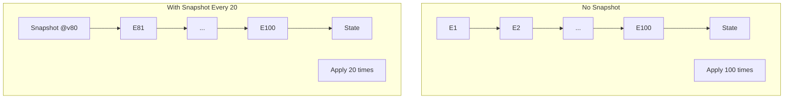

# 26章：スナップショット実装（最小）📸🧪

## この章のゴール🎯✨

* イベントが増えても、復元（Rehydrate）を短くできるようにする🔁💨
* **「最新スナップショット + その後のイベントだけ適用」**の流れを、TypeScriptで実装できるようにする🧩✅
* スナップショット有／無で「復元ステップ数（Apply回数）」が変わるのを体感する📉😳

---

## まずイメージ🌈📸

スナップショットは、ざっくり言うと **セーブデータ** だよ🎮✨

* **イベント列**＝プレイ履歴（最初から再生すると長い）📼
* **スナップショット**＝途中のセーブ（ここから再開できる）💾

つまり復元はこうなる👇

* ふつう：イベント1件目から最後まで全部Apply…😵‍💫
* スナップあり：最新スナップを読み込み → **残りイベントだけ**Apply😊

---

## スナップショットの「最小要件」✅📦

最小で必要なのはこれだけ👇

1. **streamId**（どの集約のスナップ？）🪪
2. **version**（どこまでの履歴を反映した状態？）🔢
3. **state**（その時点の状態）🧠
4. **createdAt**（いつ作った？）🕒（任意だけど便利✨）

ポイント：イベントストアによっては「スナップショット専用機能」がなく、アプリ側で“普通のデータ/イベント”として扱う設計が一般的だよ📌([EventSourcingDB][1])
（EventStoreDBでも「スナップショット用ストリームに保存して、最後のスナップから読み直す」みたいな考え方が紹介されてるよ）([Stack Overflow][2])

---

## 実装していこう🛠️✨（最小構成）

ここでは題材として「カート🛒」を使うよ（イベントは超ミニでOK）😊
やることは3つだけ👇

1. Snapshot型とSnapshotStoreを作る📦
2. Load時に「スナップ→残りイベント」を適用する🔁
3. Save時に「たまにスナップを保存する」ルールを入れる📸

---

## 1) 型を用意する📦🧾

```ts
// snapshot.ts
export type Snapshot<TState> = {
  streamId: string;
  version: number;     // このversionまでのイベントを反映したstate
  state: TState;
  createdAt: string;   // ISO文字列
};

export interface SnapshotStore<TState> {
  getLatest(streamId: string): Promise<Snapshot<TState> | null>;
  save(snapshot: Snapshot<TState>): Promise<void>;
}
```

---

## 2) 最小SnapshotStore（インメモリ）📦🧠

「最新だけ保存」でOK🙆‍♀️（まずは最小！）

```ts
// inMemorySnapshotStore.ts
import { Snapshot, SnapshotStore } from "./snapshot";

export class InMemorySnapshotStore<TState> implements SnapshotStore<TState> {
  private readonly latestByStream = new Map<string, Snapshot<TState>>();

  async getLatest(streamId: string): Promise<Snapshot<TState> | null> {
    return this.latestByStream.get(streamId) ?? null;
  }

  async save(snapshot: Snapshot<TState>): Promise<void> {
    const current = this.latestByStream.get(snapshot.streamId);

    // 古いスナップは上書きしない（versionが小さい）
    if (current && snapshot.version <= current.version) return;

    this.latestByStream.set(snapshot.streamId, snapshot);
  }
}
```

---

## 3) 最小EventStore（インメモリ）📼✅

すでに作ってある前提でもOKだけど、この章だけでも動くように最小を置いとくね😊

```ts
// eventStore.ts
export type DomainEvent = {
  type: string;
  data: unknown;
  meta?: { occurredAt?: string };
};

export type StoredEvent = DomainEvent & {
  streamId: string;
  version: number;
};

export class ConcurrencyError extends Error {}

export interface EventStore {
  append(streamId: string, expectedVersion: number, events: DomainEvent[]): Promise<StoredEvent[]>;
  readStream(streamId: string, fromVersion?: number): Promise<StoredEvent[]>;
  getCurrentVersion(streamId: string): Promise<number>;
}

export class InMemoryEventStore implements EventStore {
  private readonly streams = new Map<string, StoredEvent[]>();

  async getCurrentVersion(streamId: string): Promise<number> {
    const list = this.streams.get(streamId) ?? [];
    return list.length === 0 ? 0 : list[list.length - 1].version;
  }

  async append(streamId: string, expectedVersion: number, events: DomainEvent[]): Promise<StoredEvent[]> {
    const list = this.streams.get(streamId) ?? [];
    const currentVersion = list.length === 0 ? 0 : list[list.length - 1].version;

    if (currentVersion !== expectedVersion) {
      throw new ConcurrencyError(`Expected ${expectedVersion}, but was ${currentVersion}`);
    }

    const now = new Date().toISOString();
    const stored = events.map((e, i) => ({
      ...e,
      streamId,
      version: currentVersion + i + 1,
      meta: { occurredAt: e.meta?.occurredAt ?? now },
    }));

    this.streams.set(streamId, [...list, ...stored]);
    return stored;
  }

  async readStream(streamId: string, fromVersion: number = 1): Promise<StoredEvent[]> {
    const list = this.streams.get(streamId) ?? [];
    return list.filter(e => e.version >= fromVersion);
  }
}
```

---

## 4) 集約（カート）を「スナップ対応」にする🛒📸

ここで大事なのは👇

* スナップに入れるのは **state（状態）だけ**（イベントは入れない）
* 復元時は **スナップ state を初期値にして、残りイベントをApply**

「Apply回数」を数えて差が見えるようにするよ😆📊

```ts
// cart.ts
export type CartState = {
  cartId: string;
  items: Record<string, number>; // productId -> qty
  checkedOut: boolean;
};

export type CartEvent =
  | { type: "CartCreated"; data: { cartId: string } }
  | { type: "ItemAdded"; data: { productId: string; quantity: number } }
  | { type: "CheckedOut"; data: {} };

export class DomainError extends Error {}

export class Cart {
  private state: CartState;
  public appliedCount = 0; // 何回Applyしたか（体感用）📏

  private constructor(state: CartState) {
    this.state = state;
  }

  static newEmpty(cartId: string): Cart {
    return new Cart({ cartId, items: {}, checkedOut: false });
  }

  static fromSnapshot(state: CartState): Cart {
    // ここは「そのまま信じて復元」する最小形✨
    // 実務ではバリデーションやスキーマ移行を考えることもあるよ🧯
    return new Cart(structuredCloneSafe(state));
  }

  toSnapshotState(): CartState {
    return structuredCloneSafe(this.state);
  }

  // ---- Decide（コマンド→イベント）📮 ----
  decideCreate(): CartEvent[] {
    // すでに作成済みなら作れない…みたいなルールも本当は欲しいけど最小で省略🙆‍♀️
    return [{ type: "CartCreated", data: { cartId: this.state.cartId } }];
  }

  decideAddItem(productId: string, quantity: number): CartEvent[] {
    if (this.state.checkedOut) throw new DomainError("チェックアウト後は変更できません🥲");
    if (quantity <= 0) throw new DomainError("数量は1以上だよ🙂");
    return [{ type: "ItemAdded", data: { productId, quantity } }];
  }

  decideCheckout(): CartEvent[] {
    if (this.state.checkedOut) throw new DomainError("もうチェックアウト済みだよ🙂");
    const totalQty = Object.values(this.state.items).reduce((a, b) => a + b, 0);
    if (totalQty === 0) throw new DomainError("空のカートはチェックアウトできません🛒💦");
    return [{ type: "CheckedOut", data: {} }];
  }

  // ---- Apply（イベント→状態）🔁 ----
  apply(event: CartEvent): void {
    this.appliedCount++;

    switch (event.type) {
      case "CartCreated":
        // cartIdは既に入ってる想定（最小）
        return;

      case "ItemAdded": {
        const { productId, quantity } = event.data;
        const current = this.state.items[productId] ?? 0;
        this.state.items[productId] = current + quantity;
        return;
      }

      case "CheckedOut":
        this.state.checkedOut = true;
        return;

      default: {
        const _exhaustive: never = event;
        return _exhaustive;
      }
    }
  }

  getState(): CartState {
    return structuredCloneSafe(this.state);
  }
}

function structuredCloneSafe<T>(v: T): T {
  // JSONで十分な最小実装（DateやMapが入るなら別対応）🧊
  return JSON.parse(JSON.stringify(v)) as T;
}
```

---

## 5) ここが本題：Loadを「スナップ→残りイベント」にする🔁📸

流れはこれ👇

1. 最新スナップを取得📸
2. スナップがあれば、そのstateからCartを作る🧠
3. スナップのversion+1からイベントを読み、Applyする📼➡️🔁

```ts
// cartRepository.ts
import { EventStore, StoredEvent } from "./eventStore";
import { SnapshotStore, Snapshot } from "./snapshot";
import { Cart, CartEvent, CartState } from "./cart";

export class CartRepository {
  constructor(
    private readonly eventStore: EventStore,
    private readonly snapshotStore: SnapshotStore<CartState>,
  ) {}

  // ✅ スナップ対応Load
  async load(cartId: string): Promise<{
    cart: Cart;
    version: number;
    snapshotVersion: number;
  }> {
    const currentVersion = await this.eventStore.getCurrentVersion(cartId);
    const snap = await this.snapshotStore.getLatest(cartId);

    // 変なスナップ（未来version）を踏まない保険🧯
    const safeSnap = snap && snap.version <= currentVersion ? snap : null;

    const cart = safeSnap ? Cart.fromSnapshot(safeSnap.state) : Cart.newEmpty(cartId);
    const fromVersion = safeSnap ? safeSnap.version + 1 : 1;

    const stored = await this.eventStore.readStream(cartId, fromVersion);
    for (const e of stored) cart.apply(toCartEvent(e));

    const finalVersion = stored.length > 0 ? stored[stored.length - 1].version : (safeSnap?.version ?? 0);

    return {
      cart,
      version: finalVersion,
      snapshotVersion: safeSnap?.version ?? 0,
    };
  }

  // ✅ 保存（イベントをAppend）＋「たまにスナップ保存」📸
  async appendAndMaybeSnapshot(args: {
    cartId: string;
    expectedVersion: number;
    newEvents: CartEvent[];
    cartAfterApply: Cart;         // Append後の状態（もうApply済み想定）
    lastSnapshotVersion: number;  // load時に分かったやつ
    snapshotEvery: number;        // 例：20
  }): Promise<number> {
    const stored = await this.eventStore.append(args.cartId, args.expectedVersion, args.newEvents);
    const newVersion = stored[stored.length - 1]?.version ?? args.expectedVersion;

    if (shouldTakeSnapshot(newVersion, args.lastSnapshotVersion, args.snapshotEvery)) {
      const snapshot: Snapshot<CartState> = {
        streamId: args.cartId,
        version: newVersion,
        state: args.cartAfterApply.toSnapshotState(),
        createdAt: new Date().toISOString(),
      };
      await this.snapshotStore.save(snapshot);
    }

    return newVersion;
  }
}

function shouldTakeSnapshot(newVersion: number, lastSnapshotVersion: number, every: number): boolean {
  if (every <= 0) return false;
  return newVersion - lastSnapshotVersion >= every;
}

function toCartEvent(e: StoredEvent): CartEvent {
  // 最小：型の安全はここでは軽め（実務はevent typeごとに厳密に）🧷
  return { type: e.type as CartEvent["type"], data: e.data as any };
}
```

---

## 6) ミニ演習：スナップ有/無で復元ステップ差を確認🔁📏✨




## やること📝

* カートにアイテム追加イベントをいっぱい積む（例：100回）🛒
* **スナップなし復元**：Applyが100回近く走る😵
* **スナップあり復元**：Applyがほぼ0回（最新スナップがあるから）😊

```ts
// demo.ts
import { InMemoryEventStore } from "./eventStore";
import { InMemorySnapshotStore } from "./inMemorySnapshotStore";
import { CartRepository } from "./cartRepository";
import { Cart } from "./cart";

async function main() {
  const eventStore = new InMemoryEventStore();
  const snapshotStore = new InMemorySnapshotStore<any>();
  const repo = new CartRepository(eventStore, snapshotStore);

  const cartId = "cart-1";
  const snapshotEvery = 20;

  // まず作成
  {
    const loaded = await repo.load(cartId);
    const cart = loaded.cart;
    const evts = cart.decideCreate();
    for (const e of evts) cart.apply(e);
    await repo.appendAndMaybeSnapshot({
      cartId,
      expectedVersion: loaded.version,
      newEvents: evts,
      cartAfterApply: cart,
      lastSnapshotVersion: loaded.snapshotVersion,
      snapshotEvery,
    });
  }

  // 100回追加（スナップも時々作られる）
  for (let i = 0; i < 100; i++) {
    const loaded = await repo.load(cartId);
    const cart = loaded.cart;

    const evts = cart.decideAddItem("apple", 1);
    for (const e of evts) cart.apply(e);

    await repo.appendAndMaybeSnapshot({
      cartId,
      expectedVersion: loaded.version,
      newEvents: evts,
      cartAfterApply: cart,
      lastSnapshotVersion: loaded.snapshotVersion,
      snapshotEvery,
    });
  }

  // ✅ スナップありロード（Apply回数が少ないはず）
  const withSnap = await repo.load(cartId);
  console.log("with snapshot appliedCount =", withSnap.cart.appliedCount);

  // ✅ スナップなしロードを“手動”で再現（最初からApply）
  const noSnapCart = Cart.newEmpty(cartId);
  const all = await eventStore.readStream(cartId, 1);
  for (const e of all) noSnapCart.apply({ type: e.type as any, data: e.data as any });
  console.log("without snapshot appliedCount =", noSnapCart.appliedCount);
}

main().catch(console.error);
```

期待する雰囲気👇😊

* with snapshot appliedCount ≒ 0（または少し）📉
* without snapshot appliedCount ≒ 101（作成+追加100）📈

---

## 7) テスト（Given-When-Then）🧪🌸

ここでは「状態が一致する」と「Apply回数が減る」をチェックするよ✅

```ts
// snapshot.test.ts
import test from "node:test";
import assert from "node:assert/strict";

import { InMemoryEventStore } from "./eventStore";
import { InMemorySnapshotStore } from "./inMemorySnapshotStore";
import { CartRepository } from "./cartRepository";

test("Given many events, When load with snapshot, Then state matches and apply count is smaller", async () => {
  const eventStore = new InMemoryEventStore();
  const snapshotStore = new InMemorySnapshotStore<any>();
  const repo = new CartRepository(eventStore, snapshotStore);

  const cartId = "cart-test";
  const snapshotEvery = 10;

  // Given: create
  {
    const loaded = await repo.load(cartId);
    const cart = loaded.cart;
    const evts = cart.decideCreate();
    evts.forEach(e => cart.apply(e));
    await repo.appendAndMaybeSnapshot({
      cartId,
      expectedVersion: loaded.version,
      newEvents: evts,
      cartAfterApply: cart,
      lastSnapshotVersion: loaded.snapshotVersion,
      snapshotEvery,
    });
  }

  // Given: add 50 times (snapshots should exist)
  for (let i = 0; i < 50; i++) {
    const loaded = await repo.load(cartId);
    const cart = loaded.cart;

    const evts = cart.decideAddItem("apple", 1);
    evts.forEach(e => cart.apply(e));

    await repo.appendAndMaybeSnapshot({
      cartId,
      expectedVersion: loaded.version,
      newEvents: evts,
      cartAfterApply: cart,
      lastSnapshotVersion: loaded.snapshotVersion,
      snapshotEvery,
    });
  }

  // When: load with snapshot
  const withSnap = await repo.load(cartId);

  // Then: apple qty is 50
  assert.equal(withSnap.cart.getState().items["apple"], 50);

  // Then: apply count should be small (latest snapshot should cover most history)
  assert.ok(withSnap.cart.appliedCount < 10, `appliedCount was ${withSnap.cart.appliedCount}`);
});
```

---

## 8) よくある落とし穴💣😵‍💫（最小でもここは注意！）

* **スナップのversionがズレる**：versionが「どこまでApply済みか」そのものだよ🔢⚠️
* **未来スナップを踏む**：イベントより先のversionのスナップは無効🧯（実装でガード入れたよ）
* **stateに“派生値”を入れすぎ**：合計金額みたいなのは、あとでズレやすい💸😇
* **スキーマ変更で古いスナップが壊れる**：壊れたら捨ててリプレイで再生成できるのが強み🔁✨
* **本当はトランザクション問題がある**：イベント保存とスナップ保存が別タイミングだとズレる可能性📌（ここは“最小”なので割り切り！）

---

## 9) AI活用（Copilot/Codex向け）🤖✨

そのまま貼って使える系だよ📎💕

## 実装のたたき台を作らせるプロンプト🧱

* 「Snapshot型（streamId/version/state/createdAt）と InMemorySnapshotStore を作って。古いversionは上書きしないで」
* 「load時に snapshot があれば state から復元して、snapshot.version+1 からイベントを読んでApplyするRepositoryにして」

## レビュー観点を出させるプロンプト🔍

* 「スナップのversion定義が正しい？（どこまでのイベントが反映済みか）」
* 「未来versionのスナップを踏まない？」「fromVersionが+1になってる？」
* 「スナップ保存の条件（every N events）が意図通り？」

## テスト生成プロンプト🧪

* 「Given: 50回ItemAdded、When: snapshotEvery=10でload、Then: 状態一致 & appliedCountが小さい、のnode:testを書いて」

---

## 参考（2026-02-01 時点）📌

* TypeScriptのnpm上の最新安定版は 5.9.3 として案内されているよ🧾([npm][3])
* VS Codeは 2026年1月リリースとして v1.108 のリリースノートが公開されているよ🪟📝([Visual Studio Code][4])
* VS Code Insidersは 1.109 のノートが 2026-01-26 更新になってるよ🧪✨([Visual Studio Code][5])
* Node.js公式のEOLページでは、最新LTSや最新Currentの案内がまとめられているよ🟩([Node.js][6])
* スナップショットは「専用機能がないストアでは、アプリ側で通常データ/イベントとして扱う」説明があるよ📸([EventSourcingDB][1])

[1]: https://docs.eventsourcingdb.io/fundamentals/snapshots/?utm_source=chatgpt.com "Snapshots - EventSourcingDB"
[2]: https://stackoverflow.com/questions/16359330/are-snapshots-supported-in-eventstoredb?utm_source=chatgpt.com "Are snapshots supported in EventStoreDB?"
[3]: https://www.npmjs.com/package/typescript?activeTab=versions&utm_source=chatgpt.com "typescript"
[4]: https://code.visualstudio.com/updates?utm_source=chatgpt.com "December 2025 (version 1.108)"
[5]: https://code.visualstudio.com/updates/v1_109?utm_source=chatgpt.com "January 2026 Insiders (version 1.109)"
[6]: https://nodejs.org/en/about/eol?utm_source=chatgpt.com "End-of-Life (EOL)"
