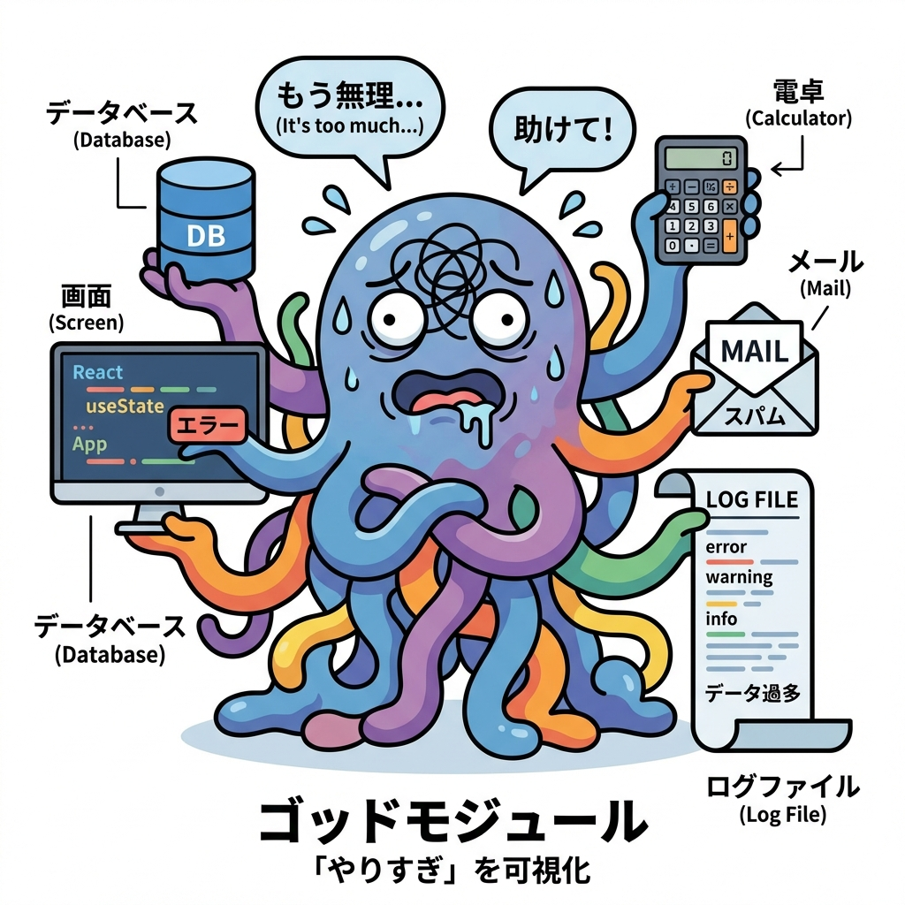
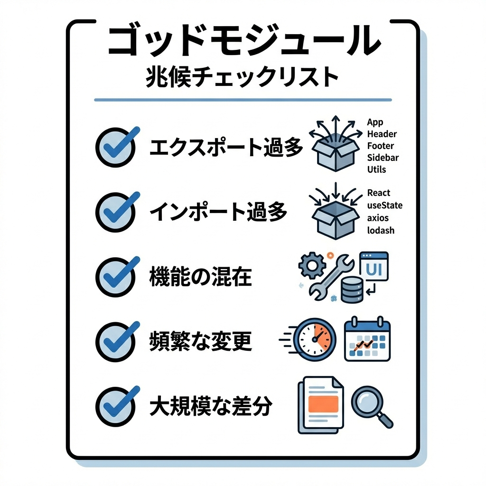
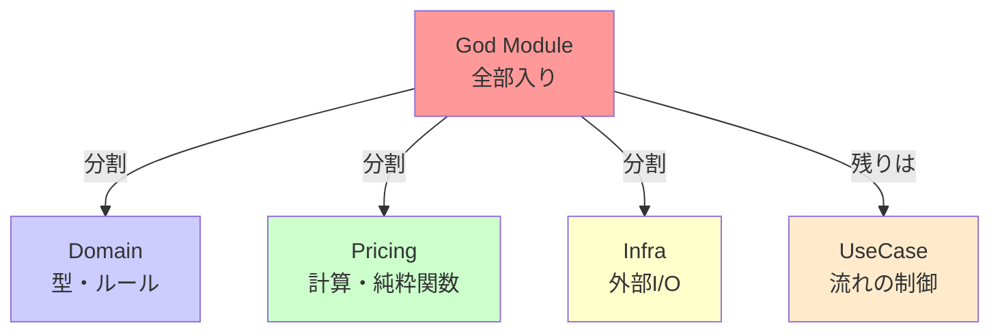

# 第5章：ニオイ図鑑① “God Module” を見抜く👃💦

### 今日のゴール🎯

* 「このファイル、何でも屋すぎない…？」を**早い段階で嗅ぎ分け**できるようになる👃✨
* 分割するときに「好み」じゃなくて、**責務（＝変わる理由）**で切れるようになる✂️🧠
* AIに手伝ってもらいつつ、最後は自分で **責務混在🍲 / 依存増加🔗** をチェックできる✅

---

## 1) God Moduleってなに？😵‍💫



ざっくり言うと…

**「とりあえずここに置いとくか」で育った、巨大な1ファイル**です📦💥
中身がこうなりがち👇

* 仕様（業務ルール）✅
* データ整形・フォーマット🎀
* 外部通信・保存（API/Storage/DB）🌐💾
* 例外処理・ログ🧯
* 便利関数ユーティリティ🧰

…が **全部同居🍲** して、ちょっと直すだけで怖くなるやつ😱

---

## 2) まずは“ニオイ”早見表👃🧾



「全部当てはまる必要はない」けど、**2〜3個**あったら黄色信号🚦

### God Moduleの典型サイン⚠️

* **exportが多い**（入口が多すぎて、どこからでも触れる）🚪🚪🚪
* **importが多い**（何でも参照してて依存が強い）🔗🔗
* **関数名のジャンルがバラバラ**（`validate` / `fetch` / `save` / `format` / `calc` が混在）🍲
* **「ここ直したら別の何かが壊れる」**が起きる😱
* PRの差分がいつもこのファイルに出る（変更の集積地）🧲

---

## 3) VS Codeで“秒速チェック”する方法👀⚡（コツだけ）

難しい道具いらないよ〜🙂✨

### ✅ チェック①：Outline（アウトライン）を見る

アウトラインが「長すぎスクロール地獄」なら、だいたい肥大してる🐘💦
→ “関数の集まり方” も見えるので、責務ラベル付けの準備に最高🎨

### ✅ チェック②：検索で `export` を数える

`export` がズラ〜っと並ぶなら「公共スペース広すぎ」になりがち🏙️
入口が多いほど、変更が伝播しやすいよ〜🔁

### ✅ チェック③：ファイル内の“話題の切り替わり”を見る

コメントや空行で
「ここから通信」→「ここから計算」→「ここから整形」
みたいに話題が変わってたら、責務が混ざってるサイン🍲

---

## 4) ハンズオン🛠️：巨大ファイルに“責務ラベル”を貼ろう🎨

ここから実践だよ〜！✨
題材はミニECの「注文」ファイル📦🛒（ありがちな混在全部盛り）

### 4-1. まずは“悪い例”の God Module（サンプル）

```ts
// src/order.ts 😱 なんでも詰め合わせ

export type Money = { amount: number; currency: "JPY" | "USD" };
export type OrderItem = { sku: string; price: Money; qty: number };
export type Order = { id: string; items: OrderItem[]; createdAt: number };

export function validateOrder(order: Order): string[] {
  const errors: string[] = [];
  if (!order.id) errors.push("id is required");
  if (order.items.length === 0) errors.push("items is empty");
  for (const it of order.items) {
    if (it.qty <= 0) errors.push(`qty must be > 0: ${it.sku}`);
  }
  return errors;
}

export function calcSubtotal(items: OrderItem[]): Money {
  const amount = items.reduce((sum, it) => sum + it.price.amount * it.qty, 0);
  return { amount, currency: "JPY" };
}

export function formatMoney(m: Money): string {
  return new Intl.NumberFormat("ja-JP", { style: "currency", currency: m.currency }).format(m.amount);
}

export async function fetchShippingFee(zip: string): Promise<Money> {
  // 本当はAPI…のつもり
  await new Promise((r) => setTimeout(r, 50));
  return { amount: zip.startsWith("1") ? 800 : 1200, currency: "JPY" };
}

export async function saveOrder(order: Order): Promise<void> {
  // 本当はDB…のつもり
  localStorage.setItem(`order:${order.id}`, JSON.stringify(order));
}

export async function placeOrder(input: {
  id: string;
  items: OrderItem[];
  zip: string;
}): Promise<{ ok: true; totalText: string } | { ok: false; errors: string[] }> {
  const order: Order = { id: input.id, items: input.items, createdAt: Date.now() };

  const errors = validateOrder(order);
  if (errors.length) return { ok: false, errors };

  const subtotal = calcSubtotal(order.items);
  const shipping = await fetchShippingFee(input.zip);

  const total: Money = { amount: subtotal.amount + shipping.amount, currency: "JPY" };

  await saveOrder(order);

  return { ok: true, totalText: `合計は ${formatMoney(total)} です` };
}
```

---

### 4-2. 責務ラベルを貼る🎨（手でやるのが超大事！）

このファイルの中身を、まず **4つの色**で分ける気持ちで見てね👇

* 🟦 **ドメイン（型・ルール）**：Order/Money、注文として守りたいこと
* 🟩 **計算（純粋関数）**：小計、合計
* 🟨 **外部I/O**：送料取得（API想定）、保存（DB想定）
* 🟥 **ユースケース**：placeOrder（流れを組み立てる）

> コツ💡：「同じ理由で変わるものは近く」
> 例：送料計算ルールが変わるなら 🟨 だけ、UI文言が変わるなら別、みたいに整理できる✨

---

## 5) 分割の“正解の形”はこれ🧩✨（初心者向けの割り切り版）

最初から細かく切りすぎると迷子になるので、今日はこの **3〜4分割**がちょうどいいよ🙂📦


```mermaid
graph TD
  God[God Module<br>全部入り] -->|分割| DOM[Domain<br>型・ルール]
  God -->|分割| PRC[Pricing<br>計算・純粋関数]
  God -->|分割| INF[Infra<br>外部I/O]
  God -->|残りは| UC[UseCase<br>流れの制御]

  style God fill:#ff9999
  style DOM fill:#ccccff
  style PRC fill:#ccffcc
  style INF fill:#ffffcc
  style UC fill:#ffebcc
```

### おすすめ構成案📁

* `src/order/domain.ts` 🟦：型・バリデーション（注文としての守り）
* `src/order/pricing.ts` 🟩：金額計算・フォーマット（純粋処理中心）
* `src/order/infra.ts` 🟨：送料取得・保存（外部と話す）
* `src/order/placeOrder.ts` 🟥：ユースケース（全部をつなぐ）

---

## 6) “良い分割”に直してみよう✂️✅（完成イメージ）

### 6-1. domain.ts（型とルール🟦）

```ts
// src/order/domain.ts
export type Money = { amount: number; currency: "JPY" | "USD" };
export type OrderItem = { sku: string; price: Money; qty: number };
export type Order = { id: string; items: OrderItem[]; createdAt: number };

export function validateOrder(order: Order): string[] {
  const errors: string[] = [];
  if (!order.id) errors.push("id is required");
  if (order.items.length === 0) errors.push("items is empty");
  for (const it of order.items) {
    if (it.qty <= 0) errors.push(`qty must be > 0: ${it.sku}`);
  }
  return errors;
}
```

### 6-2. pricing.ts（計算🟩）

```ts
// src/order/pricing.ts
import type { Money, OrderItem } from "./domain";

export function calcSubtotal(items: OrderItem[]): Money {
  const amount = items.reduce((sum, it) => sum + it.price.amount * it.qty, 0);
  return { amount, currency: "JPY" };
}

export function addMoney(a: Money, b: Money): Money {
  // 本当は通貨違いケアなどあるけど、今日は簡略版🙂
  return { amount: a.amount + b.amount, currency: a.currency };
}

export function formatMoney(m: Money): string {
  return new Intl.NumberFormat("ja-JP", { style: "currency", currency: m.currency }).format(m.amount);
}
```

### 6-3. infra.ts（外部I/O🟨）

```ts
// src/order/infra.ts
import type { Money, Order } from "./domain";

export async function fetchShippingFee(zip: string): Promise<Money> {
  await new Promise((r) => setTimeout(r, 50));
  return { amount: zip.startsWith("1") ? 800 : 1200, currency: "JPY" };
}

export async function saveOrder(order: Order): Promise<void> {
  localStorage.setItem(`order:${order.id}`, JSON.stringify(order));
}
```

### 6-4. placeOrder.ts（ユースケース🟥）

```ts
// src/order/placeOrder.ts
import { validateOrder, type Order } from "./domain";
import { calcSubtotal, addMoney, formatMoney } from "./pricing";
import { fetchShippingFee, saveOrder } from "./infra";

export async function placeOrder(input: {
  id: string;
  items: Order["items"];
  zip: string;
}): Promise<{ ok: true; totalText: string } | { ok: false; errors: string[] }> {
  const order: Order = { id: input.id, items: input.items, createdAt: Date.now() };

  const errors = validateOrder(order);
  if (errors.length) return { ok: false, errors };

  const subtotal = calcSubtotal(order.items);
  const shipping = await fetchShippingFee(input.zip);
  const total = addMoney(subtotal, shipping);

  await saveOrder(order);

  return { ok: true, totalText: `合計は ${formatMoney(total)} です` };
}
```

🎉 ね！「役割ごとに部屋が分かれた」感じになったよね🏠✨
この状態だと…

* 送料ロジック変更 → `infra.ts` だけ見ればいい📦
* 金額表示変更 → `pricing.ts` だけ見ればいい💴
* 注文のルール変更 → `domain.ts` だけ見ればいい🧠
* 全体の流れ変更 → `placeOrder.ts` を見ればいい🔁

---

## 7) AIで分割案を作る🤖✨（1〜2プロンプトだけ！）

ここは「AIが得意な案出し💡」を使うところ！

### AIプロンプト①🤖（メイン）

「このファイルを責務でグルーピングして、分割後のファイル名案も出して」

### 使い方のコツ🎀

AIが出した案は、そのまま採用しないで👇をチェック✅

* 🍲 **責務が混ざってない？**（domainにI/Oが入ってない？）
* 🔗 **importが増えすぎない？**（分割したのに依存が蜘蛛の巣🕸️になってない？）
* 🚪 **exportが増えてない？**（公開面が増えるのはだいたい悪化）

### （余裕があれば）AIプロンプト②🤖

「この分割案で、循環依存が起きそうな点を指摘して。依存の向きを整える案も」

---

## 8) 仕上げチェック✅（この章の“合格ライン”）

最後にこれが言えたら勝ち🏆✨

* 各ファイルの責務を **一文で言える** 🗣️
* `domain` は **外部I/Oを知らない**（知らないのが強い💪）
* `placeOrder` は “流れ”だけで、細かい処理は呼び出すだけ🎀
* 「送料変更多い」みたいな未来が来ても、直す場所が想像できる🔮

---

## 9) 今日のミニ宿題📝💗

* 自分のプロジェクトで「怪しい巨大ファイル」を1つ選ぶ👀
* その中身に **🟦🟩🟨🟥のラベル**を付ける（コメントでもOK）🎨
* “3〜4分割”の案を作って、**責務1文**を書いてみる✍️✨

---

## （おまけ）2026っぽい最新メモ📌✨

* TypeScript 5.9 では `import defer` のサポートなど、モジュール周りの話題も進んでるよ📦⚡ ([Microsoft for Developers][1])
* TypeScriptチームは「6.0は橋渡し（5.9→7.0）」で、7系はネイティブ化（高速化）を進めてる流れだよ🚀 ([Microsoft for Developers][2])
* ESLintは v10 のRCが出ていて（2026/01/09の記事）、周辺ツールも変化中。チーム開発なら“巨大ファイル抑制ルール”を入れるのもアリ🧹✨ ([eslint.org][3])

[1]: https://devblogs.microsoft.com/typescript/announcing-typescript-5-9/?utm_source=chatgpt.com "Announcing TypeScript 5.9"
[2]: https://devblogs.microsoft.com/typescript/progress-on-typescript-7-december-2025/?utm_source=chatgpt.com "Progress on TypeScript 7 - December 2025"
[3]: https://eslint.org/blog/2026/01/eslint-v10.0.0-rc.0-released/?utm_source=chatgpt.com "ESLint v10.0.0-rc.0 released"
