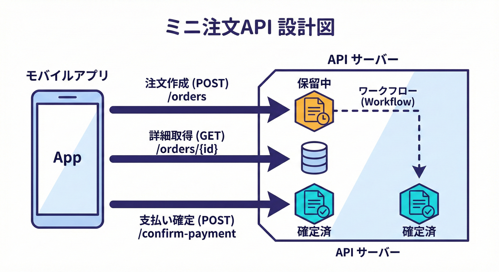
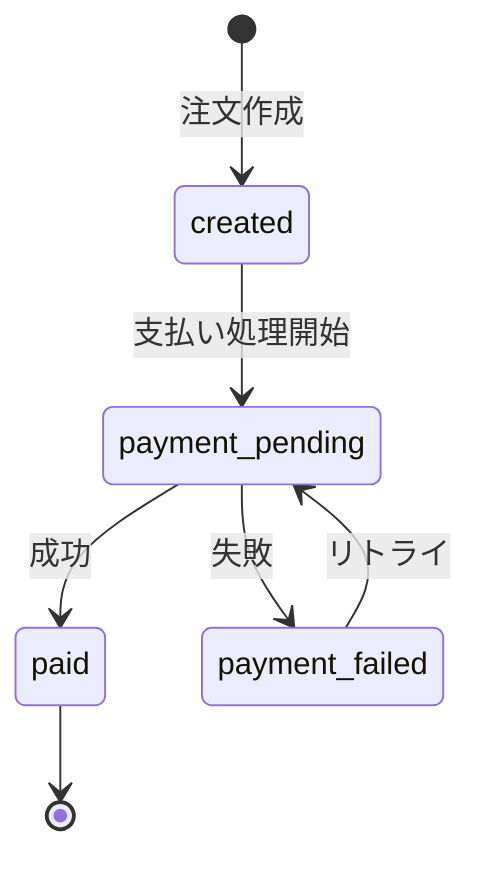

# 第5章：最小題材を決めよう（教材のミニアプリ設計）🍰🧑‍💻

## この章のゴール🎯✨

* 「冪等性が必要になる場所」がハッキリ見えるミニ題材を決める🔍🔁
* ずっと使い回せる **“ミニ注文API”** の仕様（登場人物・状態・API）を1枚にまとめる📄🧁
* 次の章以降で「冪等キー」「同時実行」「エラー設計」を乗せていける土台を作る🏗️💖



---

## まず結論：題材は「ミニ注文API」でいくよ🍰🧾

この教材では、冪等性の事故がいちばん起きやすい “こわい操作” を入れたいのね😵💦
それが **注文作成** と **支払い確定（っぽい処理）** 💳✨

* **注文作成**：連打・再送で「注文が2個できた😱」が起きやすい
* **支払い確定**：タイムアウトで「決済が2回走った😱」みたいな最悪が起きうる

そしてここがポイント👇
**Idempotency-Key（冪等キー）ヘッダー** は、POSTみたいに本来“冪等じゃない操作”を、リトライに強くするための仕組みとして標準化の議論が進んでるよ📜🔑 ([datatracker.ietf.org][1])

---

## 仕様を“ちっちゃく”して勝つ🧠✂️✨（やること / やらないこと）

題材がデカいと、冪等性の学習がボヤけるの🥺
ここは割り切って、**学習に必要な最小だけ** にするよ🙆‍♀️🌸

### やること✅

* 注文を作る（注文IDができる）🧾
* 注文の状態を見れる（作成できた？支払い済み？）👀
* 支払い確定をする（状態が変わる）💳➡️✅
* （後で）冪等キーで **二重実行を防ぐ** 🔑🔁

### やらないこと❌（全部“今は”捨てる！）

* ログイン認証（JWTとか）🔒🚫
* 本物の決済サービス連携（Stripe等）🌐🚫
* 在庫・配送・ポイント・クーポン全部🎫📦🚫
* 管理画面・UI（APIだけでOK）🖥️🚫

---

## ミニ題材のストーリー（これがあると理解が爆速）📖💨

「推しグッズ通販（ミニ）」を想像してね🛍️💖
1回目の支払い確定で成功してるのに、通信が途切れて返事が届かない…📶😇
ユーザーがもう一回押す→ **同じ処理が2回走る** → 事故💥

だから、この教材の主役はココ👇
**「支払い確定」みたいな危険操作を、同じリクエストを何回送っても壊れないようにする** 🔁🛡️

---

## 登場するデータ（型）を決めよう🧱✨

まずは“教材で使う辞書”を作る感じだよ📚💕

### Order（注文）

* `orderId`：注文ID（サーバーが作る想定）🆔
* `userId`：誰の注文か👤
* `items`：何を買ったか🧸
* `amount`：合計金額💰
* `status`：注文の状態🚦
* `createdAt` / `updatedAt`：作成・更新🕒

### OrderStatus（状態）🚦

最小でこうするよ👇（増やしたくなっても今はガマン🥺）

* `created`（注文できた！）🧾
* `payment_pending`（支払い処理中）⏳
* `paid`（支払い確定）✅💳
* `payment_failed`（支払い失敗）❌

状態遷移はこれだけでOK🙆‍♀️✨
`created → payment_pending → paid`
`created → payment_pending → payment_failed`



---

## APIの形を決める（この章のメイン）🌐🧩

ここでの目的は「冪等性の学習ポイントが自然に入るAPI」にすることだよ🔁💕

### エンドポイント一覧（最小セット）📌

1. **注文作成**

* `POST /orders`
* 注文を1つ作る🧾（ここは二重作成が起きやすい⚠️）

2. **注文取得**

* `GET /orders/{orderId}`
* 注文の状態を見る👀（安全・冪等寄り）

3. **支払い確定（危険操作🔥）**

* `POST /orders/{orderId}/confirm-payment`
* 支払い確定っぽいことをする💳✅（ここが冪等性の主戦場🔥）

4. **冪等キーのヘッダー（後で導入する約束）**

* `Idempotency-Key: <uuidなど>` 🔑
  このヘッダーは「同じ操作を1回扱いにする」ために使う流れがよく紹介されるよ📜 ([datatracker.ietf.org][1])

---

## リクエスト/レスポンス例（イメージが湧くやつ）🧠✨

### 1) 注文作成：POST /orders 🧾

**リクエスト例**

```json
{
  "userId": "u_123",
  "items": [
    { "sku": "cake_001", "qty": 1, "price": 480 },
    { "sku": "tea_002",  "qty": 2, "price": 200 }
  ]
}
```

**レスポンス例（成功）**

```json
{
  "orderId": "o_1001",
  "status": "created",
  "amount": 880
}
```

ここで起きがちな事故😱

* ユーザー連打 → `o_1001` と `o_1002` ができる
* 返事が遅い → クライアントが再送 → 二重作成

---

### 2) 注文取得：GET /orders/{orderId} 👀

**レスポンス例**

```json
{
  "orderId": "o_1001",
  "userId": "u_123",
  "status": "paid",
  "amount": 880,
  "updatedAt": "2026-01-29T12:34:56.000Z"
}
```

---

### 3) 支払い確定：POST /orders/{orderId}/confirm-payment 💳✅

ここは「同じ操作が2回走っても、結果が壊れない」ようにしたい！🔁🛡️

**リクエスト例（冪等キーつき）**

```http
POST /orders/o_1001/confirm-payment
Idempotency-Key: 8a3e1c9b-0c3f-4a62-8f31-2e1f5d6c2a10
Content-Type: application/json

{
  "paymentMethod": "card"
}
```

**レスポンス例（成功）**

```json
{
  "orderId": "o_1001",
  "status": "paid",
  "paidAt": "2026-01-29T12:35:01.000Z"
}
```

ポイント💡

* 2回目も同じ `Idempotency-Key` なら、**同じ結果を返す**（後で実装するよ🔑）
* “POSTを冪等に寄せる”考え方として、`Idempotency-Key` をサポートするのはAPI設計のベストプラクティスとしても言及されるよ📘 ([schweizerischebundesbahnen.github.io][2])

---

## 「教材のミニアプリ」設計図を1枚にまとめよう🗺️✨

ここまで決めたら、ノート（or Markdown）にこれを書けば完成👏💕

### ✅ミニ注文API：設計メモ（コピペ用）📝

* リソース：Order
* 状態：created / payment_pending / paid / payment_failed
* API：

  * POST /orders（注文作成）
  * GET /orders/{orderId}（注文取得）
  * POST /orders/{orderId}/confirm-payment（支払い確定）
* 冪等性の学習ポイント：

  * POSTはそのままだと二重実行が起きやすい
  * Idempotency-Key を導入して「同じリクエストを1回扱い」にする

---

## OpenAPI風の叩き台（ミニ版）📄✨

OpenAPIは「APIの説明書」を機械にも読める形にする仕様だよ📘
3.1系は継続的に改善されていて、3.1.1 のリリースも出てるよ🛠️ ([GitHub][3])

（まずは“雰囲気”でOK！完璧に書く必要なし🙆‍♀️）

```yaml
openapi: 3.1.1
info:
  title: Mini Order API
  version: 0.1.0
paths:
  /orders:
    post:
      summary: Create an order
      requestBody:
        required: true
        content:
          application/json:
            schema:
              type: object
              required: [userId, items]
              properties:
                userId: { type: string }
                items:
                  type: array
                  items:
                    type: object
                    required: [sku, qty, price]
                    properties:
                      sku: { type: string }
                      qty: { type: integer, minimum: 1 }
                      price: { type: integer, minimum: 0 }
      responses:
        "201":
          description: Created
  /orders/{orderId}:
    get:
      summary: Get an order
      parameters:
        - name: orderId
          in: path
          required: true
          schema: { type: string }
      responses:
        "200":
          description: OK
  /orders/{orderId}/confirm-payment:
    post:
      summary: Confirm payment (idempotent by Idempotency-Key)
      parameters:
        - name: orderId
          in: path
          required: true
          schema: { type: string }
        - name: Idempotency-Key
          in: header
          required: false
          schema: { type: string }
      requestBody:
        required: true
        content:
          application/json:
            schema:
              type: object
              required: [paymentMethod]
              properties:
                paymentMethod:
                  type: string
                  enum: [card]
      responses:
        "200":
          description: OK
        "409":
          description: Conflict
```

---

## AI活用コーナー🤖💖（そのまま貼ってOK）

### ① OpenAPIを“もうちょいちゃんと”してもらうプロンプト📄✨

* 目的：レスポンスの型（Order）をcomponentsに切り出して整理してもらう🧹

```text
あなたはOpenAPI 3.1の専門家です。
次のミニ注文API仕様を、初心者にも読みやすいOpenAPI 3.1.1 YAMLに整理してください。

- POST /orders: 注文作成。201で {orderId, status, amount} を返す
- GET /orders/{orderId}: 注文取得。200で Order を返す
- POST /orders/{orderId}/confirm-payment: 支払い確定。Idempotency-Keyヘッダーを受け取れる。200で Order を返す。競合は409

要件:
- components.schemas に Order / OrderItem / Error を作る
- status は created/payment_pending/paid/payment_failed のenum
- amount/price は整数（円）
- 例（example）も少し入れる
出力はYAMLだけにして
```

### ② “冪等性が必要な場所”の確認プロンプト🔍🔁

```text
このミニ注文APIで、冪等性が特に必要な操作を3つ挙げて、
それぞれ「何が二重になると困るか」を1行で説明して。
その上で、Idempotency-Key方式が効く理由をやさしく説明して。
```

---

## ミニ演習📝🍀（10分でOK）

### 演習A：APIの意図を1行で書こう✍️

次の3つを **1行ずつ** 書いてみてね👇

* POST /orders は何をする？🧾
* GET /orders/{orderId} は何をする？👀
* confirm-payment は何が怖い？😱

### 演習B：状態遷移を矢印で書こう🔁

* `created → payment_pending → paid`
* `created → payment_pending → payment_failed`

「失敗したらどう戻す？」は次の章以降でやるよ🧯✨

---

## チェックポイント✅✨

* [ ] ミニ題材が **小さく** まとまってる（やらないことが決まってる）✂️
* [ ] 「冪等性が必要な場所」が **APIの形として** 入ってる（confirm-payment）🔑
* [ ] Order の状態が **少なめ** で説明できる🚦
* [ ] OpenAPIの叩き台ができた📄

---

次章から、このミニ注文APIに **HTTPの冪等性の考え方** を重ねていくよ🌐🔁

[1]: https://datatracker.ietf.org/doc/draft-ietf-httpapi-idempotency-key-header/?utm_source=chatgpt.com "The Idempotency-Key HTTP Header Field"
[2]: https://schweizerischebundesbahnen.github.io/api-principles/restful/best-practices/?utm_source=chatgpt.com "Best Practices | API Principles"
[3]: https://github.com/OAI/OpenAPI-Specification/releases?utm_source=chatgpt.com "Releases · OAI/OpenAPI-Specification"

