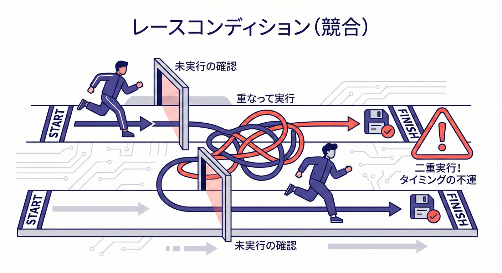
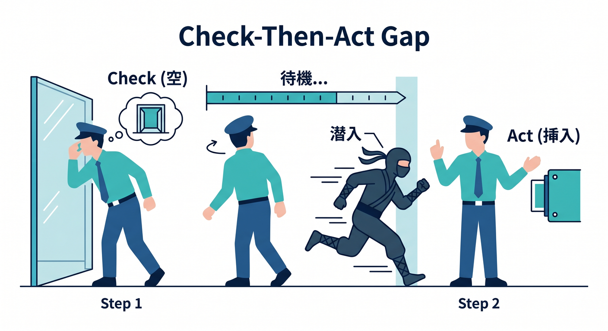
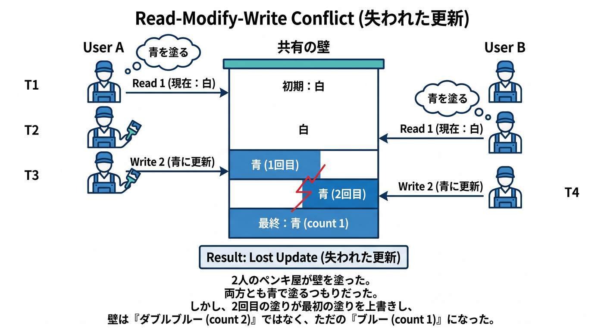
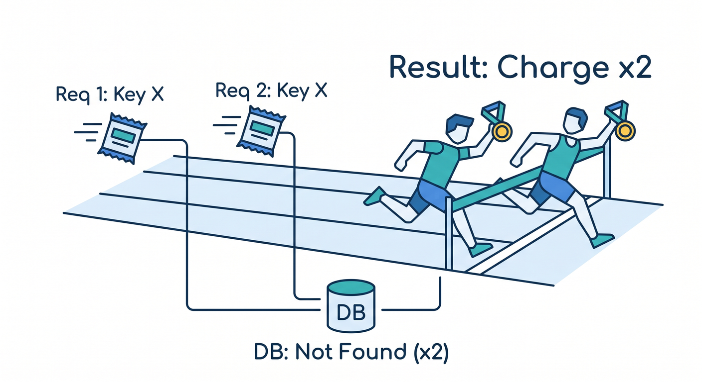
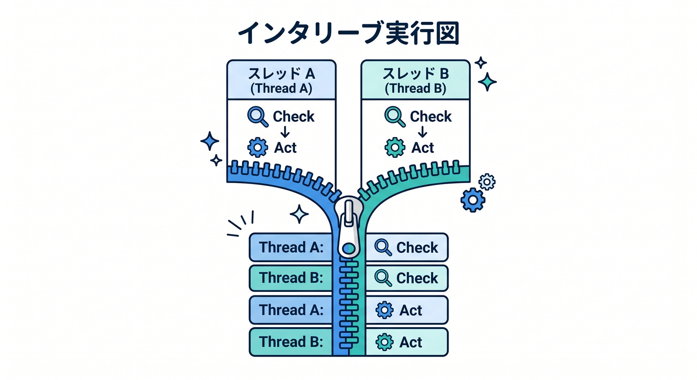
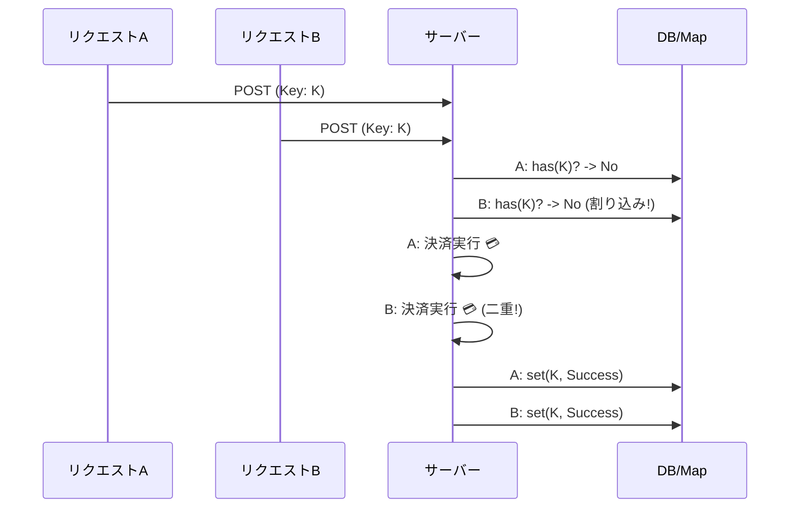

# 第15章：同時実行入門：レースコンディションって何？🏁😵‍💫

## 15.0 この章のゴール 🎯✨

この章が終わったら、これができるようになります👇😊

* 「レースコンディション（Race Condition）」を一言で説明できる 🗣️💡
* “同時に来た2リクエスト”が、なぜ壊れるかを図で説明できる 🧩🖼️
* TypeScriptで「わざとレースを起こす」→「直った版」を動かせる 🧪🔧
* 冪等キーがあっても“作り方が雑だと壊れる”のが腑に落ちる 🔑😱



---

## 15.1 「同時実行」って、どういう意味？🧵👀


サーバーにリクエストが来ると、だいたいこんな感じの処理になります👇🙂

1. 受け取る 📩
2. DBやメモリを見る 👀
3. 何か更新する ✍️
4. 外部API（決済など）を呼ぶ 💳🌐
5. 結果を返す 📤

ここでポイント！⚠️
**「同時実行」＝まったく同じ瞬間にCPUが2つ動く**って意味だけじゃないです🙅‍♀️💦
**“処理が重なって進む（オーバーラップする）”**だけで、普通に事故ります😇

特に `await` があると…

* 途中で一瞬 “席を立つ” 🪑➡️🚶‍♀️（他の処理に切り替わる）
* その間に別のリクエストが同じデータを触る 🤝💥

だから **JavaScript/Nodeの世界でもレースは起きます**🏎️💨

---

## 15.2 レースコンディションの正体 🏎️💥

レースコンディションを超ざっくり言うと👇😵‍💫
**「処理の順番（タイミング）しだいで結果が変わっちゃう状態」**です🎲💣

よくある “事故の型” はこれ👇（超重要！）✅

### ① チェックしてから実行（Check-then-Act）🧐➡️🏃‍♀️




* 「まだ処理してないよね？」を確認して
* そのあと処理する
* でも、その間に別のリクエストが割り込む😇

### ② 読んでから足す（Read-Modify-Write）📖➕✍️




* 値を読む（在庫=1）
* 減らす（-1）
* 書く（在庫=0）
* でも2人が同時に読むと「1が2回読まれる」😱

---

## 15.3 典型事故：冪等キーがあっても二重決済！？🔑💳😱




冪等キー方式（10〜14章）って、だいたいこういう発想でした👇🙂

* 同じキーなら「同じ結果を返す」📦🔁
* だから二重実行を防げるはず！✨

…でも！⚠️
**“同時に2つ来た”場合、作りが甘いと二重実行が起きます**😇💥
理由はシンプルで👇

* 1つ目：「まだMapにないね」→ 決済へ 💳
* 2つ目：「まだMapにないね」→ 決済へ 💳
* どっちも同じキーなのに、**“まだ保存してない瞬間”が被る**んです🧨

---

## 15.4 ミニ実験：レースを“わざと起こす”🧪🔥

### 準備（Windows / PowerShell）🪟⚡

新しいフォルダでOKです📁✨

```powershell
mkdir ch15-race
cd ch15-race
npm init -y
npm i -D typescript @types/node
```

Node.js は最近、**TypeScriptファイル（.ts）をそのまま実行できる**機能が入っています（型はチェックせず、型注釈を取り除いて動かすイメージ）📌✨ ([Node.js][1])
エディタ用に `tsconfig.json` も置いておくと快適です😊🧠（推奨設定あり） ([Node.js][2])

```powershell
code .
```

`tsconfig.json` を作成👇

```json
{
  "compilerOptions": {
    "noEmit": true,
    "target": "esnext",
    "module": "nodenext",
    "rewriteRelativeImportExtensions": true,
    "erasableSyntaxOnly": true,
    "verbatimModuleSyntax": true
  }
}
```

---

### ① まずはバグる版（Naive）😇💥

`race-naive.ts` を作って、これを貼ります👇🧪

```ts
// race-naive.ts
const sleep = (ms: number) => new Promise<void>((r) => setTimeout(r, ms));

let chargeCount = 0;

// 「冪等キー → レスポンス」のつもり（でも作りが甘い例）
const responseCache = new Map<string, string>();

async function confirmPaymentNaive(idempotencyKey: string): Promise<string> {
  // ✅ 同じキーなら同じ結果を返したい…！
  if (responseCache.has(idempotencyKey)) {
    return responseCache.get(idempotencyKey)!;
  }

  // ❗ ここで await が入る（外部決済API呼び出しのつもり）
  await sleep(50);

  // ❗ 副作用（決済）が走る
  chargeCount++;
  const res = `OK: charged=${chargeCount}`;

  // ✅ これで次から同じ結果…のつもり
  responseCache.set(idempotencyKey, res);
  return res;
}

async function main() {
  const key = "idem-123";

  // 「同じキーで同時に2回」💥
  const [a, b] = await Promise.all([
    confirmPaymentNaive(key),
    confirmPaymentNaive(key),
  ]);

  console.log("result A:", a);
  console.log("result B:", b);
  console.log("chargeCount:", chargeCount);
  console.log("cache:", responseCache.get(key));
}

main().catch(console.error);
```

実行👇🚀
（Node v22.18.0以降なら `.ts` をそのまま実行できます） ([Node.js][1])
もしうまく動かなければ `--experimental-strip-types` でもOKです ([Node.js][1])

```powershell
node .\race-naive.ts
## うまくいかない時：
node --experimental-strip-types .\race-naive.ts
```

**起きてほしい（事故る）結果イメージ**😱💳

* `chargeCount` が **2** になる（＝二重決済っぽい！）
* `result A` と `result B` がズレることもある（タイミング次第）🎲

---

### ② どんな順番で壊れた？（交互実行図）🧩🖼️




同じキーなのに二重実行になる “最悪の並び” を図にするとこう👇😵‍💫

* リクエストA：`has(key)` → **false**
* リクエストB：`has(key)` → **false**（Aがまだ保存してない）
* A：決済（chargeCount++）💳
* B：決済（chargeCount++）💳💳
* A：cacheに保存
* B：cacheに保存（上書き）🫠

つまり、**「チェック」と「保存」の間に await がある**と、割り込み放題なんです⚔️💥



---

### ③ ちょい改善：処理中を共有する（in-flight Promise）⏳🤝✨


同時に来た2つ目は、**1つ目の処理が終わるのを待つ**ようにします🙂
「処理中」という状態を共有するだけで、メモリ内ならかなり防げます✅

`race-fixed.ts`👇

```ts
// race-fixed.ts
const sleep = (ms: number) => new Promise<void>((r) => setTimeout(r, ms));

let chargeCount = 0;

const responseCache = new Map<string, string>();
const inFlight = new Map<string, Promise<string>>();

async function confirmPaymentBetter(idempotencyKey: string): Promise<string> {
  // 1) もう結果があれば即返す ✅
  const cached = responseCache.get(idempotencyKey);
  if (cached) return cached;

  // 2) いま誰かが処理中なら、それを待つ ✅
  const running = inFlight.get(idempotencyKey);
  if (running) return running;

  // 3) 自分が「代表で処理する」Promiseを登録する ✅（awaitより先に！）
  const p = (async () => {
    try {
      await sleep(50); // 外部決済APIのつもり

      chargeCount++;
      const res = `OK: charged=${chargeCount}`;

      responseCache.set(idempotencyKey, res);
      return res;
    } finally {
      inFlight.delete(idempotencyKey);
    }
  })();

  inFlight.set(idempotencyKey, p);
  return p;
}

async function main() {
  const key = "idem-123";

  const [a, b] = await Promise.all([
    confirmPaymentBetter(key),
    confirmPaymentBetter(key),
  ]);

  console.log("result A:", a);
  console.log("result B:", b);
  console.log("chargeCount:", chargeCount);
  console.log("cache:", responseCache.get(key));
}

main().catch(console.error);
```

実行👇🚀

```powershell
node .\race-fixed.ts
## うまくいかない時：
node --experimental-strip-types .\race-fixed.ts
```

期待する結果👇😊✨

* `chargeCount` が **1** になる 🎉
* `result A` と `result B` が同じになる 🔁✅

---

## 15.5 レースを見抜くコツ 👀🔍✨

コードを読んでて、これが見えたらレース疑い濃厚です⚠️😵‍💫

* `if (まだやってない)` のあとに `await` がある 🧐➡️⏳
* `read → await → write` の形になってる 📖➡️⏳➡️✍️
* 「同じキーは1回だけ」のはずなのに、**状態を置くのが遅い**🐢💦
* たまにしか起きない（再現しにくい）🎲😇

---

## 15.6 ミニ演習 ✍️🎓💖

### 演習1：交互実行を埋めよう🧩

次の空欄を埋めて、二重決済になる順番を完成させてね🙂

* A: has(key) → (　　　)
* B: has(key) → (　　　)
* A: chargeCount++ → (　　　)
* B: chargeCount++ → (　　　)
* A: cache.set
* B: cache.set

### 演習2：わざと “起きやすく” してみよう🧪

`race-naive.ts` の `sleep(50)` を `sleep(200)` にして、事故率が上がるか見てみよう😈🔥

### 演習3：キーを変えたらどうなる？🔑🔁

同時に来る2リクエストのキーを

* 同じキー
* 違うキー
  で比べて、`chargeCount` がどう変わるか観察しよう👀✨

---

## 15.7 AI活用コーナー 🤖💡✨

### ① レースを“料理”で例えて🍳😂

コピペ用👇

```text
レースコンディションを、料理や買い物の例えで説明して。
「チェックしてから実行（Check-then-Act）」が割り込まれる感じが伝わるようにして。
```

### ② 交互実行の“最悪パターン”を作らせる🧩

```text
このコード（貼り付ける）で、二重決済が起きる「処理の順番（インターリーブ）」を
番号付きで10ステップ以内に書いて。
```

### ③ テスト観点を出させる🧪✅

```text
この処理のレースコンディションを検出するテスト観点を10個出して。
「同じキー」「同時」「遅延」「例外」も含めて。
```

---

## 15.8 次章への橋渡し 🪜✨

この章でやったのは、「同時に来ると壊れる」体験と、レースの見分け方でした🏁🙂
次はもっと実務っぽく👇へ進みます💪

* **第16章：ユニーク制約**で“物理的に二重登録できない”世界へ🗄️🛡️
* **第17章：ロック/Atomic**で“先着1名だけ実行”を堅くする🔒⚡

（メモリ内での小技は効くけど、プロセスが複数になると別の作戦が必要になってくるよ〜！😇🧠）

[1]: https://nodejs.org/en/learn/typescript/run-natively "Node.js — Running TypeScript Natively"
[2]: https://nodejs.org/api/typescript.html "Modules: TypeScript | Node.js v25.5.0 Documentation"

