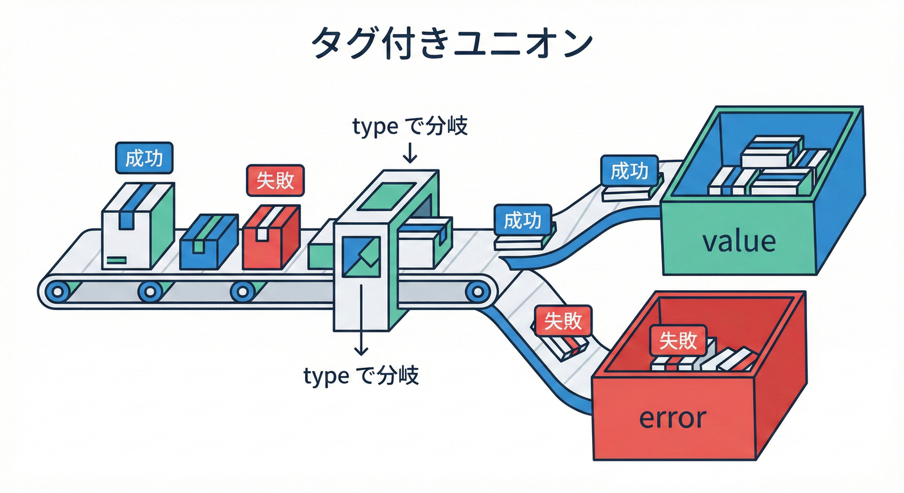
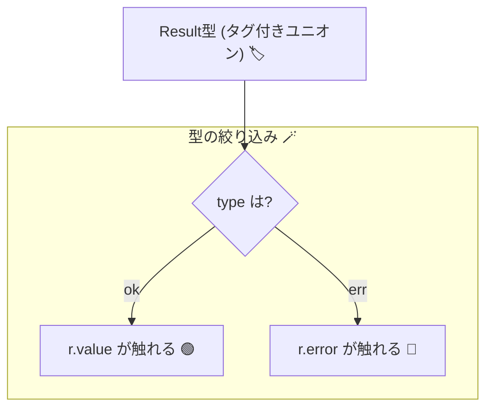

# 第9章　型の武器②：Discriminated Union（タグ付きユニオン）🏷️🧠✨



## 0) まず今日のゴール🎯💖

この章が終わると…👇

* 「状態」や「結果（成功/失敗）」を **型で安全に分岐**できるようになる🙆‍♀️✨
* `if` / `switch` の分岐で、**取り出せるプロパティが自動で変わる**感覚がつかめる🪄
* “分岐の書き忘れ” を **コンパイルで怒らせる**（漏れゼロに近づく）💥🧯

---

## 1) 最新トピックちょい足し🗞️✨（2026の空気感）

* 現行の安定版ラインとしては **TypeScript 5.9.3** が「Latest」として公開されてるよ🧩 ([GitHub][1])
* そして今は、コンパイラ等をネイティブ化する **TypeScript 7 “Native Preview”** の動きが進んでて、巨大プロジェクトで **10x級の高速化**が話題になってるよ⚡🚀 ([Microsoft Developer][2])

※でも安心してね😊
この章の「タグ付きユニオン」は、まさに TypeScript が得意な分野で、今後もずっと“主役級の武器”だよ💎

---

## 2) Discriminated Unionってなに？🧐🏷️

ひとことで言うと👇

**「同じ“タグ”（判別用フィールド）を持つ複数の型を、ユニオンでまとめたもの」**だよ✨
タグの値（例：`"success"` / `"failure"`）を見て、TypeScript が型を絞り込んでくれるの😊🪄
公式ドキュメントでも「共通フィールド（タグ）＋リテラル型で絞り込み」って形で紹介されてるよ📚 ([TypeScript][3])

---

## 3) ありがちな事故😱：「成功っぽいのにerrorが入ってる」みたいな“嘘”

たとえば「成功/失敗」を雑に書くと…👇

```ts
type ResultBad<T> = {
  ok: boolean;
  value?: T;
  error?: string;
};

// これ、型的には通っちゃう…😱（成功なのに error がある）
const r: ResultBad<number> = { ok: true, error: "えっ" };
```

こういう「矛盾した状態」が入ると、あとで分岐が地獄になるの🥲🌀
そこで登場するのが **タグ付きユニオン**💖

---

## 4) まずは鉄板：Success / Failure をタグ付きユニオンで作る🎁✨

ここではタグに `type` を使うよ（`kind` でも `state` でもOK😊）

```ts
type Ok<T> = {
  type: "ok";
  value: T;
};

type Err<E> = {
  type: "err";
  error: E;
};

type Result<T, E> = Ok<T> | Err<E>;

const ok = <T>(value: T): Ok<T> => ({ type: "ok", value });
const err = <E>(error: E): Err<E> => ({ type: "err", error });
```

### 分岐が“型で”安全になる🎯✨

```ts
function divide(a: number, b: number): Result<number, { kind: "div_by_zero" }> {
  if (b === 0) return err({ kind: "div_by_zero" });
  return ok(a / b);
}

const r = divide(10, 2);

if (r.type === "ok") {
  // ここでは r は Ok<number> に絞られる✨
  console.log(r.value.toFixed(2));
} else {
  // ここでは r は Err<...> に絞られる✨
  console.log(r.error.kind);
}
```

この「分岐した瞬間に、触れるプロパティが自動で変わる」感覚が超大事🧠✨



TypeScript は `if/switch` の流れを見て型を絞る（＝narrowing）って公式にも説明されてるよ📚 ([TypeScript][4])

---

## 5) 不変条件に効く✨：状態ごとに“持ってていい情報”を変える🚦💎

ここが本題っぽいところ！😍
「状態が違うと、成立するルール（不変条件）が違う」ってあるよね？

例：「注文」は👇みたいに状態で必須項目が変わる💡

* `draft`：まだ支払い前 → `paidAt` は存在しない
* `paid`：支払い済み → `paidAt` は必須
* `shipped`：発送済み → `shippedAt` と `trackingNo` が必須

タグ付きユニオンで表すとこう👇

```ts
type DraftOrder = {
  state: "draft";
  id: string;
  items: { sku: string; qty: number }[];
};

type PaidOrder = {
  state: "paid";
  id: string;
  items: { sku: string; qty: number }[];
  paidAt: Date;
};

type ShippedOrder = {
  state: "shipped";
  id: string;
  items: { sku: string; qty: number }[];
  paidAt: Date;
  shippedAt: Date;
  trackingNo: string;
};

type Order = DraftOrder | PaidOrder | ShippedOrder;
```

### 使う側が“間違えようがない”🎮✨

```ts
function printOrderSummary(order: Order) {
  switch (order.state) {
    case "draft":
      console.log("下書き📝", order.items.length);
      return;

    case "paid":
      console.log("支払い済み💰", order.paidAt.toISOString());
      return;

    case "shipped":
      console.log("発送済み📦", order.trackingNo);
      return;
  }
}
```

これ、**draft のときに `paidAt` を触ろうとするとコンパイルで止まる**のが最高なの🥹✨
公式の “Discriminating Unions” でも `state` を見て `switch` で安全に絞る例が出てくるよ📚 ([TypeScript][3])

---

## 6) “分岐の書き忘れ”を型で止める🔥：never で網羅チェック🕸️✅

「ケース追加したのに、switch 直し忘れた…😇」を防ぐやつ！

TypeScript には **never** を使った網羅チェックがあるよ（公式ドキュメントにも載ってる）📚 ([TypeScript][4])

```ts
function assertNever(x: never): never {
  throw new Error("Unhandled case: " + JSON.stringify(x));
}

function handle(order: Order) {
  switch (order.state) {
    case "draft":
      return "draft";
    case "paid":
      return "paid";
    case "shipped":
      return "shipped";
    default:
      // ここに来た時点で「全部扱えてない」＝コンパイルで怒られるようにする💥
      return assertNever(order);
  }
}
```

✅ これで、あとから `state: "canceled"` を追加したら **handle が赤くなる**🎉
（未来の自分を守る魔法だよ🪄🧙‍♀️）

---

## 7) ちょい便利Tips🧠✨：分解代入しても安全に絞れる（今どきTS）🧩

昔は「タグとpayloadを分けて取り出す」と、関係が切れて絞れないことがあったの🥲
でも TypeScript 4.6 から、**分解代入したタグのチェックで payload も絞れる**ようになったよ✨ ([TypeScript][5])

```ts
type Action =
  | { kind: "NumberContents"; payload: number }
  | { kind: "StringContents"; payload: string };

function processAction(action: Action) {
  const { kind, payload } = action;

  if (kind === "NumberContents") {
    payload.toFixed(1); // number ✅
  } else {
    payload.trim();     // string ✅
  }
}
```

---

## 8) よくあるハマりどころ😵‍💫（ここ大事！）

### ❌ タグが optional（`type?: "ok" | "err"`）

→ 絞り込みが弱くなって、型の恩恵が激減するよ🥲
**タグは必須**にしよ💪

### ❌ タグの名前がバラバラ

→ `type` と `kind` が混ざると読みづらい＆ミスりやすい😇
プロジェクト内で **`type` / `kind` / `state` のどれかに統一**がおすすめ✨

### ❌ `as any` で黙らせる

→ それ、**型安全を自分で壊してる**合図かも🚨
「境界で検証して、ドメイン内では信じる」流れで直そうね🛡️

---

## 9) ミニ課題🎒✨（手を動かすやつ！）

### 課題A：Resultを作って使う🎯

1. `Result<T, E>` を作る（`ok/err` の関数も）
2. `parseIntSafe(input: string)` を作る

* 成功：`Ok<number>`
* 失敗：`Err<{ type: "nan"; input: string }>`

### 課題B：状態型を作る🚦

ログイン画面を想像して👇の3状態をタグ付きユニオンで作ってみてね💖

* `idle`（未入力）
* `submitting`（送信中）
* `error`（エラー：メッセージ必須）

### 課題C（ちょい上級）🔥：never網羅チェック

状態に `success` を追加して、**switch が赤くなるのを確認**→直す✅

---

## 10) AI活用コーナー🤖💖（この章と相性バツグン！）

AIはここで超強いよ〜！✨ たとえば👇

* 「この `Order` の state を追加するとしたら、どんなケースがありえる？10個出して」🧠
* 「この `switch` の分岐漏れが起きる変更例を作って」🕵️‍♀️
* 「Resultのエラー型を、初心者に優しい分類にして」🫶

ポイントは「コード生成」より **観点出し・漏れ探し**が強いところ💪✨

---

## まとめ💎✨

* Discriminated Union は「タグで判別できるユニオン」🏷️
* `if/switch` で分岐すると、TypeScript が型を自動で絞ってくれる🪄 ([TypeScript][4])
* `never` を使うと **分岐の書き忘れ**をコンパイルで止められる🔥 ([TypeScript][4])
* 状態ごとの不変条件（必須/禁止フィールド）を **型で表現**できるようになる🚦💎

次の第10章では、この章の気持ちよさをさらに強化して「混ぜない型（Branded/Opaque風）」で事故を減らしていくよ😎🏷️✨

[1]: https://github.com/microsoft/typescript/releases "Releases · microsoft/TypeScript · GitHub"
[2]: https://developer.microsoft.com/blog/typescript-7-native-preview-in-visual-studio-2026 "TypeScript 7 native preview in Visual Studio 2026 - Microsoft for Developers"
[3]: https://www.typescriptlang.org/docs/handbook/unions-and-intersections.html "TypeScript: Handbook - Unions and Intersection Types"
[4]: https://www.typescriptlang.org/docs/handbook/2/narrowing.html "TypeScript: Documentation - Narrowing"
[5]: https://www.typescriptlang.org/docs/handbook/release-notes/typescript-4-6.html "TypeScript: Documentation - TypeScript 4.6"
