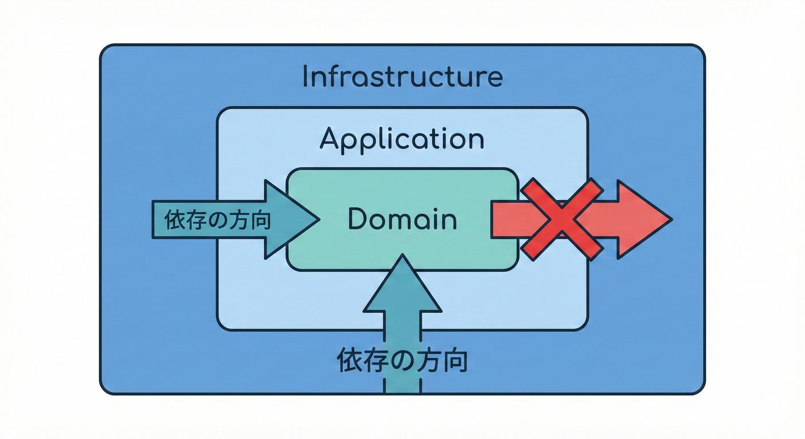
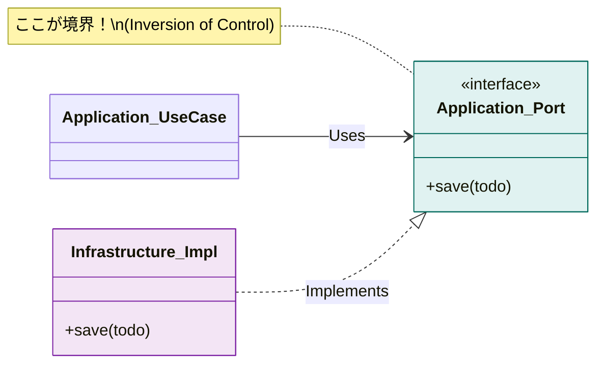

# 第4章：依存の向きを固定する（import事故を防ぐ）➡️🚧✨

この章はね、「レイヤードが崩れる一番の原因＝importの向き」を先に封じちゃう回だよ〜！🥰🧱
**ここが固まると、あとが全部ラク**になる✨（テストも変更も怖くなくなるやつ！🧪🌸）

---

## 1) この章のゴール🎯✨



読み終わったら、これができるようになってればOKだよ✅

* 「どの層がどの層をimportして良いか」**即答**できる🗣️✨
* 「そのimportがダメな理由」を**説明**できる🙅‍♀️➡️📚
* **ルール違反を“自動で止める仕組み”**を入れられる（Lint/検査）🛡️🤖

---

## 2) そもそも、なぜimportが危険なの？💥📦

TypeScriptの`import`って、ただの行じゃなくて **依存関係の“配線”** なんだよね🔌✨
1回でも “内側が外側をimport” しちゃうと…

* 内側（Domain）が外側事情（DB/HTTP/フレームワーク）に引きずられる😵‍💫
* 変更が連鎖して「どこ直せば…？」状態になる🌀
* テストが急に難しくなる（外側が絡むから）🧪💦

しかもESLintの`no-restricted-imports`みたいなルールは **静的importに対して働く**って前提があるよ（`import()`みたいな動的は別扱い）⚠️
→ だからこそ「基本は静的importを正しく使って、境界を守る」って思想が強いよ〜🧱✨ ([eslint.org][1])

---

## 3) 依存ルールの基本：外側→内側はOK、内側→外側はNG🙅‍♀️➡️✅

レイヤードの鉄板ルールこれ👇✨

* ✅ **Presentation → Application → Domain** の方向はOK
* ✅ **Infrastructure →（Application/Domainの“抽象”）** はOK
* ❌ **Domain/Application が Infrastructure/Presentation を import** はNG

イメージはこう🗺️✨

```txt
Presentation  ──▶  Application  ──▶  Domain
     ▲                 ▲
     │                 │
     └── Infrastructure ┘   （※実装は外側、抽象は内側）
```

---

## 4) OK/NG表（この章のメイン暗記カード📇✨）

| From＼To            | Presentation | Application | Domain |           Infrastructure |
| ------------------ | -----------: | ----------: | -----: | -----------------------: |
| **Presentation**   |            – |           ✅ |      ✅ | ✅(※できればApplication経由が綺麗) |
| **Application**    |            ❌ |           – |      ✅ |                        ❌ |
| **Domain**         |            ❌ |           ❌ |      – |                        ❌ |
| **Infrastructure** |            ❌ |           ✅ |      ✅ |                        – |

ポイント💡

* **Applicationは“手順”の層**：Domainは呼ぶけど、DBの実装は知らない🙈
* **Domainは“ルール”の核**：外の都合（HTTP/DB/環境変数）を知らない🙅‍♀️

---

## 5) よくあるimport事故あるある👀💥（見たら即止めて！🚨）

### 事故① DomainがDBクライアントをimportしちゃった🗄️💀

「ToDoを保存したい」→ Domainに保存処理を書きたくなって…
**DomainがPrisma/Drizzle/DB SDKをimport** → 一瞬で崩壊😇

### 事故② ApplicationがHTTPフレームワーク型を握る🌐🧷

`Request`/`Response`みたいな型をApplicationに入れ始めると、
ユースケースが “Web専用” になっちゃう😵‍💫

### 事故③ PresentationがInfrastructure直呼びして、Application素通り🎛️➡️🗄️

UIから「DB直接叩く」みたいになると、手順が散らばって再利用もテストもムリゲー🌀

---

## 6) じゃあどうする？✨「Port（内側のinterface）」で受け止める🔌🌸

“内側→外側”が必要っぽく見える場面って、だいたい
**「内側は“やりたいこと”だけ言って、実装は外側にやらせる」**で解けるよ😊

### ✅ 例：Applicationに「保存したい」をinterfaceで宣言する

**Application（内側）**：抽象（interface）だけ置く✨

```ts
// src/application/ports/TodoRepository.ts
import type { Todo } from "../../domain/Todo";

export interface TodoRepository {
  save(todo: Todo): Promise<void>;
  findAll(): Promise<Todo[]>;
}
```

**Domain（さらに内側）**：ルールとモデルだけ💎

```ts
// src/domain/Todo.ts
export type TodoId = string;

export class Todo {
  constructor(
    public readonly id: TodoId,
    public readonly title: string,
    public readonly done: boolean,
  ) {
    if (!title.trim()) throw new Error("タイトルは空にできないよ🥺");
  }

  complete(): Todo {
    if (this.done) return this;
    return new Todo(this.id, this.title, true);
  }
}
```

**Infrastructure（外側）**：DB/保存の実装を書く🗄️

```ts
// src/infrastructure/todo/SqlTodoRepository.ts
import type { TodoRepository } from "../../application/ports/TodoRepository";
import { Todo } from "../../domain/Todo";

export class SqlTodoRepository implements TodoRepository {
  async save(todo: Todo): Promise<void> {
    // ここでDBアクセス（詳細は外側に隔離✨）
  }

  async findAll(): Promise<Todo[]> {
    return [];
  }
}
```

これで

* Domain/ApplicationはDBを知らない🙈
* Infrastructureは内側の約束（interface）に従うだけ🤝✨
  が成立するよ〜！🧱🌸


```mermaid
classDiagram
    direction LR
    class Application_Port {
        <<interface>>
        +save(todo)
    }
    class Infrastructure_Impl {
        +save(todo)
    }
    class Application_UseCase {
    }

    Application_UseCase --> Application_Port : Uses
    Infrastructure_Impl ..|> Application_Port : Implements

    note for Application_Port "ここが境界！\n(Inversion of Control)"
    
    style Application_Port fill:#e0f2f1,stroke:#00695c
    style Infrastructure_Impl fill:#f3e5f5,stroke:#7b1fa2
```

---

## 7) importを“事故りにくくする”フォルダ構成🗂️✨

おすすめは層をそのままディレクトリにしちゃう形👇

```txt
src/
  presentation/
  application/
    ports/
  domain/
  infrastructure/
```

そして、**深い相対パス地獄**（`../../../../`）は事故の温床だから、
`paths`で別名importを作るのが超おすすめ🧵✨（読みやすさ＋境界の意識が上がる！）

`baseUrl`と`paths`はTypeScript公式の定番機能だよ📘✨ ([TypeScript][2])

```json
// tsconfig.json（例）
{
  "compilerOptions": {
    "baseUrl": ".",
    "paths": {
      "@presentation/*": ["src/presentation/*"],
      "@application/*": ["src/application/*"],
      "@domain/*": ["src/domain/*"],
      "@infrastructure/*": ["src/infrastructure/*"]
    }
  }
}
```

---

## 8) 依存ルールを“人力で守らない”🔥 自動で止めよう🛡️🤖

「気をつける」は絶対負けるので（笑）
**Lintで止める**のが勝ちパターンだよ〜😂✨

### A. ESLint（Flat Config）をベースにする🧼✨

最近の流れは`eslint.config.*`の **Flat Config** が中心だよ📘 ([eslint.org][3])
TypeScript向けの最短セットも公式が案内してる✨ ([typescript-eslint.io][4])

---

### B. まずは手堅く：`no-restricted-imports`で“禁止import”を作る🚫📦

ESLint公式の禁止ルール👇 ([eslint.org][1])

例：**domain配下から infrastructure/presentation を禁止**

```js
// eslint.config.mjs（抜粋イメージ）
import eslint from "@eslint/js";
import { defineConfig } from "eslint/config";
import tseslint from "typescript-eslint";

export default defineConfig(
  eslint.configs.recommended,
  tseslint.configs.recommended,
  {
    files: ["src/domain/**/*.{ts,tsx}"],
    rules: {
      "no-restricted-imports": [
        "error",
        {
          patterns: [
            "@infrastructure/*",
            "@presentation/*",
            "../infrastructure/*",
            "../presentation/*"
          ]
        }
      ]
    }
  }
);
```

これだけでも「Domainが外側を掴む事故」はかなり減るよ✅✨

---

### C. さらに強く：`eslint-plugin-boundaries`で“層ルール”を宣言する🧱📏✨

このプラグインは「要素タイプ（=層）」を定義して
**どの層がどの層をimportできるか**をルール化できるよ！💖 ([jsboundaries.dev][5])

> 「レイヤードをコードで強制する」に一番近い感じ✨
> （大きめプロジェクトほど効く〜！）

---

### D. `eslint-plugin-import`の`import/no-restricted-paths`も便利🧭✨

「このフォルダから、あのフォルダへはimport禁止」みたいな**ゾーン指定**ができるやつ！ ([GitHub][6])

---

### E. 依存グラフ検査：循環や違反を“まとめて検出”🕸️🔍

* **dependency-cruiser**：依存のルール検証・可視化に強い🧠✨ ([GitHub][7])
* **madge**：循環依存チェックで有名だよ🌀 ([DEV Community][8])
* ESLint側でも `import/no-cycle` で循環を検出できる（万能じゃないけど強い）🧪 ([GitHub][9])

---

## 9) ミニ演習🧩✨（手を動かすと一気に理解できるよ〜！）

### 演習① OK/NG表を“自分の言葉で”埋めよう📝💗

さっきの表を見ずに、これを言ってみて👇

* 「ApplicationがInfrastructureをimportしてダメな理由は？」
* 「InfrastructureがDomainをimportしてOKな理由は？」

---

### 演習② “違反import”を直してみよう🔧✨

次の状態、どこがダメで、どう直す？👀

```txt
src/domain/Todo.ts  が  src/infrastructure/db.ts をimportしている
```

ヒント💡：

* Domainから「保存したい」をinterfaceで言う
* 実装はInfrastructureに置く
* 組み立ては入口（後で出てくるComposition Root）でやる🏗️✨

---

### 演習③ ESLintで“止まる”のを確認しよう🛑✅

* `src/domain/`にわざと `@infrastructure/...` をimportしてみる
* ESLintが怒ってくれたら勝ち🎉（“人力注意”卒業！）

---

## 10) AI活用コーナー🤖💬（めっちゃ相性いいよ✨）

そのままコピって使えるプロンプト例だよ〜！🥳

* 「このツリー構成で、依存ルール違反になりそうなimportを列挙して👉」🌳🔎
* 「Domainが外側に依存してる匂いのコードを見つけて、修正案（Port案）を出して💡」🔌✨
* 「`eslint-plugin-boundaries`で、presentation/application/domain/infrastructureの許可表を設定したい。設定例ちょうだい📏」🧱

---

## 11) まとめ🍬✨（ここだけ覚えればOK！）

* レイヤード崩壊の8割は **importの向き** から💥
* **外側→内側**はOK、**内側→外側**はNG🙅‍♀️
* 迷ったら **「内側にinterface（Port）」「外側に実装」**🔌✨
* そして最後は **Lint/検査で自動化**🛡️🤖
  （ESLintのFlat Configや、境界プラグインが今どきの流れだよ〜📘✨ ([eslint.org][3])）

おまけ豆知識💡：
最近のNodeは **v24がActive LTS**で、v25がCurrentって位置づけだよ📌（セキュリティリリースも継続中） ([Node.js][10])
依存の境界を固めておくと、こういう更新の波でも “影響範囲が読める” から強いんだ〜✨🛟

---

次の章（第5章）で、ここまでのルールを“気持ちよく回る”設定（strictやLint整備）にしていこうね🛠️💖

[1]: https://eslint.org/docs/latest/rules/no-restricted-imports?utm_source=chatgpt.com "no-restricted-imports - ESLint - Pluggable JavaScript Linter"
[2]: https://www.typescriptlang.org/tsconfig/baseUrl.html?utm_source=chatgpt.com "TSConfig Option: baseUrl"
[3]: https://eslint.org/docs/latest/use/configure/configuration-files "Configuration Files - ESLint - Pluggable JavaScript Linter"
[4]: https://typescript-eslint.io/getting-started/ "Getting Started | typescript-eslint"
[5]: https://www.jsboundaries.dev/docs/rules/ "Rules Overview | JS Boundaries"
[6]: https://github.com/import-js/eslint-plugin-import/blob/main/docs/rules/no-restricted-paths.md?utm_source=chatgpt.com "eslint-plugin-import/docs/rules/no-restricted-paths.md at main"
[7]: https://github.com/sverweij/dependency-cruiser/blob/main/doc/rules-reference.md?utm_source=chatgpt.com "dependency-cruiser/doc/rules-reference.md at main"
[8]: https://dev.to/greenroach/detecting-circular-dependencies-in-a-reacttypescript-app-using-madge-229?utm_source=chatgpt.com "Detecting Circular Dependencies in a React/TypeScript ..."
[9]: https://github.com/import-js/eslint-plugin-import/blob/main/docs/rules/no-cycle.md?utm_source=chatgpt.com "eslint-plugin-import/docs/rules/no-cycle.md at main"
[10]: https://nodejs.org/en/about/previous-releases?utm_source=chatgpt.com "Node.js Releases"
