# 第14章：Infrastructure入門② 外部APIを“翻訳”する📡🈂️✨

この章のゴールはひとつだけ😊
**外部APIのクセ（形式・失敗・遅い・たまに落ちる）を、アプリの中心（Domain/Application）に持ち込まない**で、ちゃんと扱えるようになることだよ〜！💪🧁

---

## 0. まず結論：外部APIは“別の国の言葉”🗺️🗣️

外部APIって、だいたいこう👇

* 返ってくるJSONの形が**自分のドメインと合わない**（snake_case/謎のnull/文字列日付…）😵‍💫
* **失敗の種類が多すぎ**（タイムアウト/429/5xx/ネットワーク断/JSON壊れてる）💥
* “たまに遅い”が一番やっかい（待ってるだけで詰む）🐢💤
* 仕様がいつのまにか変わる（フィールドが増える/減る）🔧🌀

だから、やるべきことはこれ👇

✅ **Infrastructure層で「翻訳（Translation）」して**
✅ Application/Domainには「いつも同じ形・いつも同じ失敗の表現」で渡す🎁

---

## 1. 本日時点の“最新前提”メモ🧭✨（設計判断に効くやつ）

* Node.js はリリースラインが進んでいて、**v24 が Active LTS**、v22 は Maintenance LTS という位置づけだよ（2026-01-12 更新）。([Node.js][1])
* Node には **組み込みの `fetch()`** があって、内部は undici ベース（Node v18 以降で組み込み、`fetch` は Node 21 で stable 扱いの告知）。([GitHub][2])
* `fetch()` は**放っておくと待ち続けることがある**ので、**タイムアウトは自分で付ける設計が必須**（AbortController / `AbortSignal.timeout()` が定番）。([Node.js][3])
* TypeScript は npm 上の latest が **5.9.3（2025-09-30 公開）**で、6.0/7.0 は“橋渡し〜ネイティブ化”の大きい流れが進行中（早期2026をターゲットの話）。([npm][4])

この章の設計は、上の前提（特に **「fetch はある」「タイムアウトは自前」**）に乗っかっていくよ〜☺️🧋

---

## 2. この章で作るもの（完成イメージ）🎁✨

例として「読書ログ」っぽい題材にするね📚
外部の書誌API（例：ISBN検索）から情報を取ってきて、アプリ内はこういう形で扱えるようにする！

* 外部：`{ title: "...", publish_date: "...", authors: [...] }` みたいな雑多JSON
* 内部：`BookMeta { title: BookTitle, authors: AuthorName[], publishedAt?: YYYYMMDD }` みたいに**アプリ都合で整えた形**💎

そして失敗も揃える👇

* 外部：タイムアウト・429・5xx・ネット断・JSON壊れ…
* 内部：`ExternalServiceUnavailable` / `ExternalRateLimited` / `ExternalContractBroken` みたいに**分類して返す**🧩

---

## 3. 章の核🔥：翻訳レイヤ（ACLっぽい考え）🈂️🧱


DDD でいう **ACL（Anti-Corruption Layer）** 的な発想ね😊
（名前は覚えなくてOK！やることが大事！）

### やることは3つだけ🎀

1. **外部DTO（外の形）**を受け取る📦
2. **自分の形に変換**する🧁
3. **失敗も自分の失敗に変換**する⚠️

```mermaid
flowchart LR
    External["External API ☁️<br/>(Unstable / SnakeCase)"]
    
    subgraph Infra["Infrastructure / ACL 🛡️"]
        Adapter[Adapter]
        Transl["Translation<br/>(Data & Error)"]
    end
    
    subgraph Internal["Application / Domain 💎<br/>(Clean / Safe)"]
        App[UseCase]
        Domain[Domain Model]
    end

    External --> Adapter
    Adapter --> Transl
    Transl --> App
    App --> Domain

    style External fill:#ffebee,stroke:#ef9a9a,stroke-dasharray: 5 5
    style Internal fill:#e3f2fd,stroke:#2196f3
```



---

## 4. 実装の“型”🧩（これ覚えたら勝ち✨）

外部API連携は毎回ほぼ同じ型になるよ〜！

### 4.1 まず Application に Port（interface）を置く🔌

Application は「外部にこういう機能が欲しい」を**抽象（interface）で表現**する（第12章の続きだね）😊

例：`BookCatalogPort`（外部の本情報が欲しい）

```ts
// src/application/ports/BookCatalogPort.ts

import { Isbn } from "../../domain/valueobjects/Isbn";
import { BookMeta } from "../dto/BookMeta";

export interface BookCatalogPort {
  findByIsbn(isbn: Isbn): Promise<BookMeta | null>;
}
```

> ✅ Domain/Application は **外部URLもAPIキーもHTTPも知らない** 🙈✨
> ここが超重要！

---

### 4.2 次に Infrastructure に Adapter（実装）を書く🛠️

Infrastructure は「具体的に fetch して、翻訳して返す」をやる。

ざっくり構成はこう👇

* `HttpClient`（fetchラッパ：timeout/retry/エラー整形）
* `External DTO`（外のJSON型）
* `Mapper`（外→内変換）
* `Adapter`（Port実装）

---

## 5. “事故らない”ための必須ルール5つ🚧✨

### ルール①：タイムアウトは絶対つける⏱️

`fetch()` はタイムアウトを勝手にしてくれない前提で設計するよ〜😇
（だから AbortSignal/AbortController を使う）([Tasuke Hub][5])

Node では `AbortSignal.timeout(ms)` が使える（Node 16.14+ / 17.3+ で追加されてるよ）。([Node.js][3])

---

### ルール②：リトライは“選ぶ”🔁

なんでもリトライすると、逆に迷惑＆悪化するの🥲

✅ リトライしやすい例

* ネットワーク断っぽい
* 429（レート制限）
* 5xx（サーバ側の一時障害）
* 408/504（タイムアウト系）

⛔ リトライしない例

* 400（こっちの入力が悪い）
* 401/403（認証・権限ミス）
* 404（存在しない）※ただし仕様次第

429 は `Retry-After` があれば尊重するのが定番だよ〜📮([Akeneo API Documentation][6])
そして `Retry-After` が無いこともあるので、指数バックオフ＋ジッターがよく勧められるよ〜🎲([Doceboヘルプセンター][7])

---

### ルール③：外部JSONは信用しない（最低限チェック）🛡️

「型があるから安全」じゃないよ〜！🥺
外部は `any` の世界…！

最低限だけでも👇

* 必須フィールドがある？
* 型が想定通り？
* 文字列日付が壊れてない？

---

### ルール④：外部都合のフィールド名を内側に持ち込まない🙅‍♀️

`publish_date` とか `author_name` とか、そのままDomainに入れたら負け😵‍💫
**Infrastructure で変換して** `publishedAt` とかに整えて渡す🎁

---

### ルール⑤：秘密（APIキー等）はログにもコードにも残さない🔐

* 例：`Authorization` / `x-api-key` は**ログに出さない**🙊
* `.env` や環境変数に置く（そして `.gitignore`）🧹

---

## 6. 実装してみよう（サンプル）🧪✨

### 6.1 Application 側：DTO（内側の形）📦

```ts
// src/application/dto/BookMeta.ts

export type BookMeta = {
  title: string;            // 本当は BookTitle VO とかにしてもOK😊
  authors: string[];
  publishedAt?: string;     // "YYYY-MM-DD" みたいな形に寄せる
  source: "openlibrary";    // どこ由来か残すと便利✨
};
```

---

### 6.2 Infrastructure：HTTPクライアント（timeout + retry）🌊🛟

#### (A) エラー型を用意（内側に渡すための“分類”）🧩

```ts
// src/infrastructure/http/ExternalApiError.ts

export type ExternalApiErrorKind =
  | "Timeout"
  | "Network"
  | "RateLimited"
  | "UpstreamBadResponse"
  | "ContractBroken"
  | "Unauthorized"
  | "Forbidden"
  | "NotFound"
  | "BadRequest"
  | "Unknown";

export class ExternalApiError extends Error {
  constructor(
    public readonly kind: ExternalApiErrorKind,
    message: string,
    public readonly details?: Record<string, unknown>
  ) {
    super(message);
    this.name = "ExternalApiError";
  }
}
```

#### (B) スリープ＆バックオフ（ジッター付き）🎲

```ts
// src/infrastructure/http/retry.ts

export const sleep = (ms: number) =>
  new Promise<void>((resolve) => setTimeout(resolve, ms));

export const computeBackoffMs = (attempt: number, baseMs = 300, capMs = 5_000) => {
  // attempt: 1,2,3...
  const raw = Math.min(capMs, baseMs * Math.pow(2, attempt - 1));
  // jitter: 0.5x〜1.0x くらい（同期リトライ地獄を避ける）🎲
  const jitter = 0.5 + Math.random() * 0.5;
  return Math.floor(raw * jitter);
};

export const parseRetryAfterMs = (value: string | null): number | null => {
  if (!value) return null;

  // Retry-After は秒数 or HTTP-date のことがある📮
  const seconds = Number(value);
  if (Number.isFinite(seconds)) return Math.max(0, seconds * 1000);

  const dateMs = Date.parse(value);
  if (!Number.isNaN(dateMs)) {
    const diff = dateMs - Date.now();
    return diff > 0 ? diff : 0;
  }

  return null;
};
```

#### (C) fetch JSON：タイムアウト＋リトライ付き✨

Node には組み込み `fetch()` があり（undici ベース）、安定運用のためにタイムアウトを設計として付けるよ〜。([GitHub][2])

```ts
// src/infrastructure/http/FetchJsonClient.ts

import { ExternalApiError } from "./ExternalApiError";
import { computeBackoffMs, parseRetryAfterMs, sleep } from "./retry";

type FetchJsonClientOptions = {
  timeoutMs: number;
  maxAttempts: number; // 例：3
  userAgent?: string;
};

export class FetchJsonClient {
  constructor(private readonly opts: FetchJsonClientOptions) {}

  async getJson<T>(url: string, headers: Record<string, string> = {}): Promise<T> {
    const { timeoutMs, maxAttempts, userAgent } = this.opts;

    for (let attempt = 1; attempt <= maxAttempts; attempt++) {
      try {
        const res = await fetch(url, {
          method: "GET",
          headers: {
            ...(userAgent ? { "user-agent": userAgent } : {}),
            ...headers,
          },
          // Node/ブラウザで広く使えるタイムアウトの付け方✨
          signal: AbortSignal.timeout(timeoutMs),
        });

        if (res.status === 429) {
          const retryAfter = parseRetryAfterMs(res.headers.get("retry-after"));
          throw new ExternalApiError("RateLimited", "Rate limited (429)", {
            retryAfterMs: retryAfter ?? undefined,
            status: res.status,
          });
        }

        if (res.status === 401) throw new ExternalApiError("Unauthorized", "Unauthorized (401)", { status: 401 });
        if (res.status === 403) throw new ExternalApiError("Forbidden", "Forbidden (403)", { status: 403 });
        if (res.status === 404) throw new ExternalApiError("NotFound", "Not Found (404)", { status: 404 });
        if (res.status === 400) throw new ExternalApiError("BadRequest", "Bad Request (400)", { status: 400 });

        if (!res.ok) {
          // 5xx / 408 / 504 などは “一時的” の可能性がある
          throw new ExternalApiError("UpstreamBadResponse", `Upstream error (${res.status})`, {
            status: res.status,
          });
        }

        // JSONが壊れてる可能性もある😇
        try {
          return (await res.json()) as T;
        } catch {
          throw new ExternalApiError("ContractBroken", "Response is not valid JSON", {
            status: res.status,
          });
        }
      } catch (e) {
        const err = e as any;

        // タイムアウト/中断系（環境で name が違うことがあるので両対応）
        if (err?.name === "AbortError" || err?.name === "TimeoutError") {
          if (attempt === maxAttempts) throw new ExternalApiError("Timeout", "Request timeout", { url });
          await sleep(computeBackoffMs(attempt));
          continue;
        }

        // 自分で投げた ExternalApiError
        if (err instanceof ExternalApiError) {
          if (err.kind === "RateLimited") {
            // Retry-After を優先📮（無いならバックオフ）
            const retryAfterMs = Number((err.details as any)?.retryAfterMs);
            const waitMs = Number.isFinite(retryAfterMs) ? retryAfterMs : computeBackoffMs(attempt);
            if (attempt === maxAttempts) throw err;
            await sleep(waitMs);
            continue;
          }

          if (err.kind === "UpstreamBadResponse") {
            // 5xx等は数回だけ粘る
            if (attempt === maxAttempts) throw err;
            await sleep(computeBackoffMs(attempt));
            continue;
          }

          // 401/403/400/404 は基本リトライしない
          throw err;
        }

        // fetch のネットワーク系は TypeError になることが多い
        if (attempt === maxAttempts) {
          throw new ExternalApiError("Network", "Network error", { url });
        }
        await sleep(computeBackoffMs(attempt));
      }
    }

    throw new ExternalApiError("Unknown", "Unexpected fallthrough");
  }
}
```

> ✅ 429 の `Retry-After` は尊重するのが一般的だよ〜📮([Akeneo API Documentation][6])
> ✅ `Retry-After` が無い場合に備えて、指数バックオフ＋ジッターがよく推奨されるよ〜🎲([Doceboヘルプセンター][7])
> ✅ `AbortSignal.timeout()` は仕様として用意されてるやつだから、タイムアウト実装がスッキリするよ〜⏱️([Node.js][3])

---

### 6.3 Infrastructure：外部DTO → 内部DTOの翻訳（Mapper）🈂️✨

外部がこう返す（仮）：

* `title: string`
* `author_name?: string[]`
* `first_publish_year?: number`

翻訳して `BookMeta` にするよ〜！

```ts
// src/infrastructure/book/OpenLibraryDtos.ts

export type OpenLibrarySearchResponse = {
  docs?: Array<{
    title?: unknown;
    author_name?: unknown;
    first_publish_year?: unknown;
  }>;
};
```

最低限のガード（ざっくりでOK！）：

```ts
// src/infrastructure/book/openLibraryMapper.ts

import { BookMeta } from "../../application/dto/BookMeta";
import { ExternalApiError } from "../http/ExternalApiError";
import { OpenLibrarySearchResponse } from "./OpenLibraryDtos";

const isString = (v: unknown): v is string => typeof v === "string";
const isStringArray = (v: unknown): v is string[] =>
  Array.isArray(v) && v.every(isString);

export const mapOpenLibraryToBookMeta = (data: OpenLibrarySearchResponse): BookMeta | null => {
  const first = data.docs?.[0];
  if (!first) return null;

  if (!isString(first.title)) {
    throw new ExternalApiError("ContractBroken", "Missing or invalid title in OpenLibrary response");
  }

  const authors = isStringArray(first.author_name) ? first.author_name : [];

  const publishedAt =
    typeof first.first_publish_year === "number"
      ? `${first.first_publish_year}-01-01`
      : undefined;

  return {
    title: first.title,
    authors,
    publishedAt,
    source: "openlibrary",
  };
};
```

> 💡 ここでのポイントは「**外の `unknown` を内側に入れない**」だよ〜！🛡️
> “雑な外” を “整った内” にするのが翻訳係の仕事っ✨

---

### 6.4 Adapter：Port を実装する🔌➡️🛠️

```ts
// src/infrastructure/book/OpenLibraryBookCatalogAdapter.ts

import { BookCatalogPort } from "../../application/ports/BookCatalogPort";
import { Isbn } from "../../domain/valueobjects/Isbn";
import { BookMeta } from "../../application/dto/BookMeta";
import { FetchJsonClient } from "../http/FetchJsonClient";
import { OpenLibrarySearchResponse } from "./OpenLibraryDtos";
import { mapOpenLibraryToBookMeta } from "./openLibraryMapper";

export class OpenLibraryBookCatalogAdapter implements BookCatalogPort {
  constructor(private readonly client: FetchJsonClient) {}

  async findByIsbn(isbn: Isbn): Promise<BookMeta | null> {
    // APIのURL組み立ても Infrastructure の責務✨
    const url = `https://openlibrary.org/search.json?isbn=${encodeURIComponent(isbn.value)}`;

    const json = await this.client.getJson<OpenLibrarySearchResponse>(url);
    return mapOpenLibraryToBookMeta(json);
  }
}
```

---

## 7. 演習パート🧩🎮（手を動かすと定着するよ〜！）

### 演習1：失敗ケースを“内側の言葉”に分類しよう🗂️

次のケースが来たら、`ExternalApiErrorKind` をどれにする？☺️

* JSONパースに失敗した
* 429 で `Retry-After: 2` がある
* 503 が返ってきた
* 401 が返ってきた
* ネットワーク断っぽい（fetchが例外）

✅ 答えの目安

* JSONパース失敗 → `ContractBroken`
* 429 → `RateLimited`（Retry-After尊重📮）([Akeneo API Documentation][6])
* 503 → `UpstreamBadResponse`（数回リトライ候補）
* 401 → `Unauthorized`（基本リトライしない）
* ネット断 → `Network`（数回だけリトライ候補）

---

### 演習2：リトライ回数と待ち時間を“体感”しよう⏱️🎲

`maxAttempts=3` のとき、`computeBackoffMs()` がどんな値を出すかログで見てみてね😊
（ジッターで毎回変わるのが正常だよ〜）

---

## 8. AI活用コーナー🤖💡（この章はAIが超相性いい！）

### 8.1 外部APIの“失敗パターン洗い出し”🔎

プロンプト例👇

* 「この外部API連携で起きうる失敗を、ネットワーク/HTTP/データ形式/仕様変更で分類してリスト化して」
* 「429 のとき Retry-After が無いケースも含めて、推奨リトライ方針を3段階（弱/中/強）で提案して」([Doceboヘルプセンター][7])

### 8.2 Mapperの安全性レビュー🛡️

* 「この mapper は外部JSONの揺れに強い？危ない箇所と修正案を出して」
* 「unknown → 内部型の変換で、落とし穴を指摘して」

---

## 9. この章のチェック✅🌸（できたら勝ち！）

* [ ] 外部APIの JSON を **Domain/Application にそのまま入れてない**🙈
* [ ] timeout を必ず付けてる⏱️（`AbortSignal.timeout` など）([Node.js][3])
* [ ] リトライは“選んでる”（429/5xx などだけ）🔁
* [ ] 429 で `Retry-After` を見て待てる📮([Akeneo API Documentation][6])
* [ ] 外部の失敗を、内側の失敗に**分類して返せる**🧩

---

## おまけ：よくある“やりがち事故”😭➡️😊

* ❌ Application/Domain で `fetch()` しちゃう（境界崩壊💥）
* ❌ 外部の `snake_case` をそのままDomainに持ち込む（あとで地獄）🔥
* ❌ 429 を見ても即リトライ連打（BANされがち🥲）
* ❌ タイムアウト無し（ハングして止まる🐢）([ScrapingBee][8])

---

次の章（第15章）では、この Adapter を **どこで組み立てるか（Composition Root）** を気持ちよく決めて、「new が散らばる地獄」から卒業するよ〜🏗️🎉

[1]: https://nodejs.org/en/about/previous-releases?utm_source=chatgpt.com "Node.js Releases"
[2]: https://github.com/nodejs/undici?utm_source=chatgpt.com "nodejs/undici: An HTTP/1.1 client, written from scratch for ..."
[3]: https://nodejs.org/api/globals.html?utm_source=chatgpt.com "Global objects | Node.js v25.3.0 Documentation"
[4]: https://www.npmjs.com/package/typescript?utm_source=chatgpt.com "TypeScript"
[5]: https://tasukehub.com/articles/nodejs-fetch-timeout-retry-guide?lang=en&utm_source=chatgpt.com "Properly Designing fetch Timeouts and Retries in Node.js"
[6]: https://api.akeneo.com/documentation/good-practices.html?utm_source=chatgpt.com "REST API Good practices"
[7]: https://help.docebo.com/hc/en-us/articles/31803763436946-Best-practices-for-handling-API-rate-limits-and-429-errors?utm_source=chatgpt.com "Best practices for handling API rate limits and 429 errors"
[8]: https://www.scrapingbee.com/blog/nodejs-fetch-api-http-requests/?utm_source=chatgpt.com "How to make HTTP requests in Node.js with fetch API"
