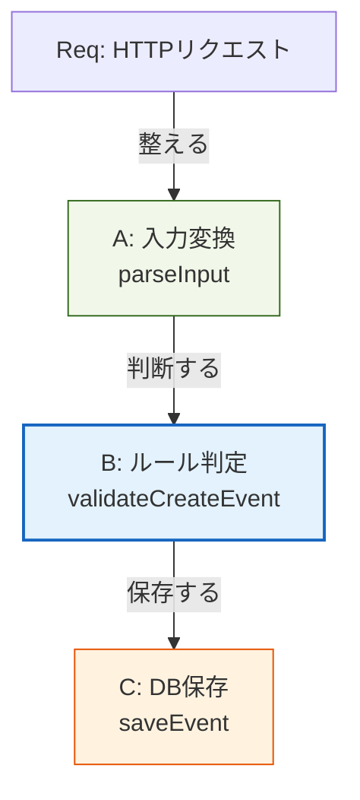
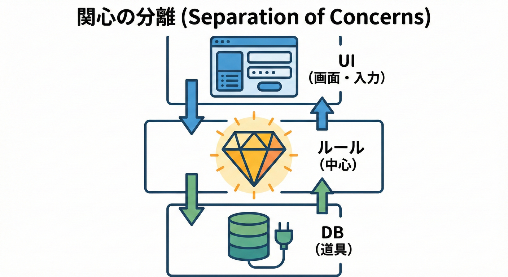

# 第6章：設計の超基礎「関心の分離」🍱✨（SoC）

## この章のゴール🎯

* 「1つのコードに色んな役目が混ざると、なぜ地獄😱なのか」を説明できる
* ざっくり **UI / 業務ルール / DB / 外部I/O** を分けて考えられる
* “分ける” の第一歩として **「中心（ルール）」と「外側（道具）」** のイメージが持てる🌀

---

## 1) 「関心」ってなに？🤔💭

**関心（concern）＝そのコードが“気にしてること（役目）”** だよ〜！

たとえば「イベント登録」でも、実は別々の関心が混ざりがち👇

* 画面/UIの都合（入力フォーム、表示メッセージ）🖥️
* 入力チェック（空欄、文字数、形式）✅
* 業務ルール（締切、定員、重複禁止）📌
* DBに保存（SQL、トランザクション）🗄️
* 外部連携（メール送信、決済、通知）📮

これらを **同じ関数に全部詰め込む** と…あとで泣く😭

※この考え方は一般に **Separation of Concerns（SoC）** と呼ばれるよ〜 ([ウィキペディア][1])

---

## 2) 混ぜると何が起きるの？😵‍💫（“地獄ポイント”）

### ✅ 変更が怖くなる

UIの文言を直しただけなのに、業務ルールが壊れる…みたいな事故💥

### ✅ テストがつらい

DBや外部APIが絡むと、テストの準備が重くなる🧪💦
→ “ルールだけ” を軽くテストできなくなる

### ✅ 使い回しできない

同じ「イベント登録」を

* Web画面
* 管理画面
* バッチ処理
  で使いたいのに、UI依存で再利用できない🙅‍♀️

---

## 3) 超ざっくり図：中心と外側🌀🧡

まずはこの一枚絵でOK！

[ DB / 外部API ]      ← 道具🛠️（入れ替わりやすい）
```


```mermaid
flowchart TD
    Req[Req: HTTPリクエスト] -->|整える| A[A: 入力変換<br/>parseInput]
    A -->|判断する| B[B: ルール判定<br/>validateCreateEvent]
    B -->|保存する| C[C: DB保存<br/>saveEvent]
    
    style A fill:#f1f8e9,stroke:#33691e
    style B fill:#e3f2fd,stroke:#1565c0,stroke-width:2px
    style C fill:#fff3e0,stroke:#e65100
```

この「内側ほど大事、外側ほど道具」って発想は、クリーンアーキテクチャ系でもよく語られるよ🌀 ([blog.cleancoder.com][2])

---

## 4) 例：混ざったコード（ありがち😇→😱）

「イベント登録」を1関数に全部入れちゃうとこうなる👇

```ts
// ❌ ぜんぶ入り：UI・検証・業務ルール・DB・整形が混在
export async function postCreateEvent(req: any, res: any, db: any) {
  const title = String(req.body.title ?? "").trim();
  const date = new Date(req.body.date);

  // 入力チェック
  if (!title) return res.status(400).send("タイトルは必須です");
  if (Number.isNaN(date.getTime())) return res.status(400).send("日付が不正です");

  // 業務ルール（例：過去日禁止）
  const now = new Date();
  if (date < now) return res.status(400).send("過去日は登録できません");

  // DB直書き
  await db.query("INSERT INTO events(title, date) VALUES (?, ?)", [title, date.toISOString()]);

  // UI向けメッセージ整形
  return res.send(`イベント「${title}」を登録しました🎉`);
}
```

パッと見は「動く」けど、あとで増築すると壊れやすいタイプ😱

---

## 5) 分け方の“コツ”はこれだけ🍱✨

### ルール：**「判断」と「I/O」を分ける**🧠↔️🔌

* **判断**＝業務ルール（ifの塊、成否の決定）
* **I/O**＝DB、HTTP、外部API、ファイル、時間（Date.now）など

👉 **判断（ルール）は、できるだけ“純粋”に**すると強い💪✨
（テストしやすい／再利用しやすい）

---

## 6) まずは“3つ”に割るだけで勝ち🏆✨



ここでは細かい層は後でOK！まずはこの3つ🍡

### A. 入力を整える（UI側の都合）🧼

* req.body を型っぽく整える
* エラーメッセージ（表示用）もここ寄り

### B. ルールで判定する（中心）💎

* 過去日禁止、定員、締切など
* “できる/できない” を決める

### C. 保存する（道具）🗄️

* DBへINSERT
* ここは将来差し替えやすい場所

---

## 7) 分離後のイメージ（スッキリ版🌿）

```ts
// ✅ A: 入力を整える
type CreateEventInput = { title: string; dateISO: string };

function parseInput(body: any): CreateEventInput {
  return {
    title: String(body.title ?? "").trim(),
    dateISO: String(body.date ?? ""),
  };
}

// ✅ B: ルール（中心）
type CreateEventResult =
  | { ok: true }
  | { ok: false; message: string };

function validateCreateEvent(input: CreateEventInput, now: Date): CreateEventResult {
  if (!input.title) return { ok: false, message: "タイトルは必須です" };

  const date = new Date(input.dateISO);
  if (Number.isNaN(date.getTime())) return { ok: false, message: "日付が不正です" };

  if (date < now) return { ok: false, message: "過去日は登録できません" };

  return { ok: true };
}

// ✅ C: 保存（道具）
async function saveEvent(db: any, input: CreateEventInput) {
  await db.query("INSERT INTO events(title, date) VALUES (?, ?)", [
    input.title,
    new Date(input.dateISO).toISOString(),
  ]);
}

// ✅ まとめ役（Controller/Usecaseっぽい）
export async function postCreateEvent(req: any, res: any, db: any) {
  const input = parseInput(req.body);

  const result = validateCreateEvent(input, new Date());
  if (!result.ok) return res.status(400).send(result.message);

  await saveEvent(db, input);
  return res.send(`イベント「${input.title}」を登録しました🎉`);
}
```

ポイントはこれ👇

* **ルール（validateCreateEvent）** が “単体で読める＆テストしやすい” 🧪✨
* DBやHTTPが変わっても、中心が巻き込まれにくい🛡️

---

## 8) ミニ演習🧩🗣️（紙に書くだけでもOK！）

### 演習1：この関数、何の関心が混ざってる？🔍

最初の「ぜんぶ入りコード」を見て、混ざってる関心を **最低4つ** 書き出してみて✍️
（例：入力チェック、業務ルール、DB、表示）

### 演習2：ルールだけ関数に抜く✂️

* 「過去日禁止」以外に、**もう1つ** ルールを足して
* それも `validateCreateEvent` に入れる（例：タイトル20文字まで）📝

### 演習3：時間を外から渡す⏰➡️

* `new Date()` をルール関数の外で作って渡す（今やったやつ！）
* これができるとテストが一気にラクになるよ〜🧪💚

---

## 9) AIに頼ると強いプロンプト例🤖📝

### ① 関心の洗い出し

* 「この関数の責務（関心）を列挙して、分離案を出して。UI/業務/DB/外部I/Oに分類して」

### ② 分離のリファクタ案

* 「このコードを “parse / validate / persist” の3分割にリファクタして。TypeScriptで、関数の入出力の型も付けて」

### ③ ルール関数のテスト観点

* 「validateCreateEvent のテストケースを境界値中心に10個。日本語で理由も添えて」

---

## 10) この章のまとめ🍱💖

* **SoC＝役目を分ける**（混ぜると変更・テスト・再利用がしんどい） ([ウィキペディア][1])
* まずは **判断（ルール）** と **I/O（DB・HTTP・外部）** を分けよう🧠↔️🔌
* “中心と外側” の感覚が、あとで **モジュール境界** を作る土台になる🧩✨

---

## おまけ：環境まわりの“最新ちょいメモ”🪟🧠

（セキュリティ的に、Node.jsはLTSの更新がちょこちょこ入るよ〜の話📌）

* Node.js は **v24 系が Active LTS** として更新されているよ ([Node.js][3])
* TypeScript は **5.9 系のリリースノートが更新**されてる（ドキュメント最終更新も新しめ） ([typescriptlang.org][4])

次章（第7章）で、この「分けたくなる気持ち🍱」を **“モジュールの思想”** に接続していくよ〜🧩🚀

[1]: https://en.wikipedia.org/wiki/Separation_of_concerns?utm_source=chatgpt.com "Separation of concerns"
[2]: https://blog.cleancoder.com/uncle-bob/2012/08/13/the-clean-architecture.html?utm_source=chatgpt.com "The Clean Architecture by Uncle Bob - Clean Coder Blog"
[3]: https://nodejs.org/en/about/previous-releases?utm_source=chatgpt.com "Node.js Releases"
[4]: https://www.typescriptlang.org/docs/handbook/release-notes/typescript-5-9.html?utm_source=chatgpt.com "Documentation - TypeScript 5.9"
