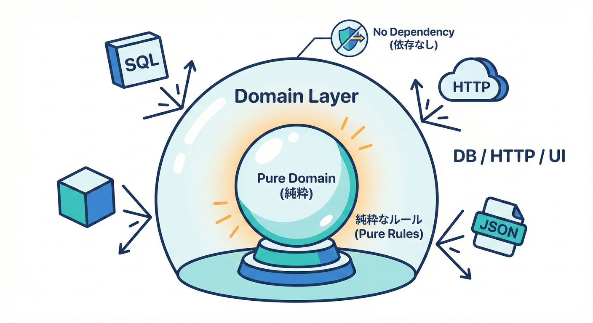
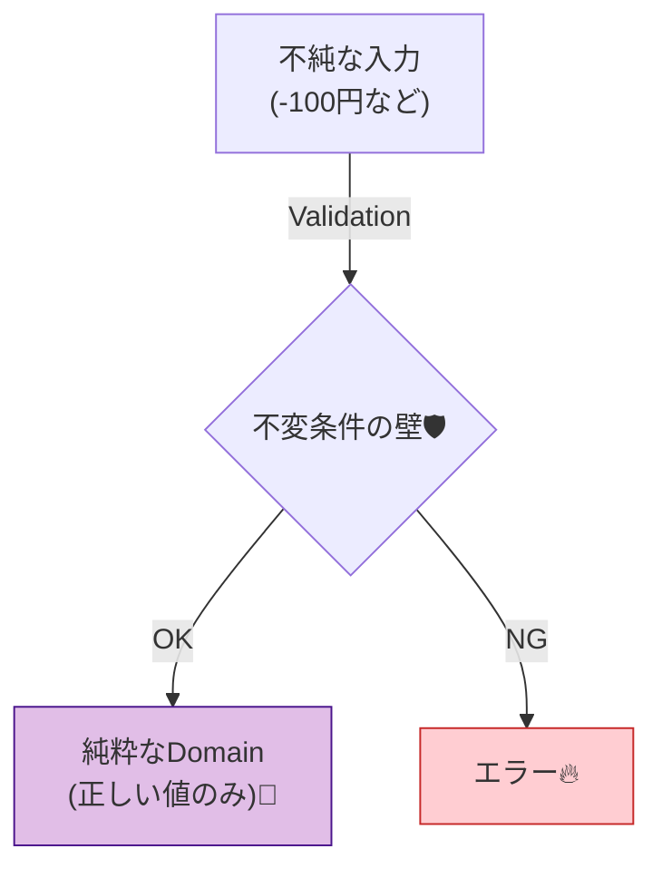
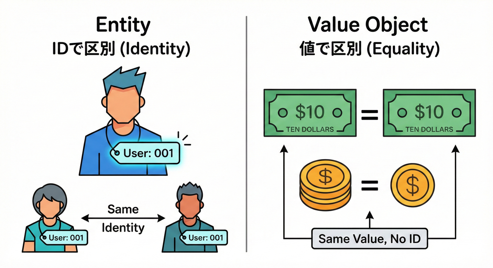
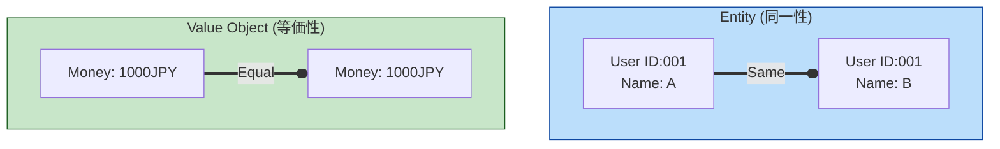

# 第19章：ドメイン層（ルールの中心）💎🧩

## この章のゴール🎯✨

この章が終わったら、こんな状態になってるのが理想だよ〜😊💖

* 「業務ルール」を置く場所がハッキリする🏠💡
* “壊れないデータ”しか作れないようにできる🛡️✨（＝不変条件を守る）
* 「Entity（エンティティ）」と「Value Object（値オブジェクト）」を使い分けられる🧩🔍
* ドメイン層が “DBやAPIやUI” に引っ張られない形で書ける🚫🗄️📡🖥️

---

# 1) ドメイン層ってなに？🍰💎

**ドメイン層＝「アプリの中心にあるルールの保管庫」**だよ✨
ここには「正しい振る舞い」だけを置くのが基本😊

たとえば学内イベント管理アプリなら👇

* 定員を超えて参加登録できない🙅‍♀️
* 開催期間外の登録はできない📅🚫
* 参加費はマイナスにならない💰🚫
* イベント名は空文字ダメ📝🚫

こういう **“業務として守るべきこと”** がドメイン層の担当だよ💎
しかも、Entity は「データ＋振る舞い」を持つのが大事（ただの箱にしない）って考え方があるよ〜📦➡️🧠 ([マイクロソフト ラーン][1])

---

# 2) ドメイン層の3つの約束🤝✨

## ① ルールはここに集める📌

ルールが散らばると、変更のたびに事故る😵‍💫💥
ドメインに寄せると「どこ見ればいいか」一発でわかる👀✨

## ② “壊れた状態” を作らせない🛡️




```mermaid
graph TD
    Input["不純な入力<br/>(-100円など)"] -->|Validation| Barrier{不変条件の壁🛡️}
    Barrier -->|OK| Pure["純粋なDomain<br/>(正しい値のみ)💎"]
    Barrier -->|NG| Error[エラー🔥]
    
    style Pure fill:#e1bee7,stroke:#4a148c
    style Error fill:#ffcdd2,stroke:#c62828
```

不正な値（例：参加費-100円）を **作れない** ようにするのが最強💪✨
「チェックし忘れ」がなくなるよ🥹💖

## ③ 外側（DB/HTTP/UI）を知らない🙈

ドメイン層は “純粋なTypeScriptの世界” に閉じ込めるのがコツ🌎✨
（DBのSQLやfetch、Express/Nextの事情を持ち込まない！）

---

# 3) Entity と Value Object の使い分け🧩🔍




```mermaid
graph TD
    subgraph Entity ["Entity (同一性)"]
        E1["User ID:001<br/>Name: A"]
        E2["User ID:001<br/>Name: B"]
        E1 == Same ==o E2
    end
    
    subgraph VO ["Value Object (等価性)"]
        V1[Money: 1000JPY]
        V2[Money: 1000JPY]
        V1 == Equal ==o V2
    end
    
    style Entity fill:#bbdefb,stroke:#0d47a1
    style VO fill:#c8e6c9,stroke:#1b5e20
```

## Entity（エンティティ）🧑‍🎓🏷️

* **“同一性（ID）で区別される”** のが特徴✨
* 時間が経っても「同じもの」として追いかけたい存在
* 例：イベント（Event）、ユーザー（User）、申込（Registration）
  「IDが本体」みたいなイメージだよ🏷️ ([マイクロソフト ラーン][1])

## Value Object（値オブジェクト）💎

* **“値そのもの” が本体**（IDがない）
* **同じ値なら同じもの**（等価性）
* 例：金額（Money）、日付範囲（DateRange）、イベント名（EventTitle）
  「住所」は文脈によって Entity になったり Value Object になったりする、って話も有名だよ🗺️✨ ([マイクロソフト ラーン][1])

---

# 4) 例題：学内イベント管理モジュール🎒📅

ここからは “それっぽい” ドメインモデルを作ってみるね😊🧩
（※この章は「値オブジェクト中心」だけど、Entity も軽く出すよ〜）

## フォルダ例📁✨

* modules/

  * events/

    * domain/

      * valueObjects/
      * entities/
      * errors/
      * services/

---

# 5) 実装してみよう（値オブジェクト→エンティティ）💻💎

## 5-1) DomainError（ドメインのエラー）🚫🧯

* 例外でもいいけど、学習では「Result型（成功/失敗）」が扱いやすいよ😊✨

```ts
// modules/events/domain/errors/DomainError.ts
export type DomainErrorCode =
  | "INVALID_TITLE"
  | "INVALID_MONEY"
  | "INVALID_DATE_RANGE"
  | "CAPACITY_EXCEEDED"
  | "ALREADY_REGISTERED";

export class DomainError extends Error {
  constructor(public readonly code: DomainErrorCode, message: string) {
    super(message);
    this.name = "DomainError";
  }
}

export type Result<T> =
  | { ok: true; value: T }
  | { ok: false; error: DomainError };

export const ok = <T>(value: T): Result<T> => ({ ok: true, value });
export const err = <T = never>(error: DomainError): Result<T> => ({ ok: false, error });
```

---

## 5-2) Money（値オブジェクト）💰✨

* 「金額＝number」だけにすると、マイナスや通貨不一致が混ざって地獄😱
* Moneyに閉じ込めると、**“正しい金額しか存在できない”** が作れるよ🛡️

```ts
// modules/events/domain/valueObjects/Money.ts
import { DomainError, err, ok, Result } from "../errors/DomainError";

export class Money {
  private constructor(
    public readonly amount: number,
    public readonly currency: "JPY" | "USD"
  ) {}

  static create(amount: number, currency: "JPY" | "USD" = "JPY"): Result<Money> {
    if (!Number.isInteger(amount)) {
      return err(new DomainError("INVALID_MONEY", "金額は整数にしてね（例：1200）"));
    }
    if (amount < 0) {
      return err(new DomainError("INVALID_MONEY", "金額はマイナスにできないよ"));
    }
    return ok(new Money(amount, currency));
  }

  add(other: Money): Result<Money> {
    if (this.currency !== other.currency) {
      return err(new DomainError("INVALID_MONEY", "通貨が違う金額は足せないよ"));
    }
    return Money.create(this.amount + other.amount, this.currency);
  }
}
```

---

## 5-3) EventTitle（値オブジェクト）📝✨

「空はダメ」「長すぎもダメ」みたいなルールはここに寄せるよ〜😊

```ts
// modules/events/domain/valueObjects/EventTitle.ts
import { DomainError, err, ok, Result } from "../errors/DomainError";

export class EventTitle {
  private constructor(public readonly value: string) {}

  static create(raw: string): Result<EventTitle> {
    const value = raw.trim();
    if (value.length === 0) {
      return err(new DomainError("INVALID_TITLE", "イベント名が空っぽだよ"));
    }
    if (value.length > 50) {
      return err(new DomainError("INVALID_TITLE", "イベント名が長すぎるよ（50文字まで）"));
    }
    return ok(new EventTitle(value));
  }
}
```

---

## 5-4) DateRange（値オブジェクト）📅✨

「開始日 <= 終了日」を絶対守るやつ〜🛡️✨

```ts
// modules/events/domain/valueObjects/DateRange.ts
import { DomainError, err, ok, Result } from "../errors/DomainError";

const toDayNumber = (isoDate: string): Result<number> => {
  // 超シンプルに YYYY-MM-DD を想定（詳しくやるならライブラリ導入もアリ）
  const m = /^(\d{4})-(\d{2})-(\d{2})$/.exec(isoDate);
  if (!m) {
    return err(new DomainError("INVALID_DATE_RANGE", "日付はYYYY-MM-DDでお願い🙏"));
  }
  const y = Number(m[1]);
  const mo = Number(m[2]);
  const d = Number(m[3]);
  // 比較用に “日” を数値化（ざっくり）
  return ok(y * 10000 + mo * 100 + d);
};

export class DateRange {
  private constructor(
    public readonly start: string, // YYYY-MM-DD
    public readonly end: string    // YYYY-MM-DD
  ) {}

  static create(start: string, end: string): Result<DateRange> {
    const s = toDayNumber(start);
    if (!s.ok) return s;

    const e = toDayNumber(end);
    if (!e.ok) return e;

    if (s.value > e.value) {
      return err(new DomainError("INVALID_DATE_RANGE", "開始日が終了日より後になってるよ"));
    }
    return ok(new DateRange(start, end));
  }

  includes(day: string): Result<boolean> {
    const d = toDayNumber(day);
    if (!d.ok) return d as any;

    const s = toDayNumber(this.start);
    if (!s.ok) return s as any;

    const e = toDayNumber(this.end);
    if (!e.ok) return e as any;

    return ok(s.value <= d.value && d.value <= e.value);
  }
}
```

---

## 5-5) Event（エンティティ）🎪🏷️

Entityは「データ＋振る舞い」で、**ルールをメソッドに入れる**感じだよ🧠✨ ([マイクロソフト ラーン][1])

```ts
// modules/events/domain/entities/Event.ts
import { DomainError, err, ok, Result } from "../errors/DomainError";
import { DateRange } from "../valueObjects/DateRange";
import { EventTitle } from "../valueObjects/EventTitle";
import { Money } from "../valueObjects/Money";

export class Event {
  private readonly attendeeIds = new Set<string>();

  private constructor(
    public readonly id: string,
    public readonly title: EventTitle,
    public readonly period: DateRange,
    public readonly fee: Money,
    public readonly capacity: number
  ) {}

  static create(params: {
    id: string;
    title: EventTitle;
    period: DateRange;
    fee: Money;
    capacity: number;
  }): Result<Event> {
    if (params.capacity <= 0) {
      return err(new DomainError("CAPACITY_EXCEEDED", "定員は1以上にしてね"));
    }
    return ok(new Event(params.id, params.title, params.period, params.fee, params.capacity));
  }

  register(studentId: string, today: string): Result<void> {
    const inPeriod = this.period.includes(today);
    if (!inPeriod.ok) return inPeriod as any;

    if (!inPeriod.value) {
      return err(new DomainError("INVALID_DATE_RANGE", "開催期間外だから登録できないよ"));
    }

    if (this.attendeeIds.has(studentId)) {
      return err(new DomainError("ALREADY_REGISTERED", "すでに登録済みだよ"));
    }

    if (this.attendeeIds.size >= this.capacity) {
      return err(new DomainError("CAPACITY_EXCEEDED", "定員オーバーだよ"));
    }

    this.attendeeIds.add(studentId);
    return ok(undefined);
  }

  get attendeeCount(): number {
    return this.attendeeIds.size;
  }
}
```

---

# 6) よくある罠あるある😵‍💫⚠️（先に潰そ！）

* 「金額」や「日付」や「名前」を全部プリミティブ（number/string）で済ませる
  → 便利だけど、ルールが散って壊れる💥💔
* Entityが getter/setter だけの “箱” になる（貧血モデル）
  → ルールがアプリ層に散らばってカオス😵‍💫 ([マイクロソフト ラーン][1])
* ドメイン層が DB / HTTP / UI の型や都合に引きずられる
  → 変更に弱くなる😱

---

# 7) ミニ演習🧩✍️（手を動かすやつ！）

## 演習A：プリミティブ卒業🌱➡️💎

次を Value Object にしてみてね😊

* 参加費：Money
* イベント名：EventTitle
* 開催期間：DateRange

「createで検証」→「private constructor」で封じ込めるのがポイント🔒✨

## 演習B：不変条件リストを作る📋🛡️

イベントの不変条件を5個書いてみよ〜✍️💕
例：定員は1以上、イベント名は空でない、期間はstart<=end…などなど✨

---

# 8) AI活用プロンプト例🤖📝（コピペでOK）

* 「学内イベント管理のドメインで、不変条件を10個挙げて。カテゴリ別に（入力値/状態/遷移）で整理して」
* 「EventTitle / Money / DateRange を Value Object として実装したい。createで返すResult型の設計案とサンプルコード出して」
* 「このregisterメソッドの仕様テスト観点を列挙して。境界値もお願い」
* 「貧血モデルになってないかレビューして。ルールが散ってる箇所を指摘して」

---

# 9) 2026年1月の “最新まわり” メモ🗞️✨（ちょい豆知識）

* TypeScript 5.9 では、tsc初期設定がより “モダン寄り” になって、strict系も含めて少しリッチになってるよ（例：noUncheckedIndexedAccess / exactOptionalPropertyTypes など）🧠✨ ([TypeScript][2])
* Node.js は v24 系が Active LTS になっていて、セキュリティリリースも継続的に出てるよ🔐✨ ([Node.js][3])

（ドメイン層自体はNode依存にしないのがコツだけど、周辺環境の“今”は押さえておくと安心だよ〜😊）

---

# 10) 章末チェックリスト✅💖

* ドメイン層に「DB」「HTTP」「UI」の都合が入ってない？🙈
* Value Object の create で、ルールがちゃんと守られてる？🛡️
* Entity が “箱” になってない？（振る舞い＝ルールが入ってる？）🧠 ([マイクロソフト ラーン][1])
* 不正な状態を **作れない** ようになってる？🚫✨
* ルール変更が来ても「ここ直せばOK」になってる？🧩🔧

---

# 次の第20章は「モジュール間連携（同期呼び出し）」だから、この章で作ったドメインを“外に見せる形（DTO/公開API）”にしていく流れがめっちゃ気持ちいいよ〜📞✨
続けて第20章もこのテンションでいこっか？😊💕

[1]: https://learn.microsoft.com/en-us/dotnet/architecture/microservices/microservice-ddd-cqrs-patterns/microservice-domain-model "Designing a microservice domain model - .NET | Microsoft Learn"
[2]: https://www.typescriptlang.org/docs/handbook/release-notes/typescript-5-9.html "TypeScript: Documentation - TypeScript 5.9"
[3]: https://nodejs.org/en/about/previous-releases?utm_source=chatgpt.com "Node.js Releases"
