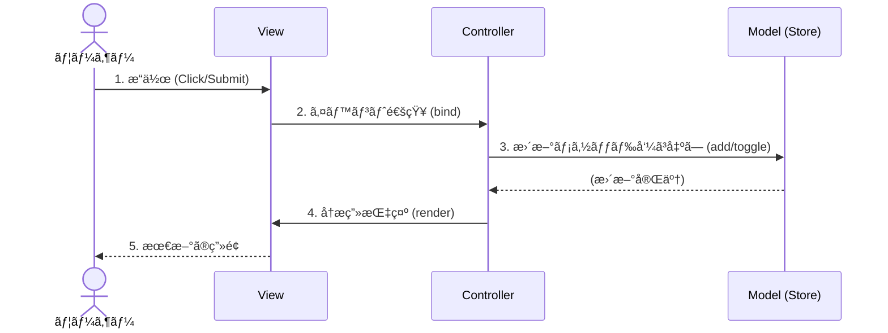

# 第6章：Controller入門①：入力（イベント）をå—ã‘ã¦æŒ‡ç¤ºã™ã‚‹ğŸ®â¡ï¸ğŸ§ 

ã“ã®ç« ã¯ã€ŒControllerï¼äº¤é€šæ•´ç†ğŸš¦ã€ã‚’体ã«å…¥ã‚Œã‚‹å›ã ã‚ˆã€œï¼âœ¨
ボタンやフォームã®å…¥åŠ›ã‚¤ãƒ™ãƒ³ãƒˆã‚’å—ã‘å–ã£ã¦ã€**Modelã‚’æ›´æ–°ã—㦠→ Viewã«â€œæç”»ã—ã¦ã­â€ã¨æŒ‡ç¤ºã™ã‚‹**æµã‚Œã‚’作りã¾ã™ğŸ”💕

---

## ã“ã®ç« ã®ã‚´ãƒ¼ãƒ«ğŸ¯âœ¨

* ControllerãŒã‚„ã‚‹ã“ã¨ã‚’説æ˜ã§ãる（交通整ç†ğŸš¦ã£ã¦ã“ã†ã„ã†æ„味ï¼ï¼‰
* **Viewã‹ã‚‰ã‚¤ãƒ™ãƒ³ãƒˆã‚’å—ã‘å–ã‚‹**（submit / click / change）🖱ï¸âŒ¨ï¸
* **Modelã‚’æ›´æ–°ã—ã¦ã€Viewã‚’å†æç”»ã™ã‚‹**基本ループãŒä½œã‚Œã‚‹ğŸ”✅
* 「Viewã«ãƒ­ã‚¸ãƒƒã‚¯ã‚’入れã™ããªã„🙅â€â™€ï¸ã€ã‚’守れる

---

## ã¾ãšçµè«–：Controllerã£ã¦ä½•è€…？👀✨

Controllerã¯ä¸€è¨€ã§ã„ã†ã¨ã€

* **ユーザーæ“作（イベント）をå—ã‘å–ã‚‹**
* **ã©ã®å‡¦ç†ã‚’å‹•ã‹ã™ã‹æ±ºã‚ã‚‹**
* **Modelã‚’æ›´æ–°ã—ã¦**
* **Viewã«å†æ画を頼む**

…ã£ã¦ã„ã†ã€**交通整ç†ä¿‚🚦**ã§ã™ï¼

✅ **Model**：データã¨ãƒ«ãƒ¼ãƒ«ï¼ˆTodoã®æ­£ä½“📦）
✅ **View**：表示（DOMを作る・更新ã™ã‚‹ğŸ¨ï¼‰
✅ **Controller**：入力をå—ã‘ã¦æŒ‡ç¤ºã™ã‚‹ï¼ˆå¸ä»¤å¡”ğŸ®ï¼‰

---

## 2026/01時点㮠“今ã©ãâ€ãƒ¡ãƒ¢ğŸ§ƒâœ¨ï¼ˆè¶…ã•ã‚‰ã£ã¨ï¼‰

* TypeScript ã®æœ€æ–°ç‰ˆã¯ **5.9ç³»**（npm上㮠Latest 㯠5.9.3） ([typescriptlang.org][1])
* Vite 㮠Latest 㯠**7.3.1** ([NPM][2])
* Node.js 㯠**v24 ㌠Active LTS**（v25 㯠Current） ([Node.js][3])
  ※ 2026-01-13 ã« Node v24.13.0 (LTS) ã®ã‚»ã‚­ãƒ¥ãƒªãƒ†ã‚£ãƒªãƒªãƒ¼ã‚¹ã‚‚出ã¦ã‚‹ã‚ˆã€œğŸ”’ ([Node.js][4])

（章ã®å†…容ã¯ãƒãƒ¼ã‚¸ãƒ§ãƒ³ã«å¼·ãä¾å­˜ã—ãªã„よã†ã«ä½œã£ã¦ã‚るよ🙆â€â™€ï¸ï¼‰

---

## 今日ã¤ãã‚‹å‹•ã（CampusTodo）🧠â¡ï¸âœ…

### ✅ 1) 追加（Add）

* 入力欄ã«ã‚¿ã‚¤ãƒˆãƒ«å…¥ã‚Œã‚‹âœï¸
* 追加ボタン or Enter ã§è¿½åŠ â•
* 一覧ã«å映📋✨

### ✅ 2) 完了トグル（Toggle）

* ãƒã‚§ãƒƒã‚¯ãƒœãƒƒã‚¯ã‚¹ã‚’押ã™âœ…
* done ãŒåˆ‡ã‚Šæ›¿ã‚ã‚‹ğŸ”
* 一覧ã«å映📋✨

---

## “責務ã¾ãœã¾ãœâ€ã‚’防ãルールğŸ€ğŸ™…â€â™€ï¸

**Viewã«æ›¸ã„ã¦ã„ã„ã®ã¯ã‚³ãƒ¬ã ã‘ï¼**👇

* DOMを作る / æ›´æ–°ã™ã‚‹
* イベントを拾ã£ã¦ã€Œå¤–ã«é€šçŸ¥ã™ã‚‹ã€ï¼ˆï¼Controllerã«æ¸¡ã™ï¼‰

**Viewã«æ›¸ã„ã¡ã‚ƒãƒ€ãƒ¡ï¼**👇

* todosé…列ã®æ›´æ–°
* idæ¡ç•ª
* 追加・完了ã®æ¥­å‹™ãƒ­ã‚¸ãƒƒã‚¯

ã“れをControllerå´ã«å¯„ã›ã‚‹ã‚ˆã€œğŸššâœ¨

---

# 実装：Controllerを入れã¦MVCã‚’å›ã™ğŸŒ€âœ¨

ã“ã“ã§ã¯æœ€å°æ§‹æˆã§ã„ãよï¼
（ã‚ã¨ã§ç¬¬12ç« ã§Service層ã«åˆ†ã‘ã‚‹ã‹ã‚‰ã€ä»Šã¯ControllerãŒå°‘ã—頑張る💪）

## ファイル構æˆï¼ˆä¾‹ï¼‰ğŸ“✨

* `src/model/TodoTypes.ts`
* `src/model/TodoStore.ts`
* `src/view/TodoView.ts`
* `src/controller/TodoController.ts`
* `src/main.ts`

---

## 1) Model：TodoStore（データ置ã場）📦

```ts
// src/model/TodoTypes.ts
export type TodoId = string;

export type TodoItem = {
  id: TodoId;
  title: string;
  done: boolean;
  createdAt: number;
};
```

```ts
// src/model/TodoStore.ts
import type { TodoId, TodoItem } from "./TodoTypes";

export class TodoStore {
  private todos: TodoItem[] = [];

  getAll(): readonly TodoItem[] {
    return this.todos;
  }

  add(title: string): TodoItem {
    const trimmed = title.trim();
    if (trimmed.length === 0) {
      throw new Error("タイトルãŒç©ºã ã‚ˆğŸ˜¢");
    }

    const todo: TodoItem = {
      id: crypto.randomUUID(),
      title: trimmed,
      done: false,
      createdAt: Date.now(),
    };

    this.todos = [todo, ...this.todos];
    return todo;
  }

  toggle(id: TodoId): void {
    this.todos = this.todos.map((t) =>
      t.id === id ? { ...t, done: !t.done } : t
    );
  }
}
```

> ã“ã“ã§ã¯ã€Œæœ€ä½é™ã®ãƒ«ãƒ¼ãƒ«ã€ã¨ã—㦠**空タイトルNG**ã ã‘入れã¦ã‚‹ã‚ˆğŸ˜Œ
> （もã£ã¨ãƒ«ãƒ¼ãƒ«å¢—ã‚„ã™ã®ã¯ç¬¬9ç« ã§æœ¬æ ¼çš„ã«ã‚„る予定🛡ï¸âœ¨ï¼‰

---

## 2) View：表示ã ã‘ + “イベントを外ã«æ¸¡ã™çª“å£â€ğŸ¨ğŸ“£

ãƒã‚¤ãƒ³ãƒˆã¯ã€ŒViewãŒControllerã‚’ç›´æ¥çŸ¥ã‚‰ãªã„ã€ã“ã¨ï¼
ã ã‹ã‚‰ `bindAddTodo()` ã¿ãŸã„㪠**イベント登録メソッド**を用æ„ã—ã¦ã€å¤–（Controller）ã‹ã‚‰é–¢æ•°ã‚’渡ã—ã¦ã‚‚らã†å½¢ã«ã™ã‚‹ã‚ˆğŸ¤âœ¨

```ts
// src/view/TodoView.ts
import type { TodoId, TodoItem } from "../model/TodoTypes";

export class TodoView {
  private form: HTMLFormElement;
  private input: HTMLInputElement;
  private list: HTMLUListElement;

  constructor(root: HTMLElement) {
    this.form = root.querySelector<HTMLFormElement>("#todo-form")!;
    this.input = root.querySelector<HTMLInputElement>("#todo-input")!;
    this.list = root.querySelector<HTMLUListElement>("#todo-list")!;
  }

  render(todos: readonly TodoItem[]): void {
    this.list.innerHTML = "";

    for (const todo of todos) {
      const li = document.createElement("li");

      const label = document.createElement("label");
      label.style.display = "flex";
      label.style.gap = "8px";
      label.style.alignItems = "center";

      const checkbox = document.createElement("input");
      checkbox.type = "checkbox";
      checkbox.checked = todo.done;
      checkbox.dataset.todoId = todo.id;

      const span = document.createElement("span");
      span.textContent = todo.title;
      if (todo.done) {
        span.style.textDecoration = "line-through";
        span.style.opacity = "0.6";
      }

      label.append(checkbox, span);
      li.append(label);
      this.list.append(li);
    }
  }

  // ✅ 追加イベントを“外ã«é€šçŸ¥â€ã™ã‚‹çª“å£
  bindAddTodo(handler: (title: string) => void): void {
    this.form.addEventListener("submit", (e) => {
      // submit ã™ã‚‹ã¨ãƒšãƒ¼ã‚¸é·ç§»ã—ã¡ã‚ƒã†ã®ã§æ­¢ã‚るよ🛑
      // preventDefault ã®æ„味㯠MDN ã§ã‚‚説æ˜ã‚ã‚Š 👠:contentReference[oaicite:4]{index=4}
      e.preventDefault();

      handler(this.input.value);
    });
  }

  // ✅ 完了トグルイベントを“外ã«é€šçŸ¥â€ã™ã‚‹çª“å£ï¼ˆã‚¤ãƒ™ãƒ³ãƒˆå§”任✨）
  bindToggleTodo(handler: (id: TodoId) => void): void {
    this.list.addEventListener("change", (e) => {
      const target = e.target;
      if (!(target instanceof HTMLInputElement)) return;
      if (target.type !== "checkbox") return;

      const id = target.dataset.todoId;
      if (!id) return;

      handler(id);
    });
  }

  clearInput(): void {
    this.input.value = "";
    this.input.focus();
  }

  showError(message: string): void {
    alert(message); // ã„ã£ãŸã‚“最å°ï¼ã‚ã¨ã§ç¬¬11ç« ã§å„ªã—ãã™ã‚‹ğŸŒ¸
  }
}
```

### 🌟 submitイベントã®æ³¨æ„（地味ã«ãƒãƒã‚‹ï¼‰

`submit` 㯠**ボタンã˜ã‚ƒãªã㦠form 自体ã«ç™ºç«**ã™ã‚‹ã‚ˆï¼ğŸ“
（MDNã«ã‚‚æ˜è¨˜ã•ã‚Œã¦ã‚‹ï¼‰ ([MDN Web Docs][5])

---

## 3) Controller：交通整ç†ä¿‚🚦（本日ã®ä¸»å½¹ï¼‰


Controller㯠**Viewã®ã‚¤ãƒ™ãƒ³ãƒˆã‚’å—ã‘ã‚‹ → Modelæ›´æ–° → Viewå†æç”»** ã‚’ã²ãŸã™ã‚‰å›ã™ã‚ˆğŸ”✨


```mermaid
sequenceDiagram
    actor User as ユーザー
    participant View
    participant Controller
    participant Store as Model (Store)

    User->>View: 1. æ“作 (Click/Submit)
    View->>Controller: 2. イベント通知 (bind)
    Controller->>Store: 3. 更新メソッド呼ã³å‡ºã— (add/toggle)
    Store-->>Controller: (更新完了)
    Controller->>View: 4. å†æ画指示 (render)
    View-->>User: 5. 最新ã®ç”»é¢
```

```ts
// src/controller/TodoController.ts
import { TodoStore } from "../model/TodoStore";
import { TodoView } from "../view/TodoView";

export class TodoController {
  constructor(
    private store: TodoStore,
    private view: TodoView
  ) {}

  init(): void {
    // 最åˆã®æç”»
    this.view.render(this.store.getAll());

    // Viewイベントをå—ã‘ã¦æŒ‡ç¤ºã™ã‚‹ï¼ˆäº¤é€šæ•´ç†ğŸš¦ï¼‰
    this.view.bindAddTodo((title) => this.handleAdd(title));
    this.view.bindToggleTodo((id) => this.handleToggle(id));
  }

  private handleAdd(title: string): void {
    try {
      this.store.add(title);
      this.view.render(this.store.getAll());
      this.view.clearInput();
    } catch (err) {
      const message = err instanceof Error ? err.message : "追加ã«å¤±æ•—ã—ãŸã‚ˆğŸ˜¢";
      this.view.showError(message);
    }
  }

  private handleToggle(id: string): void {
    this.store.toggle(id);
    this.view.render(this.store.getAll());
  }
}
```

---

## 4) main.ts：全部ã¤ãªã„ã§èµ·å‹•ğŸ”Œâœ¨

```ts
// src/main.ts
import "./style.css";
import { TodoStore } from "./model/TodoStore";
import { TodoView } from "./view/TodoView";
import { TodoController } from "./controller/TodoController";

const root = document.querySelector<HTMLElement>("#app")!;

// MVCを組ã¿ç«‹ã¦ã‚‹ğŸ§±
const store = new TodoStore();
const view = new TodoView(root);
const controller = new TodoController(store, view);

// 起動🚀
controller.init();
```

---

## 5) HTML（例）ğŸ§ï¼ˆidã ã‘åˆã£ã¦ã‚Œã°OK）

```html
<div id="app">
  <h1>CampusTodo 📚✅</h1>

  <form id="todo-form">
    <input id="todo-input" type="text" placeholder="課題を入力ã—ã¦ã­âœï¸" />
    <button type="submit">追加â•</button>
  </form>

  <ul id="todo-list"></ul>
</div>
```

---

# 動作ãƒã‚§ãƒƒã‚¯âœ…✨（ã§ããŸã‚‰å‹ã¡ğŸ‰ï¼‰

* [ ] 入力ã—ã¦ã€Œè¿½åŠ â•ã€ã§å¢—ãˆã‚‹
* [ ] Enterã§ã‚‚増ãˆã‚‹ï¼ˆform submit）
* [ ] 追加後ã€å…¥åŠ›æ¬„ãŒç©ºã«ãªã£ã¦ã‚«ãƒ¼ã‚½ãƒ«æˆ»ã‚‹
* [ ] ãƒã‚§ãƒƒã‚¯ã§å–り消ã—ç·šãŒã¤ã（done切替）
* [ ] 空欄ã§è¿½åŠ ã™ã‚‹ã¨ã‚¨ãƒ©ãƒ¼ãŒå‡ºã‚‹

---

# よãã‚ã‚‹ãƒãƒã‚Šãƒã‚¤ãƒ³ãƒˆé›†ğŸ•³ï¸ğŸ˜µâ€ğŸ’«ï¼ˆã“ã“大事ï¼ï¼‰

## â‘  追加ã—ãŸç¬é–“ページãŒãƒªãƒ­ãƒ¼ãƒ‰ã•ã‚Œã‚‹ğŸ˜‡

åŸå› ï¼šãƒ•ã‚©ãƒ¼ãƒ submitã®ãƒ‡ãƒ•ã‚©ãƒ«ãƒˆå‹•ä½œï¼ˆãƒšãƒ¼ã‚¸é·ç§»ï¼‰
対策：`e.preventDefault()` 🛑 ([MDN Web Docs][6])

## â‘¡ submitイベントをボタンã«ä»˜ã‘ã¦å‹•ã‹ãªã„🙃

submit㯠**formã«ç™ºç«**ã™ã‚‹ã‚ˆã€œï¼ ([MDN Web Docs][5])
ãªã®ã§ `form.addEventListener("submit", ...)` ãŒæ­£è§£âœ…

## â‘¢ View㧠todos ã‚’ç›´æ¥ã„ã˜ã‚ŠãŸããªã‚‹èª˜æƒ‘ğŸ°

ã„ã˜ã‚ŠãŸããªã‚‹ã‘ã©â€¦ã“ã“ã¯æˆ‘æ…¢ï¼ğŸ˜‚
Viewã¯ã€Œè¡¨ç¤ºã ã‘ã€ã«ã™ã‚‹ã¨ã€ã‚ã¨ã§æ©Ÿèƒ½è¿½åŠ ãŒãƒ©ã‚¯ã«ãªã‚‹ã‚ˆâœ¨

---

# ミニ演習（3ã¤ï¼‰ğŸ’ªğŸ€

## 演習A：二é‡é€ä¿¡ã‚’防ã🛡ï¸

* 空欄ãªã‚‰è¿½åŠ ã—ãªã„（今ã¯Error出るã ã‘）
* ã§ãã‚Œã°ã€Œè¿½åŠ ãƒœã‚¿ãƒ³ã‚’ä¸€ç¬ disabledã€ã«ã—ã¦ã‚‚OK✨

## 演習B：件数表示を付ã‘る📊

* 例：`未完了: 3 / 全部: 5` を表示
* ã©ã“ã§æ•°ãˆã‚‹ï¼Ÿ → **Controllerã§è¨ˆç®—ã—ã¦Viewã«æ¸¡ã™** ãŒæ°—æŒã¡ã„ã„よ😌✨

## 演習C：イベント設計を整ç†ğŸ§¾

* 追加：`AddTodo(title)`
* 切替：`ToggleTodo(id)`
* ã„ã¾ã¯é–¢æ•°ã§ç›´æ¸¡ã—ã—ã¦ã‚‹ã‘ã©ã€ã€Œæ“作åã€ã‚’æ„è­˜ã™ã‚‹ã¨ç¬¬8ç« ãŒã‚¹ãƒ ãƒ¼ã‚ºğŸ—ºï¸âœ¨

---

# AI相棒ã®ä½¿ã„方🤖✨（ã“ã®ç« å‘ã‘プロンプト例）

コピペã§ã©ã†ã💌（ãã®ã¾ã¾æ¡ç”¨ã˜ã‚ƒãªãã¦ã€**差分レビュー**ã­ï¼ğŸ‘€ï¼‰

1. 「TodoViewã« `bindAddTodo` 㨠`bindToggleTodo` を追加ã—ãŸã„。Viewã¯ãƒ­ã‚¸ãƒƒã‚¯ã‚’æŒãŸãšã€ã‚¤ãƒ™ãƒ³ãƒˆã‚’外ã«é€šçŸ¥ã™ã‚‹ã ã‘ã«ã—ãŸã„。最å°å®Ÿè£…例をTypeScriptã§ã€
2. 「Controller㧠`handleAdd` / `handleToggle` を作りãŸã„。例外処ç†ã¨å†æç”»ã®è²¬å‹™ã‚’ãã‚Œã„ã«ä¿ã¡ãŸã„ã€
3. 「changeイベントã®ã‚¤ãƒ™ãƒ³ãƒˆå§”ä»»ã®ä¾‹ã‚’ã€checkbox + datasetã§ã€
4. 「submitã§ãƒªãƒ­ãƒ¼ãƒ‰ã•ã‚Œã‚‹å•é¡Œã®åŸå› ã¨å¯¾ç­–ã‚’ã€åˆå¿ƒè€…å‘ã‘ã«èª¬æ˜ã—ã¦ã€
5. 「MVCã§ControllerãŒå¤ªã‚Šå§‹ã‚るサインを箇æ¡æ›¸ãã§ï¼ˆæ¬¡ç« ã¸ã®äºˆå‘Šã«ã‚‚使ã†ï¼‰ã€

---

# ã¾ã¨ã‚🌸✨

今日ã§ããŸã®ã¯ã“ã‚Œï¼ğŸ‰

* **イベント（入力） → ControllerãŒå—ã‘å–ã‚‹**ğŸ®
* **Modelã‚’æ›´æ–° → Viewã«æ画指示**🧠â¡ï¸ğŸ¨
* MVC㌠**グルグルå›ã‚Šå§‹ã‚ãŸ**🌀✅

次ã®ç« ï¼ˆç¬¬7章）ã¯ã€ã“ã®å›è»¢ã‚’「ルール化ã€ã—ã¦ã€ã•ã‚‰ã«ãƒ–レãªã„MVCã«ã—ã¦ã„ãよ〜ï¼ğŸš€ğŸ’•

[1]: https://www.typescriptlang.org/download/?utm_source=chatgpt.com "How to set up TypeScript"
[2]: https://www.npmjs.com/package/vite?utm_source=chatgpt.com "vite"
[3]: https://nodejs.org/en/about/previous-releases?utm_source=chatgpt.com "Node.js Releases"
[4]: https://nodejs.org/en/blog/release/v24.13.0?utm_source=chatgpt.com "Node.js 24.13.0 (LTS)"
[5]: https://developer.mozilla.org/en-US/docs/Web/API/HTMLFormElement/submit_event?utm_source=chatgpt.com "HTMLFormElement: submit event - Web APIs | MDN"
[6]: https://developer.mozilla.org/en-US/docs/Web/API/Event/preventDefault?utm_source=chatgpt.com "Event: preventDefault() method - Web APIs | MDN"
