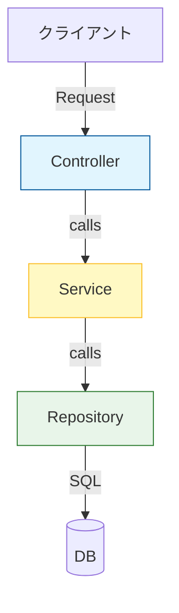
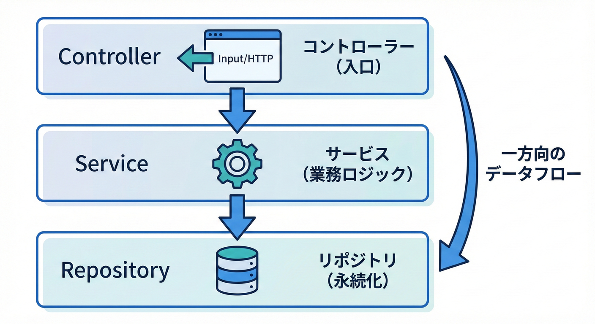
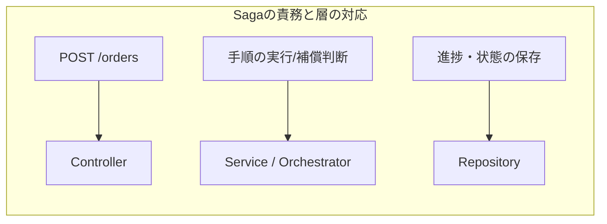
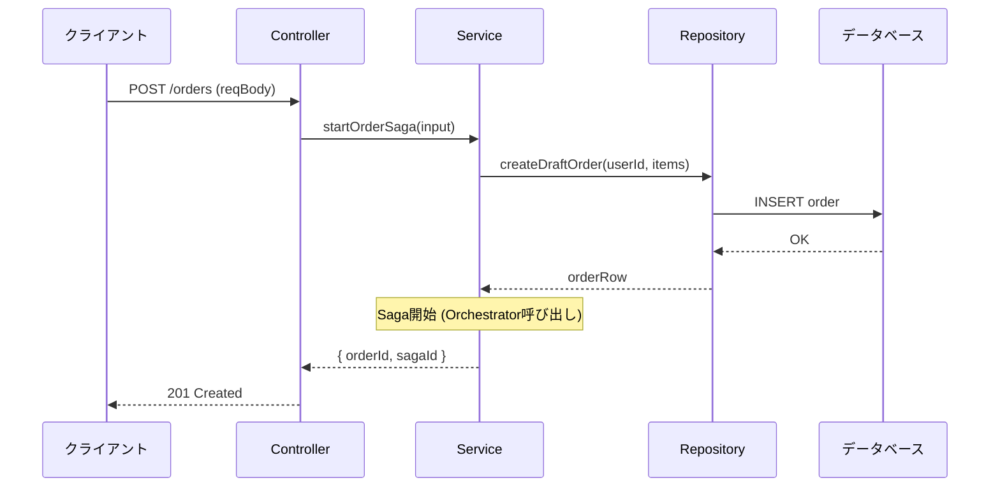

# 第7章：設計入門② “責務”ってなに？（薄い層の意識）🧁📚

## この章のゴール🎯✨

* 「この処理、どこに書けばいいの？」で迷う回数を減らす🧭💡
* Controller / Service / Repository の“役割分担”を、サッと説明できるようになる💬
* Sagaを作るときに、コードがゴチャッと混ざるのを防ぐ🧯🧩

---

# 1) “責務”ってなに？🤔🧩

**責務 = その部品が引き受ける仕事の範囲（担当範囲）**だよ😊✨

たとえば「注文を作る」って一言でも、実は中身がいろいろあるの👇

* HTTPリクエストを受け取る📩
* 入力チェックする✅
* どんな順番で処理するか決める（ビジネス手順）🧠
* DBに保存する🗄️
* エラーが起きたらどう返すか決める⚠️
* ログや追跡IDを付ける🔎

この全部を1つの関数に詰め込むと、すぐに“迷子コード”になる😵‍💫💦
だから **「責務を分ける」**のが設計の最初の一歩だよ🚶‍♀️🌱

---

# 2) “薄い層”ってどういう気持ち？🧁

「薄い層」っていうのは、ざっくり言うと👇

* **各層は“やることを少なく”**して、判断を分散しない
* **上の層は下の層を使うだけ**（下の層の事情に踏み込まない）
* それぞれが“自分の仕事だけ”をして、他人の仕事を奪わない🙅‍♀️

これをやると嬉しいことがいっぱい😊💕

* 修正が局所で済む🔧
* テストしやすい🧪
* 追加機能で破壊しにくい🛡️
* 「ここ見ればいい」が分かりやすい🗺️

---

# 3) まずは王道：Controller / Service / Repository 👑

バックエンドで超よくある分け方がこの3つだよ👇
（NestJSみたいなTypeScript向けフレームワークでも、Controller と Service（Provider）中心で組み立てる考え方が基本にあるよ😊） ([NestJS Docs][1])

## Controller（入口）🚪📩

**やること：外から来たものを受け取って、返す**

* リクエスト/レスポンスの整形
* 入力の軽いバリデーション
* 認可/認証の“入り口”（詳細は別部品に任せがち）
* Serviceを呼ぶだけ（ここが大事！）✨

✅ 合言葉：**Controllerは薄く！**（ビジネス判断を置かない） ([GitHub][2])


```mermaid
graph TD
    Client[クライアント] -- Request --> Controller[Controller]
    Controller -- calls --> Service[Service]
    Service -- calls --> Repository[Repository]
    Repository -- SQL --> DB[(DB)]
    
    style Controller fill:#e1f5fe,stroke:#01579b
    style Service fill:#fff9c4,stroke:#fbc02d
    style Repository fill:#e8f5e9,stroke:#2e7d32
```

---

## Service（手順・判断の中心）🧠🧑‍🍳

**やること：ビジネスの手順を組み立てる（ユースケース）**

* 「注文→決済→在庫→発送」みたいな流れを決める
* “どこまで成功した？”を見て次を決める
* エラーの扱い（リトライする？補償する？）の判断
* いろんなRepositoryや外部I/O部品を組み合わせる

✅ 合言葉：**手順（ユースケース）はServiceへ！** ([GitHub][2])

---

## Repository（保存と取得）🗄️📦

**やること：データの出し入れ（永続化）**

* DBから取る
* DBに保存する
* できれば“ビジネス判断”は入れない（入れると地獄）😇💦
* ORMやSQLの都合をここに閉じ込める

「RepositoryパターンでDB/ORMへの依存を薄くする」考え方は、NestJS界隈でもよく語られるよ🧩 ([Medium][3])

✅ 合言葉：**Repositoryはデータ係！** 📚



---

# 4) Sagaと“責務”の相性🍱✨（混ざりやすいポイント注意！）

Sagaって「複数ステップの手順＋失敗時の戻し」だから、放っておくと全部が混ざりやすい😵‍💫💦

だから、責務をこう割るとスッキリしやすいよ👇

* **Controller**：Saga開始の入口（例：POST /orders）
* **Service（または Orchestrator）**：Sagaの手順の司令塔（次のStepは何？失敗なら補償？）🎻
* **Repository**：

  * 注文データの保存
  * Saga状態（進捗）の保存（どこまで成功したか）
  * “実行済み”などの記録

「層を分けて、Web層が勝手に下層へ侵入しない」みたいな設計指針は、Nodeのベストプラクティスでも強調されがちだよ🔒 ([GitHub][2])


```mermaid
graph LR
    subgraph Saga_Layers ["Sagaの責務と層の対応"]
        BC[POST /orders] --> Layer1[Controller]
        Step[手順の実行/補償判断] --> Layer2[Service / Orchestrator]
        State[進捗・状態の保存] --> Layer3[Repository]
    end
```

---

# 5) 迷ったときの“置き場所ルール”🧭✨

「どこに書くべき？」ってなったら、この質問を順番にしてね😊

## Q1: これはHTTPの話？それともビジネスの話？🌍

* HTTPの話（ステータスコード、req/res整形） → **Controller**
* ビジネスの話（注文できる条件、実行順、補償判断） → **Service**

## Q2: これはDB/保存の話？🗄️

* SQL/ORM/保存形式が絡む → **Repository**

## Q3: “手順”なの？“部品”なの？🧩

* 手順（AしてBしてCして…） → **Service**
* 部品（保存する、送る、呼ぶ） → **Repository**や外部I/O用のクラス

---

# 6) ミニ例：注文Sagaの“薄い層”サンプル🛒🧯

## 6-1. フォルダ構成イメージ📁✨

* `order.controller.ts`（入口）
* `order.service.ts`（ユースケース）
* `order.repository.ts`（DB）
* `orderSaga.orchestrator.ts`（Saga司令塔：Serviceに含めてもOK）

「層で分ける or 機能（feature）で分ける」は、近年のNode/TSでも定番の整理軸としてよく出るよ📦 ([DEV Community][4])

---

## 6-2. Controllerは“薄く”✨（Serviceを呼ぶだけ）

```ts
// order.controller.ts
import { OrderService } from "./order.service";

export class OrderController {
  constructor(private readonly orderService: OrderService) {}

  async createOrder(reqBody: { userId: string; items: Array<{ sku: string; qty: number }> }) {
    // ✅ 入口の軽いチェック（重すぎない）
    if (!reqBody.userId) throw new Error("userId is required");
    if (!reqBody.items?.length) throw new Error("items is required");

    // ✅ ビジネスの手順はServiceへ
    const result = await this.orderService.startOrderSaga(reqBody);

    // ✅ レスポンス整形（ここはControllerの仕事）
    return { orderId: result.orderId, sagaId: result.sagaId };
  }
}
```

---

## 6-3. Serviceが“手順”を持つ🧠🎻

```ts
// order.service.ts
import { OrderRepository } from "./order.repository";
import { OrderSagaOrchestrator } from "./orderSaga.orchestrator";

export class OrderService {
  constructor(
    private readonly orderRepo: OrderRepository,
    private readonly saga: OrderSagaOrchestrator
  ) {}

  async startOrderSaga(input: { userId: string; items: Array<{ sku: string; qty: number }> }) {
    // ✅ ここからは「注文を成立させるための手順」
    // 1) 注文を“下書き”で作る（ビジネス判断）
    const order = await this.orderRepo.createDraftOrder(input.userId, input.items);

    // 2) Saga開始（手順の司令塔に任せる）
    const sagaId = await this.saga.start({
      orderId: order.orderId,
      userId: input.userId,
      items: input.items,
    });

    return { orderId: order.orderId, sagaId };
  }
}
```

---

## 6-4. Repositoryは“データ係”🗄️📦

```ts
// order.repository.ts
type OrderRow = { orderId: string; userId: string; status: "DRAFT" | "CONFIRMED" | "CANCELLED" };

export class OrderRepository {
  // ここではDB接続などを想定（省略）
  async createDraftOrder(userId: string, items: Array<{ sku: string; qty: number }>) {
    // ✅ 永続化の詳細はここに閉じ込める
    const orderId = crypto.randomUUID();
    const row: OrderRow = { orderId, userId, status: "DRAFT" };

    // insert into orders ... (省略)
    // insert into order_items ... (省略)

    return row;
  }
}


```mermaid
sequenceDiagram
    participant User as クライアント
    participant C as Controller
    participant S as Service
    participant R as Repository
    participant DB as データベース

    User->>C: POST /orders (reqBody)
    C->>S: startOrderSaga(input)
    S->>R: createDraftOrder(userId, items)
    R->>DB: INSERT order
    DB-->>R: OK
    R-->>S: orderRow
    Note over S: Saga開始 (Orchestrator呼び出し)
    S-->>C: { orderId, sagaId }
    C-->>User: 201 Created
```
```

---

# 7) ありがち事故あるある😇💥（そして直し方）

## 事故①：Controllerが太る🍔💦

* Controllerに「決済失敗なら返金して…在庫戻して…」みたいな手順が書かれてる
  ✅ 対策：**手順はService/Sagaへ移動！**

## 事故②：Repositoryにビジネス判断が入り込む🌀

* `if (order.total > 10000) discount...` がRepositoryにある
  ✅ 対策：**判断はService/Domainへ！Repositoryは保存だけ！**

## 事故③：ServiceがHTTPの都合を持つ📮

* Serviceが `res.status(400)` とか返し始める
  ✅ 対策：**HTTPはControllerへ戻す！**

---

# 8) AI活用：迷子を減らす“お願いテンプレ”🤖💬✨

コピペで使えるよ〜😊

* 「この関数を Controller / Service / Repository に分けて、責務をコメントで説明して」
* 「Controllerは薄く、Serviceに手順、Repositoryに永続化。ルール違反があれば指摘して」
* 「SagaのOrchestratorとして妥当か、責務の境界が崩れてないかレビューして」

AIは雛形づくりが得意だから、**“分け案を出させて、人間が責務チェックする”**のが相性いいよ✅💕

---

# 9) 章末演習：注文処理の責務を3つに分けよう📝✨

## お題😈

次の「全部入り関数」を、**Controller / Service / Repository**に分割してね！

```ts
async function createOrderEverything(reqBody: any) {
  // 入力チェック
  if (!reqBody.userId) throw new Error("userId missing");

  // DB保存
  const orderId = crypto.randomUUID();
  // insert into orders...

  // 決済API呼び出し
  // charge...

  // 在庫確保
  // reserve...

  // 失敗したら返金・在庫戻し
  // refund / release...

  return { orderId };
}
```

## やること✅

1. Controller：入力を受けてServiceを呼ぶだけにする🚪
2. Service：手順（Saga開始）を書く🧠
3. Repository：注文の保存だけにする🗄️

## チェックポイント🔎

* Controllerに“手順”が残ってない？
* Repositoryに“判断”が入ってない？
* Serviceに“永続化の細かいSQL”が入ってない？

（解答例は、6章のミニ例をベースにすればOKだよ😊🫶）

---

# まとめ🌸

* **責務 = 担当範囲**。混ぜると迷子になる😵‍💫
* **Controllerは薄く**、**Serviceが手順**、**Repositoryが保存**🧁
* Sagaは混ざりやすいから、**司令塔（手順）をService/Orchestratorに寄せる**のがコツ🎻
* 迷ったら「HTTP？手順？保存？」で仕分け🧭✨

[1]: https://docs.nestjs.com/?utm_source=chatgpt.com "Documentation | NestJS - A progressive Node.js framework"
[2]: https://github.com/goldbergyoni/nodebestpractices?utm_source=chatgpt.com "The Node.js best practices list (July 2024)"
[3]: https://medium.com/%40mitchella0100/implementing-the-repository-pattern-in-nestjs-and-why-we-should-e32861df5457?utm_source=chatgpt.com "Implementing the Repository Pattern in NestJS (and why ..."
[4]: https://dev.to/pramod_boda/recommended-folder-structure-for-nodets-2025-39jl?utm_source=chatgpt.com "Recommended Folder Structure for Node(TS) 2025"
