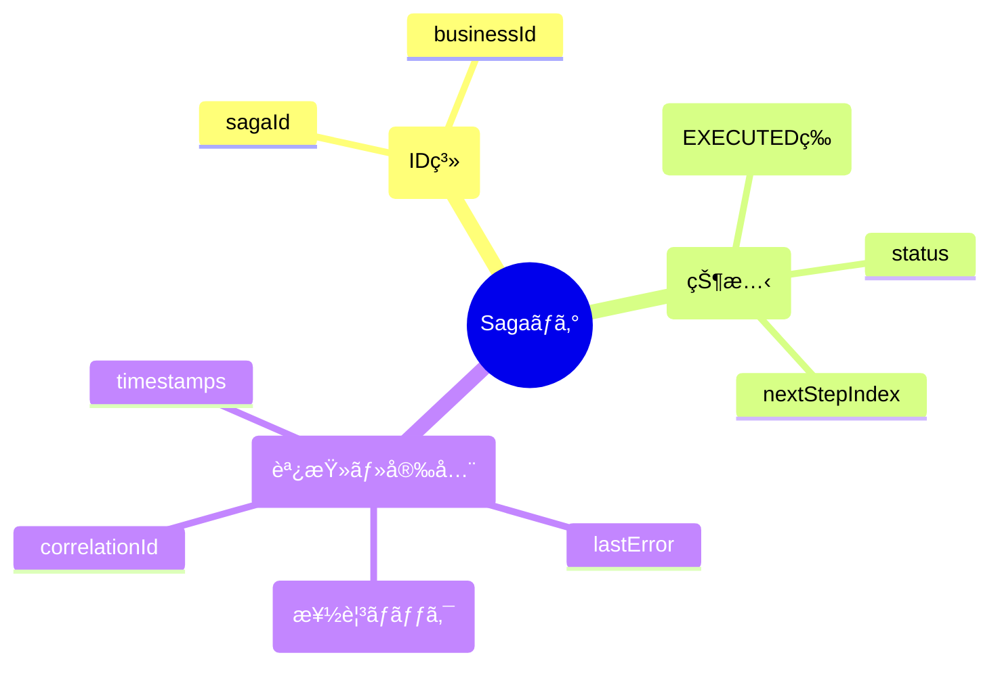
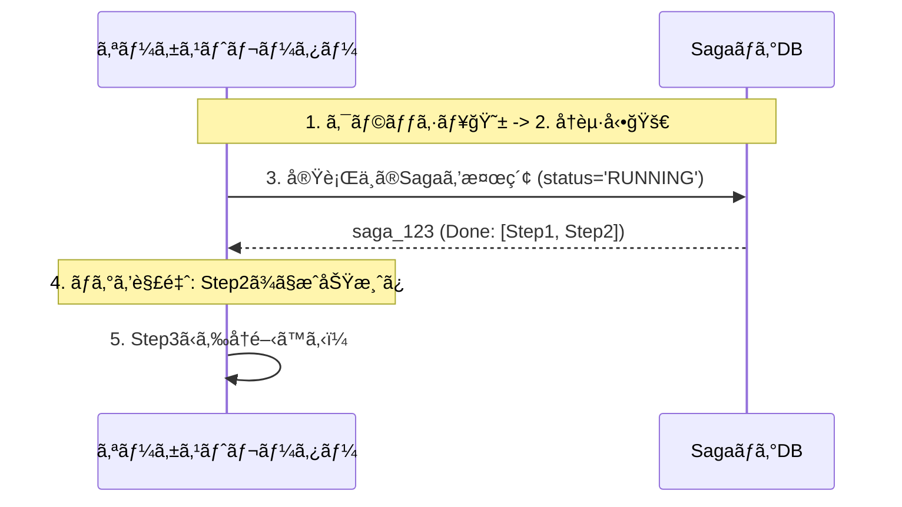
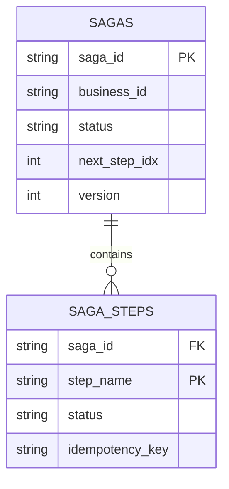

# 第9章：データ設計ã®æœ€å°ã‚»ãƒƒãƒˆï¼ˆSagaログ）📒🧷

## 9-0. ã¾ãšã€ŒSagaログã€ã£ã¦ä½•ã‚’ã™ã‚‹ã‚‚ã®ï¼ŸğŸ§ âœ¨

Sagaã¯ã€Œã„ãã¤ã‹ã®å‡¦ç†ï¼ˆStep）を順番ã«é€²ã‚ã¦ã€é€”中ã§å¤±æ•—ã—ãŸã‚‰è£œå„Ÿï¼ˆCompensation）ã§æˆ»ã™ã€ã‚„ã‚Šæ–¹ã ã‚ˆã­ğŸ”🧯
ã“ã®ã¨ã超é‡è¦ãªã®ãŒ **“途中経éを忘れãªã„ã“ã¨â€** ã§ã™ğŸ“

* アプリãŒè½ã¡ã¦ã‚‚ã€**ã©ã“ã¾ã§é€²ã‚“ã ã‹**ã‚’å†é–‹ã§ãる🧩
* リトライ（å†å®Ÿè¡Œï¼‰ã§ã€**二é‡æ±ºæ¸ˆ**ã¨ã‹ã‚’防ãã‚„ã™ããªã‚‹ğŸ”âš ï¸
* 「ãªã«ãŒèµ·ããŸï¼Ÿã€ã‚’後ã‹ã‚‰èª¿æŸ»ã§ãã‚‹ğŸ”ğŸ“

Sagaã¯ã€Œãƒ­ãƒ¼ã‚«ãƒ«ãƒˆãƒ©ãƒ³ã‚¶ã‚¯ã‚·ãƒ§ãƒ³ã®é€£é–＋失敗時ã¯è£œå„Ÿãƒˆãƒ©ãƒ³ã‚¶ã‚¯ã‚·ãƒ§ãƒ³ã€ã¨ã„ã†è€ƒãˆæ–¹ãªã®ã§ã€**進æ—ã¨è£œå„Ÿã®èµ·ç‚¹**を残ã™ã®ãŒæœ¬è³ªã§ã™ã€‚([microservices.io][1])

---

## 9-1. “最å°ã‚»ãƒƒãƒˆâ€ã®è€ƒãˆæ–¹ï¼š3ã¤ã«åˆ†ã‘ã‚‹ã¨è¿·ã‚ãªã„📦✨

Sagaログã«å…¥ã‚Œã‚‹æƒ…å ±ã¯ã€å¤§ãã3カテゴリã«åˆ†ã‘ã‚‹ã¨ã‚¹ãƒƒã‚­ãƒªã—ã¾ã™ğŸ˜ŠğŸ§¹

1. **識別ã¨ã²ã‚‚付ã‘（ID系）** 🪪🔗
2. **進æ—（状態・ã©ã“ã¾ã§ã‚„ã£ãŸã‹ï¼‰** 🚦🗺ï¸
3. **é‹ç”¨ï¼ˆèª¿æŸ»ãƒ»å†å®Ÿè¡Œãƒ»å®‰å…¨ï¼‰** ğŸ”🧰

「最å°ã‚»ãƒƒãƒˆã€ã£ã¦è¨€ã£ã¦ã‚‚ã€**未æ¥ã®è‡ªåˆ†ãŒæ³£ã‹ãªã„最ä½é™**ã¯å…¥ã‚Œã‚ˆã†ã­ğŸ˜­â¡ï¸ğŸ˜Š



```mermaid
mindmap
  root((Sagaログ))
    識別(ID系)
      sagaId
      businessId
    進æ—(状態)
      status
      steps (EXECUTEDç­‰)
      nextStepIndex
    é‹ç”¨(調査・安全)
      lastError
      version (楽観ロック)
      correlationId
      timestamps
```

---

## 9-2. 最å°ã§å¿…須：Sagaログã«å…¥ã‚Œã‚‹é …目（ã“ã‚Œã ã‘ã¯å¤–ã›ãªã„）✅📒

### A. 識別ã¨ã²ã‚‚付ã‘（ID系）🪪🔗

* **sagaId**：Sagaインスタンスã®ID（例：UUID）
* **businessId**：業務ã®ID（例：orderId / reservationId）

  * 「1注文ï¼1Sagaã€ãªã‚‰ orderId ã‚’ businessId ã«ã—ã¦OK👌

> ãƒã‚¤ãƒ³ãƒˆğŸ’¡
> **sagaId（技術的ãªID）** 㨠**businessId（業務的ãªID）** を分ã‘ã¦ãŠãã¨ã€èª¿æŸ»ãŒãƒ©ã‚¯ã«ãªã‚Šã¾ã™ğŸ”✨

### B. 進æ—（状態・ã©ã“ã¾ã§ï¼‰ğŸš¦ğŸ—ºï¸

* **status**：Saga全体ã®çŠ¶æ…‹ï¼ˆå¾Œã§ä¸€è¦§ã®ãŠã™ã™ã‚を出ã™ã‚ˆï¼‰
* **steps**：å„Stepã®å®Ÿè¡Œçµæœï¼ˆæœ€ä½ã§ã‚‚「ã©ã®StepãŒæˆåŠŸã—ãŸã‹ã€ï¼‰
* **currentStep**（ã¾ãŸã¯ nextStep）：次ã«å®Ÿè¡Œã™ã‚‹Stepã®ä½ç½®

> ã“ã“ãŒæœ€é‡è¦ğŸ§ 
> **「æˆåŠŸã—ãŸStepã®å±¥æ­´ã€ãŒãªã„ã¨ã€è£œå„Ÿã®é€†é †å®Ÿè¡ŒãŒã§ããªã„** 😵â€ğŸ’«ğŸ§¯

### C. é‹ç”¨ï¼ˆèª¿æŸ»ãƒ»å†å®Ÿè¡Œãƒ»å®‰å…¨ï¼‰ğŸ”🧰

* **createdAt / updatedAt**：ã„ã¤å§‹ã¾ã‚Šã€ã„ã¤æ›´æ–°ã•ã‚ŒãŸã‹â°
* **lastError**：最後ã®ã‚¨ãƒ©ãƒ¼ï¼ˆã‚³ãƒ¼ãƒ‰/メッセージ/発生Step）💥
* **version**（æ¨å¥¨ï¼‰ï¼šæ¥½è¦³ãƒ­ãƒƒã‚¯ç”¨ï¼ˆåŒæ™‚æ›´æ–°ã®äº‹æ•…を減らã™ï¼‰ğŸ›¡ï¸

---

## 9-3. status（状態）ãŠã™ã™ã‚セット🚦✨

åˆå¿ƒè€…ãŒã¾ãšæ‰±ã„ã‚„ã™ã„ã®ã¯ã“ã®ã¸ã‚“👇（増やã—ã™ããªã„ã®ãŒã‚³ãƒ„ï¼ï¼‰

* `RUNNING`（進行中）ğŸƒâ€â™€ï¸
* `SUCCEEDED`（全部æˆåŠŸï¼‰ğŸ‰
* `COMPENSATING`（補償中）🧯
* `COMPENSATED`（補償完了ï¼æˆ»ã—ãã£ãŸï¼‰ğŸ”✅
* `FAILED`（失敗ã—ã¦æ­¢ã¾ã£ãŸï¼‰ğŸ’¥ğŸ›‘

「補償ãŒå…¨éƒ¨ã§ããªã„ç¾å®Ÿã€ã¯å¾Œã®ç« ã§ã‚„ã‚‹ã‘ã©ã€ãƒ­ã‚°è¨­è¨ˆã¨ã—ã¦ã¯ **FAILED ã®ã¨ã㫠“ã©ã“ã¾ã§æˆ»ã›ãŸã‹â€ ãŒè¿½ãˆã‚‹** ã®ãŒå¤§äº‹ã ã‚ˆğŸ“

---

## 9-4. steps（Stepã®è¨˜éŒ²ï¼‰ã‚’ã©ã†æŒã¤ï¼Ÿ2ã¤ã®å‹ãŒã‚るよ🧩📌

Sagaログã§ä¸€ç•ªæ‚©ã‚€ã®ãŒã€Œstepsã‚’ã©ã†ä¿å­˜ã™ã‚‹ã‹ã€ã§ã™ğŸ˜µâ€ğŸ’«
代表ã¯ã“ã®2パターン👇

# パターン①：Sagaテーブル㫠steps ã‚’ã¾ã¨ã‚ã¦æŒã¤ï¼ˆå­¦ç¿’å‘ã）📦✨

* Saga 1レコードã«ã€stepsã‚’é…列（JSON）ã§æŒã¤
* 実装ãŒã‚·ãƒ³ãƒ—ルã§ç†è§£ã—ã‚„ã™ã„😊

# パターン②：SagaStepテーブルを分ã‘る（実務å‘ã）ğŸ—ï¸âœ¨

* `sagas` 㨠`saga_steps` を分ã‘ã¦æ­£è¦åŒ–
* Stepå˜ä½ã®ãƒ¦ãƒ‹ãƒ¼ã‚¯åˆ¶ç´„（é‡è¤‡æ’除）を作りやã™ã„🛡ï¸
* 集計・調査・å†å®Ÿè¡ŒãŒå¼·ã„💪

ã“ã®ç« ã§ã¯ **「最å°ã‚»ãƒƒãƒˆã€ãŒãƒ†ãƒ¼ãƒ**ãªã®ã§ã€ã¾ãšã¯â‘ ã§ã‚¤ãƒ¡ãƒ¼ã‚¸ã‚’固ã‚ã¦ã€â‘¡ã‚‚「ã“ã†ãªã‚‹ã‚ˆã€ã‚’見ã¦ãŠãæ„Ÿã˜ã«ã™ã‚‹ã­ğŸ˜ŠğŸ“š

---

## 9-5. TypeScriptã§ã€Œæœ€å°Sagaログã€ã®å‹ã‚’作る🧑â€ğŸ’»ğŸ§·

```ts
// Saga全体ã®çŠ¶æ…‹ï¼ˆå¢—ã‚„ã—ã™ããªã„✨）
export type SagaStatus =
  | "RUNNING"
  | "SUCCEEDED"
  | "COMPENSATING"
  | "COMPENSATED"
  | "FAILED";

// Stepã”ã¨ã®çŠ¶æ…‹
export type StepStatus =
  | "PENDING"      // ã¾ã 
  | "EXECUTED"     // 順方å‘ãŒæˆåŠŸ
  | "COMPENSATED"  // 補償ãŒæˆåŠŸ
  | "FAILED";      // ãã®Stepã§å¤±æ•—

export type SagaStepLog = {
  stepName: string;            // "AuthorizePayment" ã¿ãŸã„ã«ä¸€æ„ã£ã½ã
  status: StepStatus;

  // 冪等性ã®æº–備（第16-17ç« ã§è¶…é‡è¦ã«ãªã‚‹ï¼ï¼‰
  // 最å°ã‚»ãƒƒãƒˆã¨ã—ã¦ã€Œç½®ã場所ã ã‘ã€ç”¨æ„ã—ã¦ãŠãã¨å¾ŒãŒæ¥½ğŸ˜Š
  idempotencyKey?: string;

  startedAt?: string;          // ISO文字列
  finishedAt?: string;         // ISO文字列
  attempt?: number;            // リトライå›æ•°

  // 調査用（最å°ã§OK）
  lastErrorCode?: string;
  lastErrorMessage?: string;
};

export type SagaLog = {
  sagaId: string;              // UUIDãªã©
  businessId: string;          // orderIdãªã©

  status: SagaStatus;

  // ã©ã“ã¾ã§é€²ã‚“ã ï¼Ÿï¼ˆPENDING/EXECUTED ãŒè‚）
  steps: SagaStepLog[];

  // 次ã«å®Ÿè¡Œã™ã‚‹Stepã®ç›®å®‰ï¼ˆindexã§ã‚‚nameã§ã‚‚OK）
  nextStepIndex: number;

  // 監査・調査ã®æœ€ä½é™
  createdAt: string;
  updatedAt: string;

  // 失敗ã®è¦ç‚¹ã ã‘残ã™ï¼ˆå…¨æ–‡ãƒ­ã‚°ã¯åˆ¥ã«å‡ºã™æƒ³å®šï¼‰
  lastError?: {
    stepName?: string;
    code?: string;
    message?: string;
  };

  // åŒæ™‚更新対策（楽観ロック）
  version: number;

  // 相関ID（後ã§ã€Œãƒ­ã‚°è¿½è·¡ã€ãŒçˆ†é€Ÿã«ãªã‚‹âœ¨ï¼‰
  correlationId?: string;
  traceparent?: string; // W3C Trace Context ã‚’ãã®ã¾ã¾å…¥ã‚Œã‚‹æ¡ˆã‚‚ã‚るよ
};
```

`traceparent` 㯠W3Cã®æ¨™æº–ヘッダー形å¼ãŒã‚ã‚‹ã®ã§ã€åˆ†æ•£ãƒˆãƒ¬ãƒ¼ã‚¹ã¨ç›¸æ€§ãŒè‰¯ã„ã§ã™ğŸ“Œ([W3C][2])
ã•ã‚‰ã« OpenTelemetry ã¯ã€ãƒ­ã‚°ã« TraceId/SpanId を入れã¦ã€Œãƒ­ã‚°ã¨ãƒˆãƒ¬ãƒ¼ã‚¹ã‚’相関ã€ã§ãる設計ã«ãªã£ã¦ã„ã¾ã™ğŸ”—📈([OpenTelemetry][3])

---

## 9-6. 例：Sagaログ1件ã®ã‚¤ãƒ¡ãƒ¼ã‚¸ï¼ˆJSON）👀📒

```json
{
  "sagaId": "8b8f6b0b-0d86-4c20-a2aa-6a8f2f0a5c2b",
  "businessId": "order-2026-000123",
  "status": "RUNNING",
  "steps": [
    {
      "stepName": "ReserveStock",
      "status": "EXECUTED",
      "idempotencyKey": "order-2026-000123:ReserveStock",
      "startedAt": "2026-01-30T10:00:00.000Z",
      "finishedAt": "2026-01-30T10:00:01.200Z",
      "attempt": 1
    },
    {
      "stepName": "AuthorizePayment",
      "status": "FAILED",
      "idempotencyKey": "order-2026-000123:AuthorizePayment",
      "startedAt": "2026-01-30T10:00:01.300Z",
      "attempt": 1,
      "lastErrorCode": "PAYMENT_TIMEOUT",
      "lastErrorMessage": "timeout"
    },
    {
      "stepName": "CreateShipment",
      "status": "PENDING"
    }
  ],
  "nextStepIndex": 1,
  "createdAt": "2026-01-30T10:00:00.000Z",
  "updatedAt": "2026-01-30T10:00:03.000Z",
  "lastError": {
    "stepName": "AuthorizePayment",
    "code": "PAYMENT_TIMEOUT",
    "message": "timeout"
  },
  "version": 7,
  "correlationId": "corr-9d0b0a6c",
  "traceparent": "00-4bf92f3577b34da6a3ce929d0e0e4736-00f067aa0ba902b7-01"
}
```

ã“ã®1件を見るã ã‘ã§ğŸ‘‡ãŒåˆ†ã‹ã‚‹ã®ãŒç†æƒ³ã ã‚ˆâœ¨

* ã©ã®æ³¨æ–‡ã®Saga？（businessId）🛒
* ã©ã“ã¾ã§æˆåŠŸã—ãŸï¼Ÿï¼ˆReserveStockã¯æˆåŠŸï¼‰âœ…
* ã©ã“ã§å¤±æ•—ã—ãŸï¼Ÿï¼ˆAuthorizePayment）💥
* 次ã«ã©ã†ã™ã‚‹ï¼Ÿï¼ˆè£œå„Ÿã«è¡Œã？リトライ？判断ææ–™ãŒã‚る）🧠


```mermaid
sequenceDiagram
    participant Orch as オーケストレーター
    participant DB as SagaログDB
    Note over Orch, DB: 1. クラッシュ😱 -> 2. å†èµ·å‹•ğŸš€
    Orch->>DB: 3. 実行中ã®Sagaを検索 (status='RUNNING')
    DB-->>Orch: saga_123 (Done: [Step1, Step2])
    Note over Orch: 4. ログを解釈: Step2ã¾ã§æˆåŠŸæ¸ˆã¿
    Orch->>Orch: 5. Step3ã‹ã‚‰å†é–‹ã™ã‚‹ï¼
```

---

## 9-7. DBã«è½ã¨ã™æœ€å°è¨­è¨ˆï¼ˆä¾‹ï¼š2テーブル構æˆï¼‰ğŸ—„ï¸âœ¨

「実務寄りã€ãªå½¢ã‚‚ã€è»½ã見ã¦ãŠã“ã†ã­ğŸ‘€
（Stepå˜ä½ã®é‡è¤‡æ’除・検索ãŒã‚„ã‚Šã‚„ã™ã„ï¼ï¼‰

```sql
-- sagas: Saga全体
CREATE TABLE sagas (
  saga_id        TEXT PRIMARY KEY,
  business_id    TEXT NOT NULL,
  status         TEXT NOT NULL,
  next_step_idx  INTEGER NOT NULL,
  last_error_step TEXT,
  last_error_code TEXT,
  last_error_message TEXT,
  correlation_id TEXT,
  traceparent    TEXT,
  version        INTEGER NOT NULL,
  created_at     TEXT NOT NULL,
  updated_at     TEXT NOT NULL
);

CREATE INDEX idx_sagas_business_id ON sagas(business_id);
CREATE INDEX idx_sagas_status ON sagas(status);

-- saga_steps: Stepå˜ä½ï¼ˆé‡è¤‡æ’除ã—ã‚„ã™ã„）
CREATE TABLE saga_steps (
  saga_id         TEXT NOT NULL,
  step_name       TEXT NOT NULL,
  status          TEXT NOT NULL,
  idempotency_key TEXT,
  attempt         INTEGER,
  started_at      TEXT,
  finished_at     TEXT,
  last_error_code TEXT,
  last_error_message TEXT,

  PRIMARY KEY (saga_id, step_name),
  FOREIGN KEY (saga_id) REFERENCES sagas(saga_id)
);

-- Stepã®å†ªç­‰ã‚­ãƒ¼ã‚’ユニークã«ã—ã¦ã€ŒäºŒé‡å®Ÿè¡Œã€ã‚’抑止ã™ã‚‹æ¡ˆï¼ˆDBã«ã‚ˆã‚Šæ–¹è¨€ã‚り）
-- CREATE UNIQUE INDEX uq_step_idempotency_key ON saga_steps(idempotency_key);
```


```mermaid
erDiagram
    SAGAS ||--o{ SAGA_STEPS : contains
    SAGAS {
        string saga_id PK
        string business_id
        string status
        int next_step_idx
        int version
    }
    SAGA_STEPS {
        string saga_id FK
        string step_name PK
        string status
        string idempotency_key
    }
```

---

## 9-8. よãã‚る事故💣（ã“れをé¿ã‘ã‚‹ã ã‘ã§å¼·ããªã‚‹ğŸ’ªï¼‰

* **stepsã‚’ä¿å­˜ã—ã¦ãªãã¦ã€è£œå„Ÿã§ããªã„** 😭🧯
* statusã ã‘ä¿å­˜ã—ã¦ã€**ã©ã®StepãŒæˆåŠŸã—ãŸã‹åˆ†ã‹ã‚‰ãªã„** 😵
* エラーを残ã•ãšã€**åŸå› èª¿æŸ»ãŒåœ°ç„** 🔥ğŸ”
* 更新競åˆã§ã€**状態ãŒå·»ã戻る/上書ãã•ã‚Œã‚‹** 🌀（→ versionã§ã‚¬ãƒ¼ãƒ‰ğŸ›¡ï¸ï¼‰
* 相関IDãŒãªãã¦ã€**ログ追跡ãŒè¿·å­** 🧭💦

  * `traceparent` ã¯æ¨™æº–仕様ãŒã‚ã‚‹ã®ã§ã€åˆ†æ•£è¿½è·¡ã®å…¥å£ã«ã—ã‚„ã™ã„よ📌([W3C][2])
  * OpenTelemetryã¯ãƒ­ã‚°ã¨ãƒˆãƒ¬ãƒ¼ã‚¹ã®ç›¸é–¢ï¼ˆTraceId/SpanId）をé‡è¦–ã—ã¦ã‚‹ã‚ˆğŸ”—([OpenTelemetry][3])

---

## 9-9. 章末：ä¿å­˜é …ç›®ãƒã‚§ãƒƒã‚¯ãƒªã‚¹ãƒˆâœ…📋✨

**ã€å¿…須】ã“ã‚ŒãŒãªã„ã¨SagaãŒæˆç«‹ã—ã«ãã„**

* [ ] sagaId 🪪
* [ ] businessId（orderId等）🛒
* [ ] status 🚦
* [ ] steps（少ãªãã¨ã‚‚“æˆåŠŸæ¸ˆã¿Stepâ€ãŒåˆ†ã‹ã‚‹ï¼‰ğŸ“
* [ ] nextStepIndex（ã¾ãŸã¯ç¾åœ¨ä½ç½®ï¼‰ğŸ§­
* [ ] createdAt / updatedAt â°

**ã€å¼·ãæ¨å¥¨ã€‘é‹ç”¨ã§åŠ¹ã**

* [ ] lastError（step / code / message）💥
* [ ] version（楽観ロック）🛡ï¸
* [ ] correlationId or traceparent 🔗

**ã€ä½™è£•ãŒå‡ºãŸã‚‰ã€‘後ã§ä¼¸ã°ã›ã‚‹**

* [ ] attempt（リトライå›æ•°ï¼‰ğŸ”
* [ ] startedAt/finishedAt（å„Stepã®æ‰€è¦æ™‚間）â±ï¸
* [ ] 期é™ï¼ˆdeadline / timeoutAt）â°ğŸ›‘

---

## 9-10. ミニ演習（3ã¤ï¼‰ğŸ“✨

**演習1：orderSagaã®stepsを書ã出ãã†ğŸ›’📦**
注文Sagaã§ã‚ã‚ŠãŒã¡ãªStepã‚’3〜5個書ã„ã¦ã€å„Stepã«ã€Œè£œå„Ÿã€ã‚’1ã¤ãšã¤ãƒšã‚¢ã§æ›¸ã„ã¦ã¿ã‚ˆã†âœï¸ğŸ§¯
ä¾‹ï¼šåœ¨åº«ç¢ºä¿ â†’ 在庫戻ã—ã€æ±ºæ¸ˆç¢ºä¿ → 返金 ãªã©

**演習2：statusé·ç§»ã‚’ã–ã£ãã‚Šæã“ã†ğŸš¦ğŸ—ºï¸**
`RUNNING → SUCCEEDED`
`RUNNING → COMPENSATING → COMPENSATED`
`RUNNING → FAILED`
ã¿ãŸã„ã«çŸ¢å°ã§OK👌

**演習3：最å°Sagaログã®JSONã‚’1件作ã‚ã†ğŸ“’👀**
「Step2ã§å¤±æ•—→補償ã«å…¥ã‚‹ã€ãƒ‘ターンã®ãƒ­ã‚°ã‚’ã€è‡ªåˆ†ã®æ¥­å‹™ãƒ‰ãƒ¡ã‚¤ãƒ³ã§1件作ã£ã¦ã¿ã‚ˆã†ğŸ˜Š

---

## 9-11. AI活用ã®ã‚³ãƒ„（短ã„プロンプト例）🤖💡

* 「Sagaログã®å‹ï¼ˆTypeScript）をã€statusã¨steps中心ã§æœ€å°æ§‹æˆã«ã—ã¦ã€‚lastErrorã¨versionも入れã¦ã€
* 「sagas 㨠saga_steps ã®2テーブル案をSQLã§ã€‚検索用indexã‚‚ã€
* 「ã“ã®SagaログJSONを見ã¦ã€è£œå„Ÿã®èµ·ç‚¹ï¼ˆæˆåŠŸæ¸ˆã¿Step）を説æ˜ã—ã¦ã€

AIã«â€œæ¡ˆâ€ã‚’出ã•ã›ã¦ã€**ã‚ãªãŸãŒã€Œå¿…é ˆ/æ¨å¥¨/ä»»æ„ã€ã«ä»•åˆ†ã‘ã™ã‚‹**ã®ãŒæœ€å¼·ã ã‚ˆâœ¨ğŸ§ 

[1]: https://microservices.io/patterns/data/saga.html?utm_source=chatgpt.com "Pattern: Saga"
[2]: https://www.w3.org/TR/trace-context/?utm_source=chatgpt.com "Trace Context"
[3]: https://opentelemetry.io/docs/specs/otel/logs/?utm_source=chatgpt.com "OpenTelemetry Logging"
