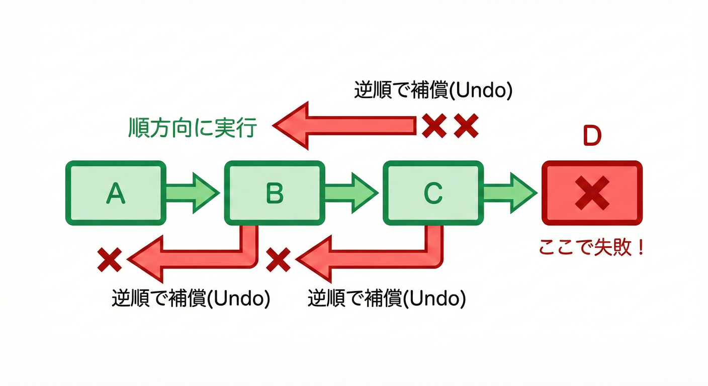

# 第15章：ミニSagaを“失敗させて”補償を発動する😈🧯

## この章のゴール🎯✨

* 「途中で失敗したら、どこまで戻す？」を“手で説明できる”ようになる🗣️💡
* ミニSagaをわざと失敗させて、**補償が逆順で動く**のを目で見る👀🔁
* 失敗パターンを3つ作って、挙動を整理できる🧪📒

---

# まずイメージを固めよ〜🧠💞

## 今日のミニ注文フロー🛒💳📦

1. 注文作成 ✅
2. 決済 ✅
3. 在庫確保 ✅
4. 発送依頼 ✅

どこかでコケたら…😵💥

* **成功したところまで**は現実に起きちゃってる
* だから **「戻す用の操作（補償）」** を走らせて整合を取りに行く🧯✨

## 超重要ルール3つ🔑🔑🔑

1. **補償は“逆順”**（最後にやったことから戻す）🔁
2. **実行済みだけ**補償する（やってないStepは戻せない）🙅‍♀️
3. 補償中に失敗しても、**できるだけ最後まで戻し切る**（止めない）🧱🧯



---

# 今日使う“最新より”の小ネタ🧩🆕

* TypeScript の配布ページでは、最新版が **5.9 系**として案内されてるよ📦✨ ([TypeScript][1])
* Node.js は **v24 が Active LTS**、v25 が Current（最新機能枠）として更新されてるよ🟩🟦 ([Node.js][2])
* TSをサクッと実行するなら `tsx` が便利（Node上でTSを実行するツール）⚡ ([GitHub][3])

---

# 失敗を“仕込む”ための道具を用意しよ😈🧰

## 失敗の種類（3つ）🌪️

* **業務エラー**：決済NG、在庫不足など（想定内）🧾
* **技術エラー**：タイムアウト、ネットワーク、DB落ち（ありがち）⏰⚡
* **バグ**：想定外の例外（泣ける）😭

この章では、わざとスイッチで発生させるよ🎛️✨

---

# 実装：1ファイルでミニSagaを完成させる💻🧪

## 1) 準備（まだなら）📦✨

* `tsx` で TypeScript をそのまま実行するよ⚡ ([GitHub][3])
* TypeScript は npm から入れるのが基本だよ📥 ([TypeScript][1])

（コマンド例）

```powershell
npm i -D typescript tsx
```

---

## 2) コピペで動く：`src/ch15_failure_demo.ts` 📝✨

```ts
/* =========================================
   Chapter 15: ミニSagaを失敗させて補償を発動するデモ 😈🧯
   実行: npx tsx src/ch15_failure_demo.ts
========================================= */

// ✅ 失敗の種類（ざっくり）
type FailMode = "BUSINESS" | "TECH" | "CRASH";

// ✅ どのStepで失敗させるか（"pay" など）
type FailPlan = Partial<Record<StepName, FailMode>>;

type StepName = "createOrder" | "pay" | "reserveStock" | "ship";

// ✅ ログ用（最小）
type SagaStatus = "RUNNING" | "COMPENSATING" | "COMPLETED" | "FAILED";
type SagaLog = {
  sagaId: string;
  status: SagaStatus;
  executed: StepName[];
  error?: string;
  compensationErrors: { step: StepName; error: string }[];
};

class BusinessError extends Error {
  readonly kind = "BUSINESS";
}
class TechnicalError extends Error {
  readonly kind = "TECH";
}
class SagaFailedError extends Error {
  constructor(
    message: string,
    readonly causeError: unknown,
    readonly compensationErrors: { step: StepName; error: string }[]
  ) {
    super(message);
  }
}

function toErrorString(e: unknown): string {
  if (e instanceof Error) return `${e.name}: ${e.message}`;
  return String(e);
}

// ✅ “失敗スイッチ”
async function maybeFail(step: StepName, plan: FailPlan): Promise<void> {
  const mode = plan[step];
  if (!mode) return;

  if (mode === "BUSINESS") throw new BusinessError(`業務エラー（例: 決済NG） @${step}`);
  if (mode === "TECH") throw new TechnicalError(`技術エラー（例: タイムアウト） @${step}`);
  throw new Error(`想定外クラッシュ（バグ想定） @${step}`);
}

// ✅ Step定義（順方向 + 補償）
type SagaStep = {
  name: StepName;
  action: () => Promise<void>;
  compensate: () => Promise<void>;
};

// ✅ ミニSaga Runner（超重要：逆順補償）
async function runSaga(sagaId: string, steps: SagaStep[], log: SagaLog): Promise<void> {
  log.status = "RUNNING";
  console.log(`\n=== Saga START: ${sagaId} 🚀 ===`);

  const executed: SagaStep[] = [];

  try {
    for (const step of steps) {
      console.log(`\n▶ Step: ${step.name} ✅`);
      await step.action();
      executed.push(step);
      log.executed.push(step.name);
      console.log(`✔ Done: ${step.name} 🎉`);
    }

    log.status = "COMPLETED";
    console.log(`\n=== Saga COMPLETED 🎊 (${sagaId}) ===`);
  } catch (e) {
    log.status = "COMPENSATING";
    log.error = toErrorString(e);

    console.log(`\n💥 Saga FAILED at some step!`);
    console.log(`原因: ${log.error}`);
    console.log(`\n=== Start COMPENSATION 🔁🧯 ===`);

    // ✅ 実行済みだけ、逆順で補償する
    for (const step of executed.slice().reverse()) {
      console.log(`\n↩ Compensate: ${step.name} 🧯`);
      try {
        await step.compensate();
        console.log(`✔ Compensated: ${step.name} ✅`);
      } catch (ce) {
        const msg = toErrorString(ce);
        log.compensationErrors.push({ step: step.name, error: msg });

        // ✅ 補償が失敗しても止めない（できるだけ戻し切る）
        console.log(`⚠ Compensation FAILED: ${step.name}`);
        console.log(`   ${msg}`);
      }
    }

    log.status = "FAILED";
    console.log(`\n=== Saga FAILED (after compensation) 😵 (${sagaId}) ===`);

    throw new SagaFailedError("Saga failed; compensation executed.", e, log.compensationErrors);
  }
}

/* =========================================
   ここから “注文Saga” を組み立てる🛒💳📦
========================================= */

function buildOrderSaga(plan: FailPlan, options?: { failRefundCompensation?: boolean }): SagaStep[] {
  return [
    {
      name: "createOrder",
      action: async () => {
        console.log("  📝 注文レコード作成中...");
        await sleep(150);
        await maybeFail("createOrder", plan);
      },
      compensate: async () => {
        console.log("  🗑 注文をキャンセル（論理削除など）...");
        await sleep(120);
      },
    },
    {
      name: "pay",
      action: async () => {
        console.log("  💳 決済実行中...");
        await sleep(200);
        await maybeFail("pay", plan);
        console.log("  💰 決済OK（仮）");
      },
      compensate: async () => {
        console.log("  💸 返金処理中...");
        await sleep(200);

        // 💥 補償そのものを失敗させる実験（オプション）
        if (options?.failRefundCompensation) {
          throw new TechnicalError("返金APIがタイムアウトした…😵");
        }

        console.log("  ✅ 返金OK（仮）");
      },
    },
    {
      name: "reserveStock",
      action: async () => {
        console.log("  📦 在庫引当中...");
        await sleep(180);
        await maybeFail("reserveStock", plan);
        console.log("  ✅ 在庫確保OK（仮）");
      },
      compensate: async () => {
        console.log("  📤 在庫引当を戻す...");
        await sleep(120);
      },
    },
    {
      name: "ship",
      action: async () => {
        console.log("  🚚 発送依頼中...");
        await sleep(180);
        await maybeFail("ship", plan);
        console.log("  ✅ 発送依頼OK（仮）");
      },
      compensate: async () => {
        console.log("  🛑 発送停止依頼...");
        await sleep(150);
      },
    },
  ];
}

function sleep(ms: number): Promise<void> {
  return new Promise((r) => setTimeout(r, ms));
}

/* =========================================
   実行：失敗パターンを試す🧪✨
========================================= */

async function main() {
  // 🧪 失敗パターン①：在庫確保で“技術エラー”（タイムアウト想定）
  await runOne("case-1", { reserveStock: "TECH" });

  // 🧪 失敗パターン②：決済で“業務エラー”（カードNG想定）
  await runOne("case-2", { pay: "BUSINESS" });

  // 🧪 失敗パターン③：補償（返金）が失敗する（でも止めずに続ける）
  await runOne("case-3", { ship: "TECH" }, { failRefundCompensation: true });
}

async function runOne(
  label: string,
  plan: FailPlan,
  options?: { failRefundCompensation?: boolean }
) {
  const log: SagaLog = {
    sagaId: label,
    status: "RUNNING",
    executed: [],
    compensationErrors: [],
  };

  console.log(`\n\n==============================`);
  console.log(` RUN: ${label} 🧪`);
  console.log(` plan: ${JSON.stringify(plan)} 🎛️`);
  console.log(`==============================`);

  try {
    const steps = buildOrderSaga(plan, options);
    await runSaga(label, steps, log);
  } catch (e) {
    console.log(`\n📒 LOG SUMMARY (${label})`);
    console.log(` status: ${log.status}`);
    console.log(` executed: ${log.executed.join(" -> ") || "(none)"}`);
    console.log(` error: ${log.error ?? "(none)"}`);

    if (log.compensationErrors.length > 0) {
      console.log(` compensationErrors:`);
      for (const ce of log.compensationErrors) {
        console.log(`  - ${ce.step}: ${ce.error}`);
      }
    } else {
      console.log(` compensationErrors: (none) ✅`);
    }

    console.log(`\n🧨 Thrown: ${toErrorString(e)}`);
  }
}

main().catch((e) => {
  console.error("FATAL:", e);
});
```

---

## 3) 実行して“逆順補償”を観察しよ👀🔁

```powershell
npx tsx src/ch15_failure_demo.ts
```

---

# 観察ポイント：ここを見たら勝ち🏆✨

## ✅ 観察①：失敗したStepは補償されない🙅‍♀️

たとえば `reserveStock` の **action中に失敗**したら、`reserveStock` は「実行済み」扱いにならないよね？
だから補償はこうなる👇

* `pay` の補償（返金）
* `createOrder` の補償（キャンセル）
  …みたいに **“完了した分だけ”**戻るよ🧯✨

## ✅ 観察②：補償は逆順🔁

`createOrder -> pay -> reserveStock` まで進んで失敗したら、補償は
`reserveStock（実行済みなら） -> pay -> createOrder` の順で戻るよ🔁📦💳📝

## ✅ 観察③：補償が失敗しても、止めずに続ける🧱

`case-3` では返金（補償）をわざと失敗させてるけど、そこで止めずに次の補償へ進むよ⚠️➡️🧯
（現実でも「返金できなかった！でも注文キャンセルはする！」みたいな判断が必要になること多い😵‍💫）

---

# よくあるミス集（先に潰す）🪓😇

* **補償を順方向で走らせちゃう**（戻せない😭）➡️ 必ず逆順🔁
* **未実行Stepも補償しちゃう**（何を戻してるの…？）➡️ 実行済みだけ🙆‍♀️
* **補償が1個失敗したら停止**（被害が拡大💥）➡️ できる限り続ける🧱
* **ログがない**（何が起きたか不明🤷‍♀️）➡️ 最低でも executed / status / error は残す📒

---

# 章末演習：失敗ケースを3パターン作る🧪🎓

## 演習A：失敗場所を変える🎛️

* `createOrder` で失敗
* `pay` で失敗
* `ship` で失敗

✅ チェック：それぞれ **補償が何個走るか**、**順序が逆**になってるか確認🔁👀

## 演習B：補償側も失敗させる😈

* `failRefundCompensation: true` を他の補償にも増やしてみてね🧯⚠️
  ✅ チェック：失敗しても他の補償が続くか🧱

## 演習C：ログを読みやすくする📒✨

* `SagaLog` に `startedAt / finishedAt` を足す⏰
* `status` が変わる瞬間にログを出す🚦
  ✅ チェック：あとで見返して「何が起きたか」すぐ追えるか🔎

---

# 理解度チェック（ミニ）✅💡

* Q1：補償はなぜ逆順？🤔
  → **最後にやった操作ほど“前提”に依存してることが多いから**（最後から戻すと安全）🔁🧯
* Q2：失敗したStepを補償しないのはなぜ？🤔
  → **完了してないなら、戻す対象が存在しない**から🙅‍♀️
* Q3：補償が失敗したらどうする？🤔
  → **止めずに他を戻しつつ、失敗を記録して調査・再実行の材料にする**📒🔎

---

[1]: https://www.typescriptlang.org/download/?utm_source=chatgpt.com "How to set up TypeScript"
[2]: https://nodejs.org/en/about/previous-releases?utm_source=chatgpt.com "Node.js Releases"
[3]: https://github.com/privatenumber/tsx?utm_source=chatgpt.com "privatenumber/tsx: ⚡️ TypeScript Execute | The easiest ..."
