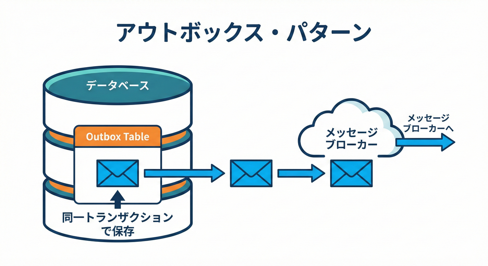

# 第23章：Outbox/Inbox・エラー設計・観測性をまとめて“運用できるSaga”へ📮🚨🔎✨

## この章のゴール🎯✨

* **メッセージの取りこぼし**と**重複処理**を、仕組みで減らせるようになる📮📥
* 失敗が起きたときに、**「何を」「どこまで」「どうする」**を迷わないエラー設計ができる🚨🧩
* 障害調査で必要な**相関ID（correlation）**を揃えて、ログから追跡できるようになる🔗🔎
* 最後に、**成功→失敗→リトライ→補償→調査**まで通る“運用できるSaga”を完成させる🎓🛠️✨

---

# 23.1 まず現実：メッセージは「届かない」「二重に届く」📨😇😈

分散システムの世界では、キレイな保証はあまり信じないのがコツです🥲
たとえば多くのキューは **at-least-once（最低1回）配信**で、状況によっては同じメッセージが**複数回届く**ことがあります。だからアプリ側は **重複を前提**に作る必要があります。📥🔁 ([AWS ドキュメント][1])

そして Outbox を使っても、送信担当（relay）が落ちたり再起動すると、同じイベントを**もう一度 publish してしまう**ことがあり得ます。つまり **「受信側は冪等であること」**が前提になります。([microservices.io][2])

> ✅ 結論：
> **Outbox = “送る”の取りこぼし対策**📮
> **Inbox = “受ける”の重複対策**📥
> この2つで「運用できる」に近づくよ〜！🫶✨ ([microservices.io][2])

---

# 23.2 Outboxパターン：取りこぼし防止の王道📮✨

## 何が嬉しいの？😊

典型的な事故👇

* DB更新は成功✅
* でもイベント送信が失敗（ネットワーク・プロセス落ち）❌
  → 結果、「状態は変わったのに通知が飛んでない」😱

**Transactional Outbox**は、これを避けるために

* **DBの更新**と
* **Outboxテーブルへの書き込み（イベント保存）**
  を **同じトランザクション**で確定させます📦🧾✨ ([microservices.io][2])

## 仕組み（超シンプル図）🖼️

1. 注文を更新する（DB）✅
2. 同じトランザクションで Outbox にイベントを書き込む📮
3. 別プロセス（relay）が Outbox を読んで publish する📤
4. publish 成功を Outbox 側に記録する📝

> relay が落ちると「publish したのに記録前に死んだ」みたいなことがあり、**二重publish**が起こり得るよ⚠️
> だから次の Inbox が超重要！([microservices.io][2])

---

# 23.3 Inboxパターン：重複処理を止める最短ルート📥🛡️

## 何が嬉しいの？😊

典型的な事故👇

* キューが同じメッセージを再配達🔁
* consumer が同じ処理を2回やってしまう😱（二重決済・二重出荷…）

Inbox では、受信したメッセージの **messageId / eventId をDBに記録**して、

* **「初めてなら処理してOK」**
* **「もう処理済みならスキップ」**
  を仕組みで判定します📥✅ ([DEV Community][3])

> ✅ コツ：Inbox テーブルに **ユニーク制約**を貼ると強い💪
> （同じIDは2回入らない → “二重実行を物理的に防ぐ”）



---

# 23.4 最小スキーマ例（Outbox / Inbox）🗃️✨

DBは何でもOKだけど、形はだいたいこれでいけるよ〜！😊

```sql
-- Outbox: “送るべきイベント”の保管場所📮
CREATE TABLE outbox (
  id              TEXT PRIMARY KEY,   -- eventId (UUIDなど)
  aggregate_type  TEXT NOT NULL,      -- "Order" など
  aggregate_id    TEXT NOT NULL,      -- orderId
  event_type      TEXT NOT NULL,      -- "OrderPaid" など
  payload_json    TEXT NOT NULL,      -- JSON文字列でもOK
  created_at      TEXT NOT NULL,      -- ISO日時
  published_at    TEXT NULL,          -- publish成功時に入れる
  attempts        INTEGER NOT NULL DEFAULT 0,
  next_attempt_at TEXT NULL           -- リトライ用
);

-- Inbox: “このconsumerはこのイベントを処理済みか？”📥
CREATE TABLE inbox (
  consumer_name TEXT NOT NULL,
  event_id      TEXT NOT NULL,
  processed_at  TEXT NOT NULL,
  PRIMARY KEY (consumer_name, event_id) -- これが重複防止の要💎
);
```

---

# 23.5 Relay（Outbox→Broker）でやるべきこと📤🔁

Outbox を読む係（relay）は、だいたい次をします👇

* **未送信（published_at が NULL）**を拾う📮
* publish する📤
* 成功したら `published_at` を埋める📝
* 失敗したら `attempts++` して、`next_attempt_at` を未来にずらす（バックオフ）🔁📉
* たまに **重複publish** してもOK（受信側が止める前提）🛡️([microservices.io][2])

---

# 23.6 Consumer（Broker→Inbox→業務処理）でやるべきこと📥✅

Consumer はこの順で考えると事故りにくいよ😊

1. メッセージを受け取る📨
2. **Inbox に (consumer_name, event_id) をINSERT** してみる✍️

* INSERT 成功 → 初見なので処理続行✅
* すでに存在 → **重複なのでスキップ**（=冪等）🛑

3. 業務処理（例：注文ステータス更新）🧾
4. ack（キューなら削除、Kafkaならコミット相当）✅

> 「FIFOだから重複しないでしょ？」って思いがちだけど、現実には**重複を前提**で設計するのが大事だよ〜⚠️ ([AWS ドキュメント][1])

---

# 23.7 エラー設計：まず “分類” しよう🧩🚨

Saga を運用するとき、エラーはだいたい次の2軸で考えるとスッキリします✨

## 軸A：業務エラー？ 技術エラー？🏷️

* **業務エラー**：入力がダメ、在庫が無い、期限切れ…（直しても同じ結果になりがち）🧾
* **技術エラー**：ネットワーク、タイムアウト、DB死んだ、503…（リトライで直る可能性あり）🌐⚡

## 軸B：リトライできる？ できない？🔁🛑

* **リトライ可**：一時的障害の可能性が高い（タイムアウト、429、503など）🔁
* **リトライ不可**：永遠に無理（バリデーション、残高不足が確定、仕様的に禁止）🛑

## まとめると（判断のテンプレ）📝

* 業務エラー → **補償 or 失敗確定**（人手対応のキューに流すのもアリ）🧯🧑‍💼
* 技術エラー（リトライ可） → **バックオフ付きリトライ**🔁📉
* 技術エラー（リトライ不可） → **失敗確定 → 補償 or 手動対応**🛑🧯

---

# 23.8 観測性：相関IDがないと、調査が地獄👻🔎

「どの注文の、どのSagaが、どこで失敗したの？」
これを **一発で追える**ようにするのが観測性です✨

## 最低限、ログに入れるもの📌

* `correlationId`（例：orderId でもOK）🔗
* `sagaId`（SagaインスタンスID）🧾
* `stepName` / `status`（どこまで進んだ？）🚦
* `eventId`（Inbox/Outboxの主キー）📮📥
* `idempotencyKey`（二重実行防止の鍵）🔑
* `attempt`（何回目の試行？）🔁
* `errorType`（Business/Technical）🏷️

## OpenTelemetry で “つながる” と強い📈✨

OpenTelemetry を使うと、HTTPやバックグラウンド処理を **trace（追跡）**でつなげられます。Node.js/JS の入門も公式にまとまってるよ📚✨ ([OpenTelemetry][4])

特に重要なのが **trace context（traceparent など）**をリクエストやメッセージに載せて渡すこと。これで「このログ、どのリクエスト由来？」が追えるようになります🔗🧠 ([OpenTelemetry][5])

---

# 23.9 TypeScript：Outbox/Inbox込みの最小コード例🧪💻

「動きが分かる」ことを優先したミニ実装です（DB部分は差し替え前提でOK）😊

## 1) まずは型（イベント封筒）📦

```ts
import crypto from "node:crypto";

export type EventEnvelope<TPayload = unknown> = {
  eventId: string;          // outbox/inbox の主キー
  eventType: string;        // "OrderPaid" など
  aggregateType: string;    // "Order"
  aggregateId: string;      // orderId
  correlationId: string;    // 追跡用（orderIdでもOK）
  traceparent?: string;     // OTelのtrace context（任意）
  payload: TPayload;
  occurredAt: string;       // ISO
};

export function newEvent<TPayload>(p: Omit<EventEnvelope<TPayload>, "eventId" | "occurredAt">): EventEnvelope<TPayload> {
  return {
    ...p,
    eventId: crypto.randomUUID(),
    occurredAt: new Date().toISOString(),
  };
}
```

## 2) Outbox に “保存” して、あとで relay が送る📮📤

```ts
type OutboxRecord = {
  event: EventEnvelope;
  publishedAt?: string;
  attempts: number;
  nextAttemptAt?: string;
};

export class OutboxStore {
  private rows: OutboxRecord[] = [];

  // ✅ 本番では「注文更新 + outbox insert」を同一トランザクションでやる
  insert(event: EventEnvelope) {
    this.rows.push({ event, attempts: 0 });
  }

  poll(now = new Date()): OutboxRecord[] {
    return this.rows.filter(r =>
      !r.publishedAt &&
      (!r.nextAttemptAt || new Date(r.nextAttemptAt) <= now)
    );
  }

  markPublished(eventId: string) {
    const r = this.rows.find(x => x.event.eventId === eventId);
    if (r) r.publishedAt = new Date().toISOString();
  }

  markFailed(eventId: string) {
    const r = this.rows.find(x => x.event.eventId === eventId);
    if (!r) return;
    r.attempts += 1;

    // 超かんたんバックオフ（例）：2^attempt 秒
    const delaySec = Math.min(60, Math.pow(2, r.attempts));
    r.nextAttemptAt = new Date(Date.now() + delaySec * 1000).toISOString();
  }
}
```

## 3) Inbox：重複を止める📥🛡️

```ts
export class InboxStore {
  private processed = new Set<string>(); // 本番はDBの UNIQUE 制約で守るのが強い💪

  tryBegin(consumerName: string, eventId: string): boolean {
    const key = `${consumerName}::${eventId}`;
    if (this.processed.has(key)) return false; // もう処理済み
    this.processed.add(key);
    return true; // 初見
  }
}
```

## 4) Relay と Consumer を “つなぐ”（疑似Broker）🔗

```ts
type PublishFn = (event: EventEnvelope) => Promise<void>;

export async function runRelayOnce(outbox: OutboxStore, publish: PublishFn) {
  const targets = outbox.poll();
  for (const r of targets) {
    try {
      await publish(r.event);
      outbox.markPublished(r.event.eventId);
    } catch {
      outbox.markFailed(r.event.eventId);
    }
  }
}

type HandleFn = (event: EventEnvelope) => Promise<void>;

export async function onMessage(
  consumerName: string,
  inbox: InboxStore,
  event: EventEnvelope,
  handle: HandleFn
) {
  const firstTime = inbox.tryBegin(consumerName, event.eventId);
  if (!firstTime) {
    // ✅ 重複なのでスキップ（冪等）
    return;
  }
  await handle(event);
}
```

---

# 23.10 “運用できるSaga” 卒業ミニ制作🎓🛠️✨

## お題：注文Saga（決済→在庫→発送）を「運用できる」形にする🛒💳📦

必須条件✅

* Outbox を使ってイベント取りこぼしを防ぐ📮
* Inbox で重複処理を防ぐ📥
* エラー分類（業務/技術、リトライ可否）をコードに落とす🚨
* ログに相関ID・sagaId・step・eventId・attempt を必ず出す🔎

## ① 成功パス（まずは気持ちよく成功✨）

* 注文作成 → Outbox に `OrderCreated` を保存📮
* relay が publish📤
* consumer が Inbox 判定 → 在庫確保 → 次イベント保存…🔁
* 最終的に `Shipped` で完了🎉

## ② 失敗パス（途中で壊す😈）

* 在庫確保で「在庫なし」を発生 → **業務エラー**として即失敗🛑
* 補償：決済済みなら返金、在庫確保済みなら在庫戻し🧯

## ③ 技術エラー（タイムアウト）→ リトライ🔁⏰

* 発送APIでタイムアウトを発生
* **技術エラー（リトライ可）**としてバックオフ付きリトライ
* それでも無理なら失敗確定 → 補償 or 手動対応へ🧑‍💼

## ④ “重複メッセージ”耐性テスト👻🔁

* 同じ `eventId` を2回 consumer に渡す
* 2回目は Inbox でスキップされること✅
* それでも最終状態が壊れないこと✅ ([AWS ドキュメント][1])

## ⑤ 調査演習（ログだけで追う🔎）

ログから次を答えられたら合格🎓✨

* どの `correlationId` のSagaが失敗した？
* 失敗した `stepName` はどこ？
* `attempt` は何回目？
* 補償はどこまで走った？

---

# 23.11 章末チェックリスト✅📌

* [ ] Outbox は「DB更新と一緒に保存」できてる📮 ([microservices.io][2])
* [ ] relay の二重publishが起きても壊れない（受信側が冪等）📤🛡️ ([microservices.io][2])
* [ ] Inbox による重複スキップができてる📥✅ ([DEV Community][3])
* [ ] エラーを「業務/技術」「リトライ可否」で分けてる🚨🧩
* [ ] ログに correlationId / sagaId / step / eventId / attempt が揃ってる🔗🔎
* [ ] trace context（traceparent など）を伝播できるイメージが持てた📈 ([OpenTelemetry][5])

---

# まとめ✨📚

* **Outbox**で「送信の取りこぼし」を防いで📮
* **Inbox**で「重複処理」を止めて📥
* **エラー分類**で迷わず対処して🚨
* **相関ID＋トレース**で調査できるようにする🔎📈 ([microservices.io][2])

[1]: https://docs.aws.amazon.com/AWSSimpleQueueService/latest/SQSDeveloperGuide/sqs-queue-types.html?utm_source=chatgpt.com "Amazon SQS queue types - Amazon Simple Queue Service"
[2]: https://microservices.io/patterns/data/transactional-outbox.html?utm_source=chatgpt.com "Pattern: Transactional outbox"
[3]: https://dev.to/actor-dev/inbox-pattern-51af?utm_source=chatgpt.com "Achieving Idempotency with the Inbox Pattern"
[4]: https://opentelemetry.io/ja/docs/languages/js/getting-started/nodejs/?utm_source=chatgpt.com "Node.js"
[5]: https://opentelemetry.io/ja/docs/languages/js/getting-started/browser/?utm_source=chatgpt.com "ブラウザ"
