# 第2章：環境構築（Windows + VS Code + TypeScript）🛠️✨

この章のゴールは「迷子にならない土台」を作って、**実行✅ / テスト✅ / 整形✅ / Lint✅** がワンボタンで回るミニ雛形を完成させることだよ〜！😊💕

---

## 0) まず“今の最新”を押さえる（2026-01-20時点）📌🗓️

* Node.js は **v24 系が Active LTS**（安定して長く使う枠）で、直近もセキュリティリリースが出てるよ 🔒✨ ([Node.js][1])
* TypeScript は公式サイトで「最新は **5.9**」として案内されてるよ 🧩 ([typescriptlang.org][2])
* ESLint は “Flat Config” が主流になってて、`defineConfig()` などの流れが整理されてきてるよ 🧹 ([eslint.org][3])
* Prettier は直近で **3.8.0（2026-01-14）** の告知が出てるよ ✨ ([prettier.io][4])
* Vitest は「Node 20 以上」など要件が明記されてるよ（Node 24 ならOK）🧪 ([vitest.dev][5])

---

## 1) Node.js を入れる（まずはここ！）🟩⬇️

1. Node.js をインストール
2. PowerShell を開いて、ちゃんと入ったか確認するよ✅

```text
node -v
npm -v
```

💡 目安：Node が **v24.x** になってたらOKだよ〜！ ([Node.js][1])
（ちなみに v24.13.0 は 2026-01-13 のセキュリティリリースだよ🔒） ([Node.js][6])

---

## 2) VS Code に “開発セット” を入れる 🧰✨

```mermaid
flowchart LR
    VSCode["VS Code (エディタ)"]
    TS["TypeScript 5.9 (言語)"]
    Node["Node.js v24 (実行環境)"]
    Vitest["Vitest (テスト)"]
    
    Node --> VSCode
    TS --> VSCode
    Vitest --> VSCode
    
    subgraph Toolchain ["モダンな開発セット"]
        Node
        TS
        Vitest
    end
```





VS Code の拡張機能で、最低これだけ入れよう〜！😊

* **ESLint**（Lint 表示）
* **Prettier - Code formatter**（自動整形） ([Visual Studio Marketplace][7])
* **Vitest**（テストが見やすい：任意だけど便利）🧪
* **GitHub Copilot**（AI補助🤖）

---

## 3) ミニプロジェクト雛形を作る（コピペでOK）📦✨

### 3-1. フォルダ作成 & npm 初期化 📁

```text
mkdir sm-ts-starter
cd sm-ts-starter
npm init -y
mkdir src
```

---

## 4) パッケージを入れる（最小で強いセット）💪✨

### 4-1. TypeScript 実行（tsx）＋型チェック（tsc）🧠🏃‍♀️

* `tsx` は「TypeScript をそのまま実行」できる便利ランナーだよ（ただし **型チェックはしない** ので、`tsc` も併用が推奨）🧩 ([Node.js][8])
* さらに `tsx watch` で保存のたびに再実行できるよ！👀✨ ([tsx][9])

```text
npm i -D typescript tsx @types/node
```

### 4-2. ESLint（Flat Config）🧹

TypeScript-ESLint の Quickstart が超素直でおすすめだよ〜！📘 ([TypeScript ESLint][10])

```text
npm i -D eslint @eslint/js typescript-eslint
```

### 4-3. Prettier（整形担当）✨

```text
npm i -D prettier
```

### 4-4. テスト（Vitest）🧪

Vitest は要件として **Node 20+** などが明記されてるよ（Node 24 ならOK）✅ ([vitest.dev][5])

```text
npm i -D vitest vite
```

---

## 5) 設定ファイルを作る（ここが“迷子防止”の要）🧭✨

### 5-1. tsconfig.json（TypeScript のルール）🧩

ルートに `tsconfig.json` を作ってね👇

```json
{
  "compilerOptions": {
    "target": "ES2022",
    "module": "NodeNext",
    "moduleResolution": "NodeNext",

    "rootDir": "src",
    "outDir": "dist",

    "strict": true,
    "skipLibCheck": true,

    "sourceMap": true
  },
  "include": ["src"]
}
```

💡 TypeScript 5.9 は `tsc --init` の体験も改善されてるよ（最近の既定が良くなってきてる）🧁 ([Microsoft for Developers][11])

---

### 5-2. eslint.config.mjs（Flat Config でいくよ）🧹✨

ルートに `eslint.config.mjs` を作る👇（ほぼ公式の形） ([TypeScript ESLint][10])

```js
// @ts-check
import eslint from '@eslint/js';
import { defineConfig } from 'eslint/config';
import tseslint from 'typescript-eslint';

export default defineConfig(
  eslint.configs.recommended,
  tseslint.configs.recommended
);
```

---

### 5-3. Prettier 設定（.prettierrc.json）✨

ルートに `.prettierrc.json` を作るよ👇
（Prettier は設定ファイル形式がいろいろ選べるって公式にも書いてあるよ） ([prettier.io][12])

```json
{
  "semi": true,
  "singleQuote": true,
  "printWidth": 100,
  "trailingComma": "all"
}
```

ついでに `.prettierignore` もあると気持ちいい😊

```text
dist
node_modules
```

---

### 5-4. VS Code の保存設定（自動で整うやつ）💖

`.vscode/settings.json` を作って👇（フォルダに `.vscode` も作ってね）

```json
{
  "editor.formatOnSave": true,
  "editor.defaultFormatter": "esbenp.prettier-vscode",

  "editor.codeActionsOnSave": {
    "source.fixAll.eslint": "explicit"
  },

  "eslint.validate": ["javascript", "javascriptreact", "typescript", "typescriptreact"]
}
```

---

## 6) サンプルコードを置く（動作確認用）✅🎉

### 6-1. src/index.ts

```ts
export function main() {
  console.log('Hello TypeScript 🎉');
}

main();
```

---

## 7) package.json に “ワンボタンコマンド” を作る 🧰✨

`package.json` の `"scripts"` をこうするよ👇

```json
{
  "scripts": {
    "dev": "tsx watch src/index.ts",
    "typecheck": "tsc --noEmit",
    "build": "tsc",
    "start": "node dist/index.js",

    "lint": "eslint .",
    "format": "prettier . --write",

    "test": "vitest",
    "test:watch": "vitest --watch",

    "check": "npm run typecheck && npm run lint && npm run test"
  }
}
```

---

## 8) 動作チェック（ここまで来たら勝ち🏆）🎮✨

順番に打っていこ〜！😊

```text
npm run dev
```

別ターミナルで：

```text
npm run lint
npm run format
npm run test
npm run check
```

全部通ったら、雛形完成〜！！🎉🎉🎉

---

## 9) ありがちな詰まりポイント（ここだけ見ればだいたい助かる）🆘💡

### 🟨 `npm` が PowerShell で動かない（npm.ps1 がうんぬん）

PowerShell の実行ポリシーで止まるやつ！
（“CurrentUser だけ”にしておくのが無難だよ〜）

```text
Set-ExecutionPolicy -Scope CurrentUser RemoteSigned
```

### 🟦 ESLint の設定が古い形で生成されがち

AI が昔の `.eslintrc` 前提で書いちゃうことがあるの…🥺
今は **Flat Config** が基本で、`eslint.config.*` を使う流れが強いよ〜 ([eslint.org][3])

---

## 10) AIに頼ると爆速になる“聞き方テンプレ”🤖💬✨

コピペで使ってOKだよ〜！

* 「この `eslint.config.mjs` の意味を、初心者向けにやさしく説明して！例もつけて🥺」
* 「`tsconfig.json` の `module` と `moduleResolution` を NodeNext にした理由を、図解っぽく説明して〜🧠✨」
* 「いま出てるこのエラー文を貼るから、原因候補を3つと直し方を順番に教えて🙏」
* 「この雛形に“状態機械の状態・イベント”が増えても崩れないフォルダ構成案ちょうだい📁✨」

---

## ✅ この章の“完成チェックリスト”🧾💖

* `node -v` が v24 系になってる🟩 ([Node.js][1])
* `npm run dev` で `Hello TypeScript` が出る🎉
* `npm run lint` が動く🧹
* `npm run format` で整形できる✨
* `npm run test` が動く🧪 ([vitest.dev][5])
* 最後に `npm run check` が通る✅

---

次の第3章からは、いよいよ「状態」と「イベント」で世界を見る練習に入るよ〜🚦💞

[1]: https://nodejs.org/en/about/previous-releases?utm_source=chatgpt.com "Node.js Releases"
[2]: https://www.typescriptlang.org/download/?utm_source=chatgpt.com "How to set up TypeScript"
[3]: https://eslint.org/blog/2025/03/flat-config-extends-define-config-global-ignores/ "Evolving flat config with extends - ESLint - Pluggable JavaScript Linter"
[4]: https://prettier.io/blog/2026/01/14/3.8.0?utm_source=chatgpt.com "Prettier 3.8: Support for Angular v21.1"
[5]: https://vitest.dev/guide/?utm_source=chatgpt.com "Getting Started | Guide"
[6]: https://nodejs.org/en/blog/release/v24.13.0?utm_source=chatgpt.com "Node.js 24.13.0 (LTS)"
[7]: https://marketplace.visualstudio.com/items?itemName=esbenp.prettier-vscode&utm_source=chatgpt.com "Prettier - Code formatter"
[8]: https://nodejs.org/en/learn/typescript/run?utm_source=chatgpt.com "Running TypeScript with a runner"
[9]: https://tsx.is/watch-mode?utm_source=chatgpt.com "Watch mode"
[10]: https://typescript-eslint.io/getting-started/ "Getting Started | typescript-eslint"
[11]: https://devblogs.microsoft.com/typescript/announcing-typescript-5-9/?utm_source=chatgpt.com "Announcing TypeScript 5.9"
[12]: https://prettier.io/docs/configuration?utm_source=chatgpt.com "Configuration File"
