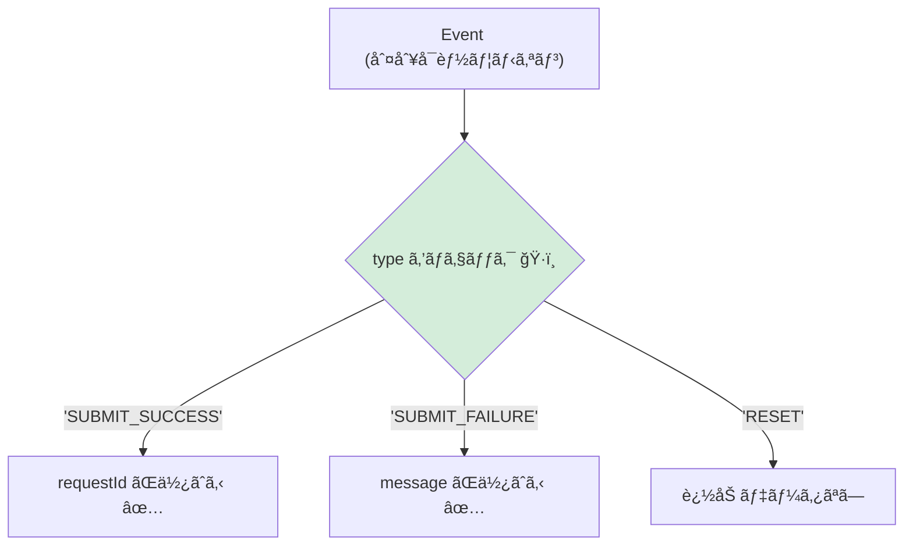

# 第18章：Eventã‚’å‹ã«ã™ã‚‹ï¼ˆåˆ¤åˆ¥å¯èƒ½ãƒ¦ãƒ‹ã‚ªãƒ³ï¼‰ğŸ«âœ¨

ã“ã®ç« ã¯ã€Œã‚¤ãƒ™ãƒ³ãƒˆãŒå¢—ãˆã¦ã‚‚破綻ã—ãªã„å‹ã®ä½œã‚Šæ–¹ã€ã‚’身ã«ã¤ã‘ã‚‹å›ã ã‚ˆã€œğŸ˜Š
状態（State）をå‹ã«ã§ããŸã‚‰ã€æ¬¡ã¯ **イベント（Event）もå‹ã§å®ˆã‚‹**ã¨ä¸€æ°—ã«å¼·ããªã‚‹ï¼ğŸ’ªâœ¨

---

## 0. 2026å¹´1月時点ã®â€œã„ã¾â€ãƒ¡ãƒ¢ğŸ—“ï¸ğŸ”

* TypeScript 㯠**5.9 ç³»ãŒå®‰å®šãƒ©ã‚¤ãƒ³**ã§ã€å…¬å¼ã§ã‚‚ 5.9 ã®ãƒªãƒªãƒ¼ã‚¹å‘ŠçŸ¥ãŒå‡ºã¦ã‚‹ã‚ˆğŸ“Œ ([Microsoft for Developers][1])
* 一方㧠**TypeScript 6.0（ブリッジ）→ 7.0（ãƒã‚¤ãƒ†ã‚£ãƒ–）**ã¸ã®å¤§ãã„移行ãŒé€²è¡Œä¸­ã€‚ãƒã‚¤ãƒ†ã‚£ãƒ–プレビュー（`@typescript/native-preview`）や進æ—ã‚‚å…¬å¼ãŒå‡ºã—ã¦ã‚‹ã‚ˆğŸš€ ([Microsoft for Developers][2])

ã“ã®ç« ã®å†…容（判別å¯èƒ½ãƒ¦ãƒ‹ã‚ªãƒ³ï¼‰ã¯ã€5.9ç³»ã§ã‚‚超ã©çœŸã‚“中ã«ä½¿ãˆã‚‹ã‹ã‚‰å®‰å¿ƒã—ã¦OK👌✨ ([TypeScript][3])

---

## 1. 今日ã®ã‚´ãƒ¼ãƒ«ğŸ¯ğŸ’–

ã“ã®ç« ã‚’終ãˆãŸã‚‰ã€ã“ã‚“ãªã“ã¨ãŒã§ãるよã†ã«ãªã‚‹ã‚ˆï¼

* ✅ Event ã‚’ **判別å¯èƒ½ãƒ¦ãƒ‹ã‚ªãƒ³**ã§å®šç¾©ã§ãる（`type` ã‚’ç›®å°ã«ã™ã‚‹ï¼‰ ([TypeScript][3])
* ✅ `switch (event.type)` 㧠**å‹ãŒå‹æ‰‹ã«çµã‚Šè¾¼ã¾ã‚Œã‚‹**（narrowing） ([TypeScript][4])
* ✅ æ–°ã—ã„イベントを追加ã—ãŸã¨ãã« **ãƒãƒ³ãƒ‰ãƒªãƒ³ã‚°æ¼ã‚Œã‚’コンパイルã§æ°—ã¥ã‘ã‚‹**（`never`） ([TypeScript][4])

---

## 2. Eventã£ã¦ãªã«ï¼Ÿï¼ˆçŠ¶æ…‹æ©Ÿæ¢°ã®â€œå…¥åŠ›â€ï¼‰ğŸ“®âœ¨

状態機械ã¯ã–ã£ãã‚Šã“ã†ã ã£ãŸã‚ˆã­ğŸ‘‡

* **State（状態）**：ã„ã¾ä½•ã‚’ã—ã¦ã‚‹ã‹
* **Event（イベント）**：何ãŒèµ·ããŸã‹ï¼ˆãƒ¦ãƒ¼ã‚¶ãƒ¼æ“作 / タイãƒãƒ¼ / APIçµæœâ€¦ï¼‰
* **Transition（é·ç§»ï¼‰**：状態ãŒã©ã†å¤‰ã‚ã‚‹ã‹

Event を雑㫠`string` ã§æ‰±ã†ã¨ã€ã‚¤ãƒ™ãƒ³ãƒˆåã®æ‰“ã¡é–“é•ã„ã§æ­»ã«ã‚„ã™ã„…😇
ã ã‹ã‚‰ **イベントã®ç¨®é¡ã¨ã€ã‚¤ãƒ™ãƒ³ãƒˆã”ã¨ã®â€œæŒã¡ç‰©ï¼ˆpayload）â€ã‚’å‹ã«ã™ã‚‹**よğŸâœ¨

---

## 3. 判別å¯èƒ½ãƒ¦ãƒ‹ã‚ªãƒ³ï¼ˆDiscriminated Union）ã£ã¦ï¼ŸğŸ”–🧸


コツã¯ã“ã‚Œã ã‘ï¼

* 全イベント㫠**共通ã®ç›®å°**ã‚’æŒãŸã›ã‚‹ï¼ˆã‚ˆãã‚ã‚‹ã®ã¯ `type`）
* `type` ã‚’ **文字列リテラル**（`"SUBMIT"` ã¿ãŸã„ã«å›ºå®šï¼‰ã«ã™ã‚‹
* ãã†ã™ã‚‹ã¨ TypeScript ㌠`switch` ã‚„ `if` 㧠**å‹ã‚’çµã‚Šè¾¼ã‚ã‚‹** ([TypeScript][3])


```mermaid
flowchart TD
    E["Event (判別å¯èƒ½ãƒ¦ãƒ‹ã‚ªãƒ³)"] --> Tag{"type ã‚’ãƒã‚§ãƒƒã‚¯ ğŸ·ï¸"}
    Tag -- "'SUBMIT_SUCCESS'" --> P1["requestId ãŒä½¿ãˆã‚‹ ✅"]
    Tag -- "'SUBMIT_FAILURE'" --> P2["message ãŒä½¿ãˆã‚‹ ✅"]
    Tag -- "'RESET'" --> P3["追加データãªã—"]
    
    style Tag fill:#d4edda
```


---

## 4. ã¾ãšã¯ “イベントå‹â€ を作ã‚ã†ğŸ«âœ¨ï¼ˆåŸºæœ¬å½¢ï¼‰

フォームé€ä¿¡ã‚’é¡Œæã«ã€ã‚ˆãã‚るイベントを作るã­ğŸ˜Š

```ts
// 例: フォームã§æ‰±ã†ãƒ•ã‚£ãƒ¼ãƒ«ãƒ‰
type Field = "email" | "password";

// Event（判別å¯èƒ½ãƒ¦ãƒ‹ã‚ªãƒ³ï¼‰
export type Event =
  | { type: "START_EDIT" }
  | { type: "CHANGE_FIELD"; field: Field; value: string }
  | { type: "SUBMIT" }
  | { type: "SUBMIT_SUCCESS"; requestId: string }
  | { type: "SUBMIT_FAILURE"; message: string; retryable: boolean }
  | { type: "RESET" };
```

ãƒã‚¤ãƒ³ãƒˆğŸ’¡

* `type: "CHANGE_FIELD"` ã¿ãŸã„ã« **固定文字列**ã«ã™ã‚‹ã®ãŒè¶…大事ï¼
* イベントã”ã¨ã«å¿…è¦ãªãƒ‡ãƒ¼ã‚¿ã ã‘æŒãŸã›ã‚‹ï¼ˆ`SUBMIT_SUCCESS` 㯠`requestId` ã»ã—ã„よã­ã€œğŸ”）

---

## 5. `switch(event.type)` 㧠“å‹æ‰‹ã«å‹ãŒåˆã†â€ 快感😆✨

イベントを処ç†ã™ã‚‹å´ï¼ˆReducer/Transition）ã§ã“ã†ãªã‚‹ğŸ‘‡
`case` ã®ä¸­ã§ã¯ **event ãŒãã®å‹ã«çµã‚‰ã‚Œã‚‹**ã‚ˆï¼ ([TypeScript][4])

```ts
import type { Event } from "./events";

function handleEvent(event: Event) {
  switch (event.type) {
    case "START_EDIT":
      // event 㯠{ type: "START_EDIT" }
      return "start editing!";

    case "CHANGE_FIELD":
      // event 㯠{ type: "CHANGE_FIELD"; field: Field; value: string }
      return `changed ${event.field} = ${event.value}`;

    case "SUBMIT_SUCCESS":
      // event 㯠{ type: "SUBMIT_SUCCESS"; requestId: string }
      return `ok! requestId=${event.requestId}`;

    case "SUBMIT_FAILURE":
      return event.retryable ? "retry?" : "give up...";

    case "SUBMIT":
    case "RESET":
      return "simple event";

    default:
      // 後㧠“æ¼ã‚Œæ¤œå‡ºâ€ ã‚’å¼·ãã™ã‚‹ã‚ˆï¼
      return "unknown";
  }
}
```

---

## 6. ãƒãƒ³ãƒ‰ãƒªãƒ³ã‚°æ¼ã‚Œã‚’ “コンパイルã§æ­¢ã‚る†🚫✅（never ã®ã‚„ã¤ï¼‰

イベントãŒå¢—ãˆãŸã®ã« `switch` ã‚’ç›´ã—忘れる…ã‚ã‚‹ã‚る😇
ã“ã“㧠**`never` を使ã†ã¨ã€æ¼ã‚ŒãŸç¬é–“ã«å‹ã‚¨ãƒ©ãƒ¼**ã«ã§ãã‚‹ã‚ˆï¼ ([TypeScript][4])

```ts
function assertNever(x: never): never {
  throw new Error("Unexpected event: " + JSON.stringify(x));
}

function handleEventStrict(event: Event) {
  switch (event.type) {
    case "START_EDIT":
      return "start editing!";
    case "CHANGE_FIELD":
      return `changed ${event.field}`;
    case "SUBMIT":
      return "submit";
    case "SUBMIT_SUCCESS":
      return event.requestId;
    case "SUBMIT_FAILURE":
      return event.message;
    case "RESET":
      return "reset";
    default:
      // Event ã«æ–°ã—ã„ type を足ã™ã¨ã€ã“ã“ãŒå‹ã‚¨ãƒ©ãƒ¼ã«ãªã‚‹âœ¨
      return assertNever(event);
  }
}
```

ã“ã‚Œã§ã€Œç›´ã—忘れã€ãŒ **ビルド時ã«å³ãƒãƒ¬**ã™ã‚‹ã®ã€ã‚ã¡ã‚ƒå¼·ã„😳💕

---

## 7. よãã‚ã‚‹æ²¼ãƒã‚¤ãƒ³ãƒˆğŸ« ï¼ˆã“ã“超大事）

### ⌠`type: string` ã«ã—ã¡ã‚ƒã†

```ts
// ダメ例: çµã‚Šè¾¼ã¿ãŒåŠ¹ã‹ãªã„😇
type BadEvent = { type: string; payload?: unknown };
```

ã“ã‚Œã ã¨ `switch (event.type)` ã—ã¦ã‚‚「çµå±€ string ã§ã—ょ？ã€ã£ã¦ãªã£ã¦ã€å‹ã®æ©æµãŒæ¿€æ¸›â€¦ğŸ’¦

### ⌠payload を全部 `any` ã«ã¾ã¨ã‚ã‚‹

```ts
type BadEvent =
  | { type: "SUBMIT_SUCCESS"; data: any }
  | { type: "SUBMIT_FAILURE"; data: any };
```

“便利ãã†â€ã«è¦‹ãˆã¦ã€**実ã¯ãƒã‚°ãŒå¢—ãˆã‚‹**ã‚„ã¤ã€œğŸ˜‡
イベントã”ã¨ã«å¿…è¦ãªå½¢ã‚’ã¡ã‚ƒã‚“ã¨æŒãŸã›ã‚ˆğŸâœ¨

---

## 8. “イベント作æˆé–¢æ•°â€ を用æ„ã™ã‚‹ã¨ã€ã•ã‚‰ã«äº‹æ•…ãŒæ¸›ã‚‹ğŸ§¯âœ¨

æ¯å› `{ type: "...", ... }` を手打ã¡ã™ã‚‹ã¨ã€åœ°å‘³ã«ãƒŸã‚¹ã‚‹ã®ã‚ˆâ€¦ğŸ¥º
ã ã‹ã‚‰ **イベントを作る関数（creator）**を用æ„ã—よï¼

```ts
import type { Event } from "./events";

export const E = {
  startEdit(): Event {
    return { type: "START_EDIT" };
  },
  changeField(field: "email" | "password", value: string): Event {
    return { type: "CHANGE_FIELD", field, value };
  },
  submit(): Event {
    return { type: "SUBMIT" };
  },
  submitSuccess(requestId: string): Event {
    return { type: "SUBMIT_SUCCESS", requestId };
  },
  submitFailure(message: string, retryable: boolean): Event {
    return { type: "SUBMIT_FAILURE", message, retryable };
  },
  reset(): Event {
    return { type: "RESET" };
  },
};
```

VS Code ã®è£œå®ŒãŒã‚ã¡ã‚ƒæ°—æŒã¡ã„ã„ã‚„ã¤â€¦ğŸ˜†ğŸ’

---

## 9. `satisfies` を使ã†ã¨ “形ã®ãƒã‚§ãƒƒã‚¯â€ ãŒä¸Šæ‰‹ãã§ãる🧩✨（ãŠã™ã™ã‚）

`events` ã®ä¸€è¦§ã¨ã‹ã€Œã“ã®å½¢ã§æƒã£ã¦ã¦ã»ã—ã„ï¼ã€ã£ã¦ã¨ãã€`satisfies` ãŒä¾¿åˆ©ã ã‚ˆğŸª„
（値ã®æ¨è«–ã‚’æ½°ã•ãšã« “満ãŸã—ã¦ã‚‹ã‹â€ ã‚’ãƒã‚§ãƒƒã‚¯ã§ãる） ([TypeScript][5])

例：イベントã®è¡¨ç¤ºåè¾æ›¸ã‚’ã€æ¼ã‚Œãªãæƒãˆã‚‹ğŸ‘‡

```ts
import type { Event } from "./events";

type EventType = Event["type"];

export const eventLabel = {
  START_EDIT: "編集開始",
  CHANGE_FIELD: "入力変更",
  SUBMIT: "é€ä¿¡",
  SUBMIT_SUCCESS: "é€ä¿¡æˆåŠŸ",
  SUBMIT_FAILURE: "é€ä¿¡å¤±æ•—",
  RESET: "リセット",
} satisfies Record<EventType, string>;
```

Event を増やã—ãŸã®ã«è¾æ›¸ã‚’足ã—忘れãŸã‚‰ã€ã“ã“ã§æ°—ã¥ã‘ã‚‹ï¼ğŸ‘✨

---

## 10. ミニ演習ğŸ“🌸（手を動ã‹ã™ã¨ä¸€æ°—ã«è¦šãˆã‚‹ï¼ï¼‰

### 演習A：イベントを1ã¤è¿½åŠ ã—よã†â•ğŸ«

`CANCEL` を追加ã—ã¦ã¿ã¦ã­ï¼ˆpayloadãªã—）

1. `Event` ã« `{ type: "CANCEL" }` を足ã™
2. `handleEventStrict` ãŒå‹ã‚¨ãƒ©ãƒ¼ã«ãªã‚‹ã®ã‚’確èª
3. `case "CANCEL":` を足ã—ã¦ç›´ã™

### 演習B：payload設計ã—ã¦ã¿ã‚ˆã†ğŸ

`VALIDATION_FAILED` を追加ï¼

* `errors: Array<{ field: Field; message: string }>` ã‚’æŒãŸã›ã¦ã¿ã‚ˆã†âœ¨

---

## 11. AI活用プロンプト集🤖💖（ãã®ã¾ã¾ã‚³ãƒ”ペOK）

* 「フォームé€ä¿¡ã®çŠ¶æ…‹æ©Ÿæ¢°ã§ã€å¿…è¦ã«ãªã‚Šãã†ãªã‚¤ãƒ™ãƒ³ãƒˆã¨ payload 候補を列挙ã—ã¦ã€‚éä¸è¶³ã‚‚指摘ã—ã¦ã€
* 「ã“ã® Event ユニオンã€å‘½åを統一ã—ãŸã„。命åルール案ã¨ãƒªãƒãƒ¼ãƒ æ¡ˆã¡ã‚‡ã†ã ã„ã€
* 「イベントã”ã¨ã® payload ãŒé‡ã™ããªã„ã‹ãƒ¬ãƒ“ューã—ã¦ã€‚Context ã«å¯„ã›ã‚‹ã¹ãã‚‚ã®ã‚‚æ•™ãˆã¦ã€
* 「`switch(event.type)` ã®æ¼ã‚Œã‚’ `never` ã§æ¤œå‡ºã™ã‚‹å½¢ã«ãƒªãƒ•ã‚¡ã‚¯ã‚¿ã—ã¦ã€
* 「`eventLabel` è¾æ›¸ã‚’ `satisfies` ã§æ¼ã‚Œæ¤œå‡ºã§ãã‚‹å½¢ã«ã—ã¦ã€ ([TypeScript][5])

---

## 12. ã“ã®ç« ã®ã¾ã¨ã‚ğŸ§âœ¨ï¼ˆãƒã‚§ãƒƒã‚¯ãƒªã‚¹ãƒˆï¼‰

* ✅ Event 㯠`{ type: "..." }` を共通目å°ã«ã—㟠**判別å¯èƒ½ãƒ¦ãƒ‹ã‚ªãƒ³**ã§ä½œã‚‹ ([TypeScript][3])
* ✅ `switch(event.type)` ã§å‹ãŒçµã‚‰ã‚Œã¦ã€payload ãŒå®‰å…¨ã«æ‰±ãˆã‚‹ ([TypeScript][4])
* ✅ `assertNever` 㧠**イベント追加時ã®æ¼ã‚Œ**をコンパイルã§æ¤œå‡ºã§ãã‚‹ ([TypeScript][4])
* ✅ `satisfies` を使ã†ã¨ã€Œè¾æ›¸ã‚„設定ã®æ¼ã‚Œæ¤œå‡ºã€ãŒæ°—æŒã¡ã‚ˆãã§ãã‚‹ ([TypeScript][5])

---

次ã®ç¬¬19ç« ã§ã¯ã€State ã ã‘ã˜ã‚ƒè¡¨ã›ãªã„“データâ€ã‚’ **Context** ã«å…¥ã‚Œã¦ã€çŠ¶æ…‹æ©Ÿæ¢°ãŒã•ã‚‰ã«ç¾å®Ÿã®ã‚¢ãƒ—リã£ã½ããªã‚‹ã‚ˆã€œğŸ§ ğŸ’–

[1]: https://devblogs.microsoft.com/typescript/announcing-typescript-5-9/?utm_source=chatgpt.com "Announcing TypeScript 5.9"
[2]: https://devblogs.microsoft.com/typescript/announcing-typescript-native-previews/?utm_source=chatgpt.com "Announcing TypeScript Native Previews"
[3]: https://www.typescriptlang.org/docs/handbook/unions-and-intersections.html?utm_source=chatgpt.com "Handbook - Unions and Intersection Types"
[4]: https://www.typescriptlang.org/docs/handbook/2/narrowing.html?utm_source=chatgpt.com "Documentation - Narrowing"
[5]: https://www.typescriptlang.org/docs/handbook/release-notes/typescript-4-9.html?utm_source=chatgpt.com "Documentation - TypeScript 4.9"
