# 第25章：非同期（Loading / Timeout / Cancel）を入れる⏳🧯

この章は、「現実のアプリっぽい挙動」を状態機械に入れていく回だよ〜！💪✨
**API待ち（Loading）**、**タイムアウト（Timeout）**、**ユーザーキャンセル（Cancel）**が入ると、一気に“実務で使える感”が出るの😊🌸

---

## 1) まず結論：非同期は「結果をイベントで戻す」だけ！📮✨

非同期処理（fetchとか）は、状態機械の外で起きるよね。
だから状態機械側では、

* ✅ **「開始」**をイベントとして受け取る（例：`SUBMIT`）
* ✅ **「成功」**もイベント（例：`RESOLVE`）
* ✅ **「失敗」**もイベント（例：`REJECT`）
* ✅ **「タイムアウト」**もイベント（例：`TIMEOUT`）
* ✅ **「キャンセル」**もイベント（例：`CANCEL`）

…って感じで、**全部イベントで統一**するとキレイにまとまるよ🥰✨

---

## 2) なぜ状態機械がないと非同期が事故るの？💥😵‍💫

よくある事故がこれ👇

### 🚨 事故A：遅れて帰ってきたレスポンスが、いまの画面を壊す（レース）🏎️💨


* 1回目送信 → 遅い
* 2回目送信 → 先に成功
* その後、1回目が遅れて成功 → **画面が巻き戻る**😱

```mermaid
sequenceDiagram
    participant UI
    participant M as "Machine (状態機械)"
    participant S as Server
    
    UI->>M: 1回目送信 SUBMIT (id:1)
    M->>S: リクエスト (id:1)
    
    Note over UI, S: 通信が遅延...⌛
    
    UI->>M: 2回目送信 SUBMIT (id:2)
    M->>S: リクエスト (id:2)
    
    S-->>M: 1回目の成功が今さら届く (id:1)
    M->>M: 現在の id:2 と不一致！<br/>無視して現状維持 🙈
    
    S-->>M: 2回目の成功が届く (id:2)
    M->>M: id:2 で一致！<br/>Success 状態へ遷移 ✅
```



### 🚨 事故B：キャンセルしたのに成功扱いになる🙅‍♀️

キャンセル押したのに、裏で成功イベントが来て「成功表示」…みたいなやつ😵‍💫

→ 対策は次の2つが王道だよ✨

1. **requestId（相関ID）**で「いま生きてる要求」だけ受け付ける
2. **AbortController**で通信そのものを止める（キャンセル/タイムアウト）🛑
   `abort()`すると`fetch()`は`AbortError`という`DOMException`で失敗になると言われてるよ📌 ([MDN Web Docs][1])

---

## 3) 例題：フォーム送信（送信中に Cancel / Timeout あり）📨⏳


ここからは、こういう挙動を作るイメージでいくね👇✨

* 送信ボタン → **Submitting（Loading表示）**
* Cancelボタン → **Editingに戻る**（通信も中止）
* 5秒経っても返らない → **Timeout状態**（通信も中止）
* 成功 → **Success**
* 失敗 → **Error**

---

## 4) 状態・イベント・Context を設計しよう🧩🧠

### ✅ State（状態）

* `editing`：入力中✍️
* `submitting`：送信中（Loading）⏳
* `success`：成功🎉
* `error`：失敗😢
* `timeout`：タイムアウト⌛

### ✅ Context（拡張状態）

* `requestId`：いまの送信を識別と言う名の「チケット」🎫
* `form`：入力内容（例）
* `errorMessage`：表示用（例）

### ✅ Event（イベント）

* `SUBMIT`（送信開始）
* `CANCEL`（ユーザーキャンセル）
* `TIMEOUT`（時間切れ）
* `RESOLVE`（成功結果）
* `REJECT`（失敗結果）

ポイントはこれ👇✨
**`RESOLVE/REJECT/TIMEOUT` は必ず `requestId` を持たせる**（遅延レスポンス対策）✅

---

## 5) 遷移表（超重要）📋✨

例として「送信まわり」だけ抜き出すね😊

| 現在の状態      | イベント                 | ガード          | 次の状態       | Effect（外でやること）                                                |
| ---------- | -------------------- | ------------ | ---------- | ------------------------------------------------------------- |
| editing    | SUBMIT               | 入力OK         | submitting | `START_REQUEST(requestId)` + `START_TIMEOUT(requestId, 5000)` |
| submitting | CANCEL               | —            | editing    | `ABORT_REQUEST(requestId)` + `CANCEL_TIMEOUT(requestId)`      |
| submitting | TIMEOUT(requestId)   | requestId一致  | timeout    | `ABORT_REQUEST(requestId)`                                    |
| submitting | RESOLVE(requestId)   | requestId一致  | success    | `CANCEL_TIMEOUT(requestId)`                                   |
| submitting | REJECT(requestId)    | requestId一致  | error      | `CANCEL_TIMEOUT(requestId)`                                   |
| submitting | RESOLVE/REJECT(古いid) | requestId不一致 | submitting | 何もしない（無視）🙈                                                   |

この「古いidは無視」が、レース事故を止める最強のお守りだよ🧿✨

---

## 6) 実装：Reducer（純粋）＋ Effect（副作用）で分ける🌿🧪

### 6-1. 型定義（State / Event / Effect）

```ts
// ✅ 今の安定版 TypeScript は 5.9.3（npmのlatest）だよ📌
/* 参考: npm / TypeScript公式 */ // :contentReference[oaicite:1]{index=1}

type RequestId = string;

type State =
  | { kind: "editing"; form: { text: string } }
  | { kind: "submitting"; form: { text: string }; requestId: RequestId }
  | { kind: "success" }
  | { kind: "error"; message: string }
  | { kind: "timeout" };

type Event =
  | { type: "SUBMIT" }
  | { type: "CANCEL" }
  | { type: "TIMEOUT"; requestId: RequestId }
  | { type: "RESOLVE"; requestId: RequestId; result: unknown }
  | { type: "REJECT"; requestId: RequestId; error: unknown };

type Effect =
  | { type: "START_REQUEST"; requestId: RequestId; payload: { text: string } }
  | { type: "ABORT_REQUEST"; requestId: RequestId }
  | { type: "START_TIMEOUT"; requestId: RequestId; ms: number }
  | { type: "CANCEL_TIMEOUT"; requestId: RequestId };

type ReduceResult = { state: State; effects: Effect[] };

const newRequestId = (): RequestId => crypto.randomUUID();
```

---

### 6-2. reducer：状態遷移だけを書く（副作用ゼロ）✨

```ts
function reduce(state: State, event: Event): ReduceResult {
  switch (state.kind) {
    case "editing": {
      if (event.type === "SUBMIT") {
        const requestId = newRequestId();
        return {
          state: { kind: "submitting", form: state.form, requestId },
          effects: [
            { type: "START_REQUEST", requestId, payload: { text: state.form.text } },
            { type: "START_TIMEOUT", requestId, ms: 5000 },
          ],
        };
      }
      return { state, effects: [] };
    }

    case "submitting": {
      const id = state.requestId;

      if (event.type === "CANCEL") {
        return {
          state: { kind: "editing", form: state.form },
          effects: [
            { type: "ABORT_REQUEST", requestId: id },
            { type: "CANCEL_TIMEOUT", requestId: id },
          ],
        };
      }

      if (event.type === "TIMEOUT") {
        if (event.requestId !== id) return { state, effects: [] }; // 古いタイムアウトは無視🙈
        return {
          state: { kind: "timeout" },
          effects: [{ type: "ABORT_REQUEST", requestId: id }],
        };
      }

      if (event.type === "RESOLVE") {
        if (event.requestId !== id) return { state, effects: [] }; // 古い成功は無視🙈
        return {
          state: { kind: "success" },
          effects: [{ type: "CANCEL_TIMEOUT", requestId: id }],
        };
      }

      if (event.type === "REJECT") {
        if (event.requestId !== id) return { state, effects: [] }; // 古い失敗は無視🙈
        return {
          state: { kind: "error", message: "送信に失敗したよ😢" },
          effects: [{ type: "CANCEL_TIMEOUT", requestId: id }],
        };
      }

      return { state, effects: [] };
    }

    default:
      return { state, effects: [] };
  }
}
```

---

## 7) Effect Runner：fetch + AbortController + タイマー ⏳🛑

`fetch` は `AbortController` の `signal` を渡すとキャンセル可能になるよ🧯
そして `abort()` すると `AbortError` で失敗になる（＝catchに入る）📌 ([MDN Web Docs][1])

さらに最近は `AbortSignal.timeout(ms)` で「指定時間で自動中止」も作れるよ（新しめだけど主要ブラウザで使える扱い）📌 ([MDN Web Docs][2])

ここでは分かりやすく「setTimeoutでabort」方式にするね😊（理解しやすい！）

```ts
class EffectRunner {
  private controllers = new Map<RequestId, AbortController>();
  private timeouts = new Map<RequestId, number>();

  constructor(private dispatch: (event: Event) => void) {}

  run(effect: Effect) {
    switch (effect.type) {
      case "START_REQUEST": {
        const controller = new AbortController();
        this.controllers.set(effect.requestId, controller);

        void (async () => {
          try {
            const res = await fetch("/api/submit", {
              method: "POST",
              headers: { "Content-Type": "application/json" },
              body: JSON.stringify(effect.payload),
              signal: controller.signal,
            });

            if (!res.ok) throw new Error(`HTTP ${res.status}`);
            const result = await res.json();

            this.dispatch({ type: "RESOLVE", requestId: effect.requestId, result });
          } catch (error) {
            // abort() で止めた場合は AbortError になることがあるよ📌
            // :contentReference[oaicite:4]{index=4}
            this.dispatch({ type: "REJECT", requestId: effect.requestId, error });
          }
        })();

        return;
      }

      case "ABORT_REQUEST": {
        const controller = this.controllers.get(effect.requestId);
        controller?.abort(); // fetchが中止される🛑
        this.controllers.delete(effect.requestId);
        return;
      }

      case "START_TIMEOUT": {
        const handle = window.setTimeout(() => {
          this.dispatch({ type: "TIMEOUT", requestId: effect.requestId });
        }, effect.ms);

        this.timeouts.set(effect.requestId, handle);
        return;
      }

      case "CANCEL_TIMEOUT": {
        const handle = this.timeouts.get(effect.requestId);
        if (handle != null) window.clearTimeout(handle);
        this.timeouts.delete(effect.requestId);
        return;
      }
    }
  }
}
```

---

## 8) Machine API（send方式）に合体させる📮✨

```ts
class Machine {
  private state: State;
  private runner: EffectRunner;

  constructor(initial: State, onChange: (s: State) => void) {
    this.state = initial;

    const dispatch = (e: Event) => this.send(e, onChange);
    this.runner = new EffectRunner(dispatch);
  }

  // UIからは send({type:"SUBMIT"}) みたいに呼ぶ感じ💖
  send(event: Event, onChange: (s: State) => void) {
    const { state, effects } = reduce(this.state, event);
    this.state = state;
    onChange(this.state);

    for (const eff of effects) this.runner.run(eff);
  }
}
```

---

## 9) UIでの見え方（超シンプル例）👀✨

* `submitting` の間はボタン無効 + ローディング表示⏳
* `timeout` は「時間がかかったよ、もう一回やってみてね」って出す⌛
* `error` は「失敗したよ」って出す😢
* `editing` に戻ったら入力そのまま残す✍️💕

---

## 10) この章の落とし穴チェック✅🕵️‍♀️

* ✅ **古いレスポンスを無視してる？**（requestId照合）
* ✅ **送信中の2回目SUBMITは防いでる？**（ガード or ボタン無効）
* ✅ **Cancel/Timeout時にタイマーを止めてる？**（`CANCEL_TIMEOUT`）
* ✅ **成功/失敗時にタイマーを止めてる？**（忘れがち！）

---

## 11) AI活用プロンプト集🤖✨（そのままコピペOK）

### 🧠 設計を強くする

* 「`editing/submitting/success/error/timeout` の遷移表を、禁止遷移も含めて埋めて」
* 「requestId方式でレース条件を防ぐチェックリストを作って」

### 🧪 テスト作り

* 「この遷移表から表駆動テスト（state×event→next）を作って」
* 「古いrequestIdのRESOLVE/REJECTを無視するテストケースを追加して」

### 🔍 レビュー

* 「Cancel/Timeoutまわりで“タイマー解除漏れ”が起きないかレビューして」
* 「副作用がreducerに混ざってないか監査して」

---

## 12) ミニ課題🎓🌸

### 課題A：timeout → retry を追加しよ🔁⌛

* `timeout` 状態で `SUBMIT` できるようにして、もう一回送信！

### 課題B：キャンセル理由を表示したい🛑💬

* `CANCEL` で `editing` に戻る時、「キャンセルしたよ🙂」を一瞬出す設計にしてみよ〜！

---

ここまでできたら、**“非同期で事故らない状態機械”の基礎体力**がかなり付くよ💪💖
次は（ロードマップ通りなら）「大きくなっても崩れない整理術（階層状態）」に進むと、急に世界が広がるやつ〜！🏢✨

[1]: https://developer.mozilla.org/ja/docs/Web/API/AbortController/abort?utm_source=chatgpt.com "AbortController: abort() メソッド - Web API | MDN"
[2]: https://developer.mozilla.org/ja/docs/Web/API/AbortSignal/timeout_static?utm_source=chatgpt.com "AbortSignal: timeout() 静的メソッド - Web API | MDN"
