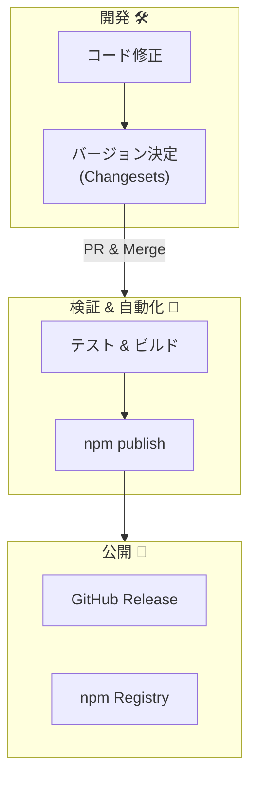

# 第16章　リリース運用：リリースノート＋自動化＋AIでラクする🚀🤖✨

この章のゴールはね、**「ちゃんと出せる人」になること**だよ〜！📦💕
作るだけじゃなくて、**安全に・説明つきで・自動で**リリースできると強い✨

---

## 16.0 まず全体像を1枚で🗺️✨（“出す”の流れ）


リリース運用って、ざっくりこう👇

1. 変更する🛠️
2. 互換性チェックする🛡️（壊してない？）
3. リリースノート書く📝（何が変わった？）
4. バージョン決める🔢（MAJOR/MINOR/PATCH）
5. CIで自動テスト✅
6. タグ付けしてRelease作る🏷️
7. npmへ公開📤
8. 公開後の確認🔍（インストールできる？型は？）


```mermaid
graph TD
    subgraph Develop["開発 🛠️"]
        Code["コード修正"] --> Ver["バージョン決定<br/>(Changesets)"]
    end
    
    subgraph CI["検証 & 自動化 🤖"]
        Test["テスト & ビルド"] --> Publish["npm publish"]
    end
    
    subgraph Public["公開 📍"]
        Release["GitHub Release"]
        Package["npm Registry"]
    end
    
    Ver -- "PR & Merge" --> CI
    Publish --> Public
```

そして2026年の現実としては、**セキュアな公開**がすごく重要💣→🛡️
（npmは“どこでビルドされ誰が公開したか”の検証＝provenanceが重視されてるよ）([npmドキュメント][1])

---

## 16.1 リリースノートとChangelogの違い📝📘

* **Release Notes（リリースノート）**：今回のリリースで利用者が知りたいこと✨

  * 追加された機能✨
  * 修正されたバグ🐛
  * 破壊的変更💥（超重要）
* **CHANGELOG**：履歴の台帳📚（積み上がるログ）

おすすめはこれ👇

* GitHub Releaseには**Release Notes**
* リポジトリには**CHANGELOG.md**

---

## 16.2 2026年“いま”の前提（バージョン感）🔧✨

* Node.jsは **v24 が Active LTS**、v22/v20 は Maintenance LTS、v25 は Current という並びになってるよ([Node.js][2])
* TypeScript は **5.9 系のリリースノートが公開されていて**、Node向け設定も“固定名”が増えて安定してきてる（例：`--module node20`）([TypeScript][3])

ライブラリ側のおすすめ感覚は👇（初心者向けにざっくり）

* **利用者を広く取りたい**：Nodeの下限を“古すぎない範囲”に置く（例：Maintenance LTS以上）🧯
* **自分の開発・CIは最新LTSで回す**（今ならActive LTS寄り）💪

---

## 16.3 “最低限のリリース基本セット”を作ろう🧰✅

ここだけ整ってれば、かなり事故が減るよ〜！

### ✅ リリース前に必ず通すもの

* テスト：`npm test` ✅
* 型チェック：`tsc --noEmit` ✅
* ビルド：`npm run build` ✅
* パッケージ中身チェック：`npm pack --dry-run` ✅（地味に超大事）

### 🛡️ 互換性チェック（最低限でOK）

「公開APIのスナップショット」を作って差分を見る方式がラク✨

* `.d.ts` や APIレポートを生成して、PRで差分が出たら目視チェック👀
* ここで「壊れてない？」が見えると、**バージョン判定がブレにくい**よ🔢

---

## 16.4 方式を選ぶ：おすすめ2ルート🛤️✨

### ルートA：Changesetsで“人間の意図”を残す📝💡（おすすめ）

* 変更ごとに「これはMINOR」「これはPATCH」って**先に宣言**できる
* リリースノートの素材も集まる
* 超初心者でも迷子になりにくい🥰

### ルートB：Conventional Commitsで“コミットから自動判定”🧾⚙️

* 仕組みは強いけど、最初の運用ルール作りがちょい難しめ💦

この章では **Changesets中心**でいくね〜！🎀

---

## 16.5 Changesets：日常の使い方（超やさしく）🌸

### ① 変更したら changeset を1個作る

```bash
npx changeset
```

質問されるから、感覚でOK👇

* 破壊：MAJOR💥
* 機能追加：MINOR✨
* 修正：PATCH🐛

そして、changesetの本文には**利用者向けの説明**を書くよ📝
（ここがRelease Notesの材料になる✨）

### ② “リリース用PR”を自動で作る（Version Packages PR）📦✨

Changesetsは「changesetが溜まったら、まとめて version bump + changelog するPR」を作れるよ👍
→ あとはそれをマージすればOK🙆‍♀️

---

## 16.6 “公開”はセキュアに：Trusted Publishing（トークン無し）🔐✨

2026っぽい超重要ポイント！🌟
GitHub Actionsからnpmへ公開する時、**OIDCでトークン不要**にできるよ（Trusted Publishers）([npmドキュメント][4])

ポイントはこれ👇

* GitHub Actions側に **`id-token: write`** 権限が必要([npmドキュメント][4])
* npm側で「このGitHubリポジトリ/ワークフローからの公開を信頼する」設定をする

> “トークン管理がいらない”＝運用がラク＆漏洩リスクが下がる😇🛡️

---

## 16.7 Provenance（来歴）もつけよう🧾🛡️

npmは **provenance（どこでビルドされ誰が公開したか）** を付けられるよ([npmドキュメント][1])
GitHub公式ドキュメントでも **`npm publish --provenance`** が推奨されてる([GitHub Docs][5])

```bash
npm publish --provenance
```

---

## 16.8 ワークフロー例：CI → Tag/Release → npm publish（イメージ）⚙️🏷️📤

「雰囲気がわかればOK」な最小サンプルだよ〜✨
（実案件では少しずつ育てればOK🌱）

### ① PRで走るCI（テスト・型・ビルド・packチェック）✅

```yaml
name: CI
on:
  pull_request:
  push:
    branches: [ main ]

jobs:
  test:
    runs-on: ubuntu-latest
    steps:
      - uses: actions/checkout@v4
      - uses: actions/setup-node@v4
        with:
          node-version: 24
      - run: npm ci
      - run: npm test
      - run: npm run build --if-present
      - run: npx tsc --noEmit
      - run: npm pack --dry-run
```

### ② タグで publish（Trusted Publishing + provenance）📤🔐

```yaml
name: Publish
on:
  push:
    tags:
      - "v*"

permissions:
  contents: read
  id-token: write

jobs:
  publish:
    runs-on: ubuntu-latest
    steps:
      - uses: actions/checkout@v4
      - uses: actions/setup-node@v4
        with:
          node-version: 24
          registry-url: "https://registry.npmjs.org"

      - run: npm ci
      - run: npm run build --if-present
      - run: npm test
      - run: npm publish --provenance
```

この形は、**GitHub公式のnpm公開ガイド**とも整合するよ([GitHub Docs][5])

---

## 16.9 AIの使いどころ：リリース運用が“作業”になる🤖💖

### 🤖 ① リリースノート生成（PR/コミット → 利用者向け文章）

プロンプト例👇

```text
次の変更ログを、利用者向けのリリースノートに直して！
- 箇条書き
- 破壊的変更があるなら先頭に⚠️で強調
- 初心者にもわかる言葉
- 200〜400文字くらい
（変更ログ）：
...
```

### 🤖 ② 破壊的変更チェック（“それMAJORじゃない？”を疑う）

```text
この差分は利用者コードを壊す可能性ある？
公開API変更・型変更・挙動変更の観点で、危険度を3段階で教えて。
最後に「推奨バージョン（MAJOR/MINOR/PATCH）」も提案して。
（差分）：
...
```

### 🤖 ③ 移行ガイド（Breakingがある時の“優しさ”）

```text
次の変更で困る利用者が最短で移行できる手順を書いて。
- Before/After のコード例
- よくあるエラーと対処
- 1ページで収める
（変更内容）：
...
```

---

## 16.10 よくある事故ポイント（先に潰そ）😇💥

* ✅ `npm pack --dry-run` をしない → **不要ファイルしか入ってない**／**d.tsが入ってない**
* ✅ タグの付け方がブレる → `v1.2.3` 形式で統一🏷️
* ✅ Trusted Publishing の設定が合ってない → **npm publish が 404 っぽく失敗**しがち（設定不一致が原因のことが多い）([GitHub][6])
* ✅ “何を公開APIとして守るか”が曖昧 → バージョン判断が毎回ぐちゃぐちゃ🌀
  → 第4章〜第13章のルールをここで使う番だよ〜🧩✨

---

## 16.11 ミニ演習（卒業制作🎓✨）：リリース物語を完成させよう📚🌈

小さなTSライブラリを想定して、これを作るよ👇

### 🎯 目標ストーリー

* `0.1.0`：実験版🧪
* `1.0.0`：契約宣言🏁
* `1.1.0`：機能追加✨
* `2.0.0`：非推奨→削除でMAJOR💥

### ✅ やることチェックリスト

* changeset を各リリースで作る📝
* Release Notes をAIで下書きして、人間が仕上げる🤖✍️
* CIで `test / build / tsc / pack` を通す✅
* tag（`v1.0.0`みたいに）を切って publish を回す🏷️📤
* `2.0.0` では **移行ガイド** を1ページ作る🪜💕

---

必要なら、次の返信で「Changesetsの設定（初期化〜Release PRまで）」を、あなたの想定プロジェクト構成（ライブラリ/アプリ/モノレポ）に合わせて“そのままコピペで動く形”にして渡すよ〜🧁✨

[1]: https://docs.npmjs.com/generating-provenance-statements/?utm_source=chatgpt.com "Generating provenance statements"
[2]: https://nodejs.org/en/about/previous-releases?utm_source=chatgpt.com "Node.js Releases"
[3]: https://www.typescriptlang.org/docs/handbook/release-notes/typescript-5-9.html?utm_source=chatgpt.com "Documentation - TypeScript 5.9"
[4]: https://docs.npmjs.com/trusted-publishers/?utm_source=chatgpt.com "Trusted publishing for npm packages"
[5]: https://docs.github.com/actions/publishing-packages/publishing-nodejs-packages?utm_source=chatgpt.com "Publishing Node.js packages"
[6]: https://github.com/orgs/community/discussions/176761?utm_source=chatgpt.com "NPM publish using OIDC on github actions #176761"
